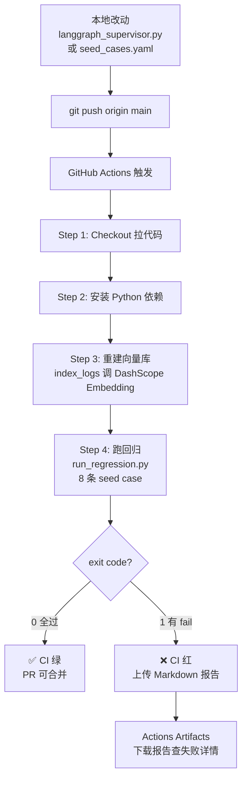

# CI 回归测试集成总结

> **阶段目标**：把本地手动跑的 Prompt 回归测试，接入 GitHub Actions，
> 实现「改代码 → 推送 → 自动验证 → 结果可见」的工程化闭环。

---

## 一、这个阶段做了什么

### 完整流程图



### 涉及的文件

| 文件 | 作用 |
|---|---|
| `.github/workflows/regression.yml` | GitHub Actions workflow 定义 |
| `tech_showcase/regression/run_regression.py` | 回归测试主脚本，exit 0/1 |
| `tech_showcase/regression/seed_cases.yaml` | 8 条测试用例 |
| `tech_showcase/regression/baseline.json` | 上次满意的基准结果（入 git）|
| `tech_showcase/regression/reports/` | 每次跑的 Markdown 报告（入 git）|

### GitHub Secrets 配置

| Secret 名 | 用途 |
|---|---|
| `API_KEY` | DashScope API，跑 LLM + Embedding |
| `DASHSCOPE_API_KEY` | 兼容旧 workflow 版本 |
| `LANGSMITH_API_KEY` | 可选，LangSmith trace 上报 |

---

## 二、触发条件

```yaml
# 三种触发方式
on:
  workflow_dispatch:        # 手动触发（UI 点 Run workflow）
  pull_request:             # PR 时自动触发
    paths: [supervisor, regression, tools, rag, config ...]
  push:                     # push main 时自动触发（同 paths 过滤）
```

**paths 过滤的意义**：只有改了核心代码才跑，改 README / 文档不浪费 API 额度。

---

## 三、CI 带来的好处

### 3.1 改 Prompt 有数据保护

**之前**：改 `SUPERVISOR_PROMPT_TEMPLATE` 靠感觉，随便问几个 query 看起来还好就 commit。

**现在**：
```
改 Prompt → push → CI 自动跑 8 条 case →
  全过 → 绿，放心合并
  有失败 → 红，下载报告看哪条坏了，改到绿再合并
```

**类比 Java**：就像改了 Service 代码，JUnit 自动跑一遍，不通过不能上线。

### 3.2 Baseline 对比，趋势可见

每次 CI 报告都对比 `baseline.json`：

```markdown
vs baseline：
- 通过率：62.5% → 87.5% （↑25.0%）   ← 变好了
- LLM judge 均分：0.69 → 0.56 （↓0.13）← judge 评分降了（模型换了）
- 总耗时：88.6s → 91.0s （↑2.4s）
```

不只看「过没过」，还看「和上次比变好还是变坏了」。

### 3.3 报告自动归档

每次跑完，Markdown 报告上传到 Actions Artifacts，保留 30 天。
PR 的 reviewer 可以直接在 GitHub 上点开报告，看改动对每条 case 的影响。

### 3.4 强制工程纪律

CI 红 = PR 阻塞（如果开了 Branch Protection）。
想合并就必须把测试修绿。**Prompt 改动不再是「感觉好像变好了」，而是有数据说话**。

---

## 四、踩过的坑（排查经验）

| 坑 | 原因 | 解决 |
|---|---|---|
| Secret 传入但 `settings.api_key` 仍为空 | 缺少 `API_BASE_URL`，pydantic-settings 读了 env 但 DashScope 没 base_url 也报错 | workflow 里加 `API_BASE_URL: https://dashscope.aliyuncs.com/compatible-mode/v1` |
| Re-run 跑的是旧代码 | Re-run 复用同一个 commit 的 workflow | 加 `workflow_dispatch` 手动触发新 run |
| 修了 workflow 但没触发新 run | `.github/` 目录不在 paths 过滤里 | 手动点 `Run workflow` |
| Secret 名字不一致 | 旧 workflow 用 `DASHSCOPE_API_KEY`，新 workflow 改成 `API_KEY` | 两个名字都加进 Secrets |

---

## 五、当前 CI 状态

```
最新结果（2026-04-25）：7/8 pass（87.5%）
模型：qwen-plus

✅ simple_count      今天有多少 ERROR？
✅ top_services      报错最多的 3 个服务？
✅ time_filter       08:00-09:00 的 ERROR？
✅ root_cause        DBPool 为什么失败？
✅ structured_report 生成结构化报告
✅ ambiguous         帮我分析一下（模糊问题）
❌ out_of_scope      今天天气怎么样？（qwen-plus 偶发路由到 parser）
✅ follow_up_payment 那 Payment 呢？（多轮追问）
```

`out_of_scope` 是已知的 qwen-plus 能力问题，不是 Prompt bug。
Baseline 已更新为 7/8，后续若退步到 6/8 CI 会重新变红。

---

## 六、后续可以做的

- **修 `out_of_scope`**：Prompt 加「与日志无关的问题直接 END」规则，跑回归验证，让 CI 到 8/8
- **扩 seed case 到 20-30 条**：每遇到一个新 bug 加一条 case 复现
- **接 Branch Protection**：仓库 Settings → Branches → 要求 CI 通过才能合并 PR
- **LangSmith Experiments**：把每次 CI 结果上报到 LangSmith，UI 里看历次分数曲线

---

## 七、Java 类比速查

| CI 概念 | Java 世界 |
|---|---|
| `regression.yml` workflow | Maven Surefire + Jenkins pipeline |
| `run_regression.py` exit 0/1 | JUnit BUILD SUCCESS / FAILURE |
| `baseline.json` | ApprovalTests 的 `*.approved.txt` |
| seed_cases.yaml | `@ParameterizedTest` 测试数据 |
| LLM judge 评分 | 无直接对应（Java 断言是 deterministic）|
| `workflow_dispatch` | Jenkins 手动触发 Build |
| Artifacts 上传报告 | Surefire HTML 报告 |
