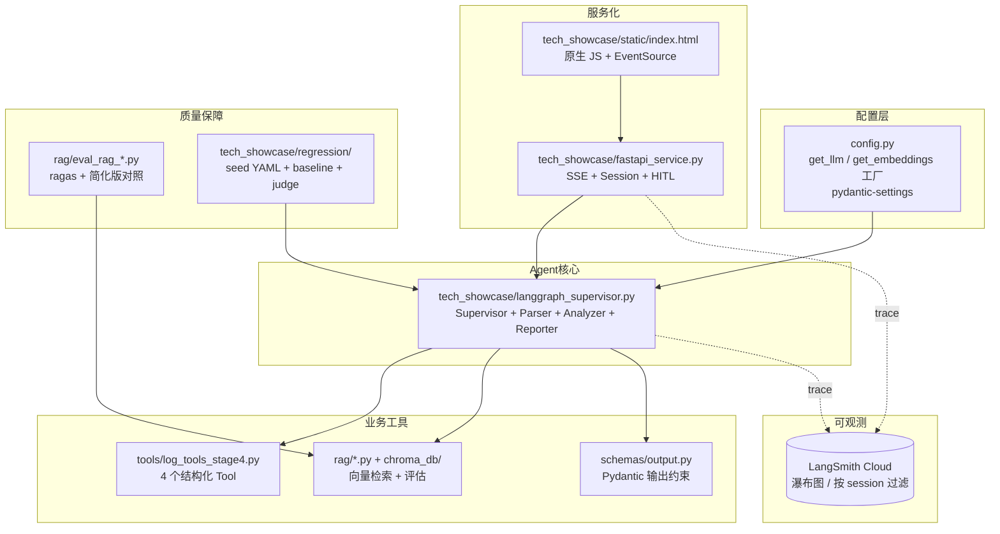
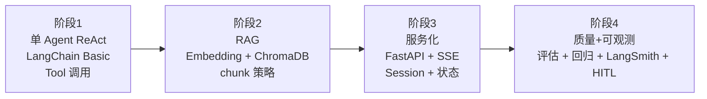

# 00 项目总结与知识图谱

> **一行定位** —— 5 年 Java 后端开发者，从零搭建一个完整可运行的 AI Agent 应用（LangChain + LangGraph + FastAPI + RAG + 评估 + 可观测 + HITL）的全过程总结。

---

## 一、项目简介

`java-to-agent` 不是一个业务项目，而是一份**学习+练兵工程**：

- **主线任务**：用日志分析（`logs/app.log`）作为业务背景，从最简单的 ReAct Agent 一路做到生产级的多 Agent + SSE 流式 + 评估体系 + HITL。
- **工程目标**：让一个 Java 后端开发者，在 3-4 周内把 AI Agent 工程化能力**拉到可以独立交付**的水平。
- **技术栈**：Python 3.11 + LangChain 1.x + LangGraph 1.x + FastAPI + ChromaDB + DashScope（阿里云百炼 qwen-plus）+ LangSmith。

如果你是一个 Java 开发者，想知道「AI Agent 到底值不值得学、Java 那一套东西能不能迁移过来、学了之后能干什么」，这份总结就是为你写的。

---

## 二、技术栈总览



每一层的作用：

- **配置层**：一个 `get_llm()` 工厂屏蔽 Ollama / DashScope / OpenAI 的差异，业务代码永远写 `llm = get_llm()`。和 Spring 的 `@ConditionalOnProperty` 是一回事。
- **业务工具**：Tool 是「LLM 能调用的函数」，Pydantic schema 是「LLM 必须按这个格式输出」。Java 类比：Service 方法 + `@Valid DTO`。
- **Agent 核心**：Supervisor 模式，一个「LLM 调度员」根据用户 query 动态路由到 3 个专家 Agent。本质上是 DispatcherServlet。
- **服务化**：FastAPI = Python 版的 Spring WebFlux，SSE = `SseEmitter`。浏览器端用原生 JS 直接读 stream。
- **质量保障**：向量检索质量用 ragas 评估，Prompt 改动用 seed YAML + baseline + LLM judge 做回归。
- **可观测**：LangSmith 就是 AI 世界的 Zipkin，瀑布图比打日志直观 10 倍。

---

## 三、已完成能力清单

下表每一项对应一份 milestone 文档，按时间线排列：

| # | 里程碑 | 一行价值 | 文档链接 |
|---|---|---|---|
| 01 | **项目归档** | 把散落的 7 个 `main_stageN.py` 归到 `legacy_learning/`，另做一份 `all_in_one.py` 作技术速查 | [01-legacy-archive.md](01-legacy-archive.md) |
| 02 | **Supervisor 多 Agent** | 从线性流水线升级为 LLM 动态路由的多 Agent，学到 LangGraph 最精髓的模式 | [02-supervisor-multi-agent.md](02-supervisor-multi-agent.md) |
| 03 | **DashScope Provider** | Ollama 内存不够跑，切阿里云百炼，顺便用工厂模式支持多 provider | [03-dashscope-provider.md](03-dashscope-provider.md) |
| 04 | **RAG 评估** | 接入 ragas 对照自制简化版，实锤 self-judgment bias（14% 系统性虚高） | [04-rag-evaluation.md](04-rag-evaluation.md) |
| 05 | **FastAPI + SSE** | CLI 包装成 HTTP 服务，SSE 节点级流式推送，踩 CRLF 和 RustBindingsAPI 两个大坑 | [05-fastapi-sse.md](05-fastapi-sse.md) |
| 06 | **Session 多轮对话** | 应用层 dict 实现滚动 5 轮对话上下文，Supervisor 学会「不重复回答」 | [06-session-memory.md](06-session-memory.md) |
| 07 | **LangSmith 可观测** | 所有 LLM/Tool 调用接入分布式追踪，瀑布图直接暴露 Supervisor 反复横跳 | [07-langsmith-observability.md](07-langsmith-observability.md) |
| 08 | **回归测试** | 8 条 seed YAML + baseline + LLM judge + Markdown 报告，Prompt 改动用数据说话 | [08-regression-testing.md](08-regression-testing.md) |
| 09 | **HITL Checkpointer** | 补齐 LangGraph 核心机制，Reporter 前人工确认，踩 astream chunk tuple 的坑 | [09-hitl-checkpointer.md](09-hitl-checkpointer.md) |

99 号文档是 [99-future-work.md](99-future-work.md)，列了所有 P2+ 候选和已知 bug。

---

## 四、Java 后端迁移路线建议（最值钱的一段）

这是本总结最核心的内容。如果你只看一节，看这一节。

### 4.1 哪些 Java 经验能直接用（迁移率 80% 以上）

| Java 技能 | AI Agent 里对应什么 | 迁移注意 |
|---|---|---|
| `@Transactional` 事务边界管理 | Agent 的 State 更新原子性 / Checkpointer 保存点 | 概念同构，细节不同（Agent 没有数据库那么强的 ACID） |
| 分布式追踪（Zipkin / SkyWalking） | **LangSmith**（直接同构） | 学曲线极低，3 小时上手 |
| `@Valid DTO` 入参校验 | Pydantic BaseModel + `with_structured_output` | Pydantic 是 Python 的 Bean Validation |
| 工厂模式 + 多实现切换 | `get_llm()` + provider switch | `pydantic-settings` ≈ `@ConfigurationProperties` |
| 单例 + double-checked locking | 向量数据库单例（Rust bindings 并发坑） | PyO3 的包对并发初始化不友好，必须单例化 |
| 幂等性设计 | Prompt 回归测试的 baseline 对比 | 从「请求幂等」升级为「模型行为幂等」 |
| `SseEmitter` / `Flux<ServerSentEvent>` | FastAPI + `EventSourceResponse` | 协议一致，浏览器端还是 EventSource |
| `@Async` 线程池 | `asyncio.to_thread()` | 概念一致，调度模型不同 |
| JUnit `@ParameterizedTest` | seed YAML + run_regression.py | 同构，多了一个「LLM judge」新评分维度 |
| Sentinel / 限流熔断 | LangGraph `recursion_limit` + Supervisor `MAX_LOOPS` | 防 Agent 死循环就是防雪崩 |

**核心观点**：**事务、幂等、追踪、熔断、限流这类 Java 老技能，在 Agent 场景不是过时，而是放大 10 倍价值**。因为 LLM 调用又贵又慢又不确定，工程纪律比任何时候都重要。

### 4.2 哪些要重新学（Java 里没有直接对应）

| 新概念 | Java 最接近的东西 | 但本质不同在哪 |
|---|---|---|
| **Prompt 工程** | 无 | 不是编程，更接近「用自然语言规定契约」 |
| **向量检索 / RAG** | Elasticsearch 全文检索 | 语义相似而非关键词匹配，相似度是浮点分数 |
| **Python asyncio** | CompletableFuture / Reactor | 单线程事件循环，不是多线程并发 |
| **LLM-as-a-Judge** | 无 | 用 AI 给 AI 打分，必须警惕 self-judgment bias |
| **Structured Output** | Jackson 反序列化 | Jackson 是解析**已经合法的 JSON**，structured output 是**强制 LLM 生成合法 JSON** |
| **ReAct 循环** | 无 | LLM 在「思考 → 调用 Tool → 观察结果 → 再思考」循环里跑，像人类 debug |

### 4.3 推荐学习顺序

分 4 个阶段，每阶段 1 周左右：



- **阶段 1（ReAct）**：先把「LLM 调用 Tool」这件事跑通，理解 ReAct 循环，不急着多 Agent。
- **阶段 2（RAG）**：学 embedding、chunk 策略、相似度检索。这里坑多（不同 provider 限制各异，见 03）。
- **阶段 3（服务化）**：把学到的东西装进 FastAPI，前端连上，体验从「跑一次就退出」到「真正能用」。
- **阶段 4（质量 + 可观测）**：这是 Java 老兵的优势区域，可以飞速拉开差距——把工程纪律直接搬过来。

---

## 五、3 个「啊哈时刻」

这是本项目最有教学价值的 3 个洞察，每个都值得单独讲半小时。

### 5.1 Self-Judgment Bias 实锤

同一数据集（`rag/eval_dataset.yaml` 5 条 sample）+ 同一 retrieval（sliding_window）：

| 指标 | 自制简化版 | ragas 官方 | 差值 |
|---|---|---|---|
| Context Recall | 1.00 | 1.00 | 0 |
| Faithfulness | 0.85 | 0.69 | **-0.16** |
| Answer Relevance | 0.97 | 0.71 | **-0.26** |
| 综合 | 0.94 | 0.80 | **-0.14** |

**结论**：自己写的评估逻辑（让 LLM 自己给自己打分）比 ragas 严谨算法**系统性虚高 14%**。

**教训**：评估体系必须用业界标准框架（ragas、deepeval、OpenAI Evals），自己拍脑袋写的分数不可信。放到 Java 世界里，这相当于「自己写 JUnit 断言，和用 AssertJ/Hamcrest 标准库断言」的差距——但在 AI 场景更严重，因为断言逻辑本身就是 LLM 跑的。

### 5.2 Supervisor 会「变聪明」

多轮对话测试中，连续 5 轮问相同问题「今天有多少 ERROR？」：

- 第 1 轮：Supervisor → Parser → Supervisor → END（正常）
- 第 2 轮：Supervisor → Parser → Supervisor → END（仍调 Parser 确认）
- 第 3 轮：Supervisor → Parser → Supervisor → END
- 第 4 轮：Supervisor → END（**直接结束，不调 Parser**！）
- 第 5 轮：Supervisor → END

**根因**：`conversation_history` 里已有 4 条相同 Q&A，prompt 里「不必重复已答过的内容」规则生效，LLM 判断「用户就是在重复问，直接回答即可」。

**教训**：**在 LangGraph 里，Prompt 是真正的「代码」**。一条自然语言规则改变整个执行流。这对 Java 开发者最反直觉——代码逻辑由一句中文自然语言决定。但这也是 Agent 的威力。

### 5.3 Trace 比 Log 多看到 10x

第 2 轮「那 Payment 呢？」的 CLI 日志：

```
[Supervisor] 路由到 parser
[Parser] 产出：Payment 相关错误 3 条
[Supervisor] 路由到 END
[最终报告] Payment 服务报错 3 次...
```

**看起来一切正常**。但 LangSmith 瀑布图显示：

```
Supervisor (500ms) → next=analyzer  ← 第 1 次决策错了
  Analyzer (1.2s) → 没有 Payment 数据
Supervisor (400ms) → next=parser    ← 回退重新决策
  Parser (2.1s) → 查到 3 条
Supervisor (300ms) → next=END
```

**真相**：Supervisor 第一次决策直接跳过 Parser 调 Analyzer（错了），失败后回退再调 Parser。

**教训**：CLI 日志只能看到最终结果，LangSmith 瀑布图把「反复横跳」暴露无遗。**Trace 比 Log 值钱 10 倍**。这是从 Java 世界直接迁移过来的 Zipkin 经验，在 AI 场景价值放大。

---

## 六、项目能力水平自评

按行业通用等级：

- **初级（L1）**：能用 LangChain 跑通 ReAct Agent，调用 OpenAI API ❌ 已远超
- **中级（L2）**：能搭建 RAG、做 Prompt 工程、理解 LangGraph 基础 ✅ 完全覆盖
- **中高级（L3）**：能独立设计多 Agent 架构、接入评估体系、做服务化 ✅ 本项目水平
- **高级（L4）**：深度 Prompt 工程、微调、自定义评估、生产级优化 ❌ 需要进一步投入
- **资深（L5）**：能设计 Agent 框架本身（LangChain 核心贡献者级） ❌ 非目标

**综合判断**：**入门偏进阶，能独立交付中等规模 Agent 产品**。下一步拉高的方向：Prompt 工程深度、模型微调、成本优化、生产级 SRE。

---

## 七、时间投入估算

| 阶段 | 投入（含学习 + 代码 + 调试） |
|---|---|
| 01 归档 | 半天 |
| 02 Supervisor | 2-3 天 |
| 03 Provider 切换 | 1 天（含踩 4 个坑） |
| 04 RAG 评估 | 1-2 天 |
| 05 FastAPI + SSE | 2-3 天（CRLF 坑占半天） |
| 06 Session | 1 天 |
| 07 LangSmith | 0.5 天 |
| 08 回归测试 | 1-2 天 |
| 09 HITL | 1-2 天（astream chunk 坑占半天） |
| **合计** | **约 3-4 周**（含阅读代码和学习材料） |

如果你是 Java 老兵，有 FastAPI / async 基础，能再砍 30%。如果完全零基础 Python，估计 5-6 周。

---

## 八、给 Java 后端同行的 5 条建议

### 建议 1：用 LLM 取代「写不出 if-else」的地方，别用 LLM 做确定性任务

**反模式**：让 LLM 去算「用户余额是否 > 100」。这是结构化任务，写 Java 代码就行。

**正模式**：让 LLM 判断「这段用户投诉是抱怨产品质量还是物流速度」。这是「我没法穷举 if-else」的模糊分类任务。

Tool 就是 Java 代码，LLM 是 Router。**分工清楚**才是 Agent 正确的打开方式。

### 建议 2：分布式追踪这类 Java 老技能，在 Agent 场景放大 10 倍价值

Zipkin 在 Java 微服务里是「锦上添花」，在 Agent 里是「没它就瞎」。LLM 调用贵、慢、不确定，没 trace 等于盲调试。接 LangSmith 3 小时，省后面 3 周时间。

### 建议 3：事务/锁/幂等这类硬功夫，直接对应 Agent 可靠性工程

- 「Supervisor 死循环」= 无限递归 → `recursion_limit` 兜底
- 「并发初始化 RustBindings 报错」= 并发坑 → 单例 + 锁
- 「Prompt 改动不小心搞坏其他 case」= 回归问题 → seed YAML + baseline
- 「用户确认后才执行」= 两阶段提交 → Checkpointer + interrupt_before

**所有 Java 可靠性工程的经验，都在 AI Agent 里找到了对应的坑**。

### 建议 4：先做评估体系再调 Prompt，否则改动等于拍脑袋

这是最容易犯的错。初学者上来就改 Prompt、看一两个 case 效果、以为变好了。

**正确顺序**：

1. 写 seed 数据集（10-30 条 case）
2. 跑 baseline 存下来
3. 改 Prompt
4. 再跑，看所有 case 的 diff，不是看一个 case

没评估体系的 Prompt 调优就是走一步退两步。本项目 08 号 milestone 的全部意义就在这。

### 建议 5：工厂模式 + 环境变量切 provider，是 AI 基建工程师的日常

一个完整的 Agent 项目，会在以下维度频繁切换：

- LLM 提供商（OpenAI vs 百炼 vs Anthropic vs 本地 Ollama）
- Embedding 提供商（可能和 LLM 不同家）
- Vector Store（Chroma 本地 vs Pinecone 云 vs Qdrant）
- Observability（LangSmith vs Phoenix vs 自建）

**把这些都抽到工厂 + env，是 Day 1 就该做的事**。不是「以后再重构」，是「第一行业务代码之前就定好」。参考 `config.py:55-120` 的 `get_llm()` / `get_embeddings()`。

---

## 九、附：关键术语速查

| 术语 | 一句话解释 | Java 类比 |
|---|---|---|
| **Agent** | 能自主调用 Tool 完成任务的 LLM | 一个自主调用 Service 方法的 AI-Controller |
| **Tool** | LLM 能通过函数调用执行的代码 | Service 方法 |
| **ReAct** | Reason + Act 循环：思考→调用→观察→再思考 | 无直接对应，最接近「递归式 debug」 |
| **State** | LangGraph 里 Agent 间流转的上下文 | 请求上下文 / ThreadLocal |
| **Checkpointer** | State 持久化机制，支持中断/恢复 | Spring Batch 的 JobExecutionContext |
| **Supervisor** | 负责调度专家 Agent 的 LLM 决策节点 | DispatcherServlet |
| **RAG** | Retrieval-Augmented Generation，检索增强 | Elasticsearch + LLM 后处理 |
| **Embedding** | 把文本变成向量的模型 | 无，是 AI 独有能力 |
| **SSE** | Server-Sent Events，单向流式推送 | `SseEmitter` / `Flux<ServerSentEvent>` |
| **HITL** | Human-in-the-loop，执行中需人工确认 | Activiti UserTask 审批节点 |
| **Prompt** | 发给 LLM 的指令文本 | 配置 + 代码的混合体（最奇特的概念） |

---

## 十、学习资料总索引

优先阅读（对 Java 开发者最友好）：

- [LangChain 官方文档](https://python.langchain.com/docs/introduction/)
- [LangGraph 官方教程](https://langchain-ai.github.io/langgraph/tutorials/introduction/)
- [FastAPI 官方教程](https://fastapi.tiangolo.com/tutorial/)
- [LangSmith Quickstart](https://docs.smith.langchain.com/)

进阶：

- [RAGAS 评估框架](https://docs.ragas.io/)
- [Pydantic 文档](https://docs.pydantic.dev/latest/)
- [阿里云百炼开发指南](https://help.aliyun.com/zh/dashscope/)

思想类：

- [Judging LLM-as-a-Judge 论文](https://arxiv.org/abs/2306.05685)
- [Anthropic: Building Effective Agents](https://www.anthropic.com/research/building-effective-agents)
- [Andrej Karpathy: Software 2.0](https://karpathy.medium.com/software-2-0-a64152b37c35)

---

## 十一、下一步

继续看 [01-legacy-archive.md](01-legacy-archive.md) 了解项目归档；或直接跳到 [02-supervisor-multi-agent.md](02-supervisor-multi-agent.md) 看架构精髓。

后续可做清单见 [99-future-work.md](99-future-work.md)。
