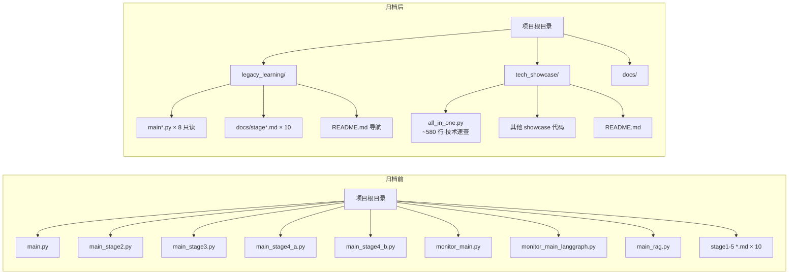

# 01 项目归档（Legacy Archive）

> **一行定位** —— 把学习阶段散落的 7 个 `main_stageN.py` 迁移到 `legacy_learning/` 只读归档，另建 `tech_showcase/all_in_one.py` 作为单文件技术速查表。

---

## 背景（Context）

学习过程中按阶段产出了多个入口脚本，随着阶段积累，问题开始暴露：

- **入口散乱**：`main.py`、`main_stage2.py`、`main_stage3.py`、`main_stage4_a.py`、`main_stage4_b.py`、`monitor_main.py`、`monitor_main_langgraph.py`、`main_rag.py`——7 个脚本散在根目录。
- **想查某技术点要在多文件间跳**：想看 Tool 怎么写、ReAct 怎么跑、RAG 怎么检索——得分别打开不同 main 文件。
- **没有清晰的「已学会 / 在开发」边界**：新同事（或未来的自己）第一次看这个项目，不知道哪些是成品、哪些是练习稿。
- **仓库根目录混乱**：根目录堆了 10+ 个 `.py` + 10+ 个 `.md`，看起来像个半成品仓库而不是学习项目。

归档不是「把代码藏起来」，而是**建立秩序**：学习产物是资产，需要被检索、被复用、但不应该挡道。

---

## 架构图



---

## 设计决策

### 1. 单文件 vs 多文件：`all_in_one.py` 选单文件

**选项对比**：

- **选项 A**：拆成 `section1_basic.py`、`section2_react.py`、...（模块化清晰）
- **选项 B**：一个大文件 `all_in_one.py`，内部分节
- **选项 C**：保持多个 `main_stageN.py` 不动

**最终选 B**，理由：

- 学习回顾场景的核心诉求是**快速 Ctrl+F 定位**。「怎么初始化 LangChain agent」「RAG 检索怎么写」——这种查询在一个文件里 Ctrl+F 2 秒搞定，跨文件 Grep 要想半天用什么关键字。
- 按编号分段（§1 §2 §3）+ 注释标题块，视觉上像一本速查手册。
- 避免「为了模块化而制造耦合」——每节代码基本独立，硬拆反而引入无谓的 import 路径。

**适用边界**：这个决策只适合「学习归档」场景。真正的业务代码必须模块化。

### 2. 按编号分段对齐原来的 stage 命名

`all_in_one.py` 内部用 `# ==================== §1 XXX ====================` 分节，编号和原来的 `main_stage1/2/3/4/5` 对应。这样：

- 老代码的历史记忆能直接挂上去。
- 新人看的时候有「线性学习曲线」的暗示。

### 3. 每段内部各自 import（而不是顶部集中 import）

```python
def section_4b():
    import langchain
    from langchain_community.vectorstores import Chroma
    # ... 该段业务代码
```

**原因**：支持 `python all_in_one.py --section 4b` 命令行参数只跑某一段。如果 import 集中顶部，即使只跑 §1 也要加载 Chroma 这种重包（~2 秒启动）。

这是一个很「Pythonic」但 Java 开发者可能觉得反直觉的做法：**import 的副作用（加载）也要管理**。

### 4. 用 `git mv` 迁移以保留历史

所有 tracked 文件用 `git mv` 迁移，这样：

- `git log --follow legacy_learning/main_stage4_a.py` 还能追到原 `main_stage4_a.py` 的完整历史。
- Code Review 时 diff 显示为 rename（不是 delete + create），review 负担低。

### 5. 归档目录分工

| 目录 | 用途 | 是否 tracked |
|---|---|---|
| `legacy_learning/` | 只读归档，旧 main 脚本 + 旧讲解 md | 是 |
| `tech_showcase/` | 在开发的成品代码 | 是 |
| `docs/` | 新产出的讲解文档（如本 milestones 系列） | 是 |
| `chroma_db/` | 向量数据库持久化，运行时生成 | 否（.gitignore） |
| `__pycache__/` | Python 字节码 | 否 |

---

## 核心代码

### 文件清单

| 文件 | 改动 | 说明 |
|---|---|---|
| `tech_showcase/all_in_one.py` | 新建 | 约 580 行，7 个 section 压到一个文件 |
| `tech_showcase/README.md` | 新建 | 作为 showcase 入口导航 |
| `legacy_learning/README.md` | 新建 | 说明这是只读归档，指向 tech_showcase |
| `legacy_learning/main*.py` | git mv | 8 个旧入口脚本迁移 |
| `legacy_learning/docs/stage*.md` | git mv | 10 份阶段讲解迁移 |
| 根目录 | 清理 | 只剩 `config.py`、`schemas/`、`tools/`、`rag/` 等业务包 |

### 关键片段 1：`all_in_one.py` 的分段结构

```python
# tech_showcase/all_in_one.py
"""
AI Agent 学习技术速查（Technical Showcase）

使用方式:
    python all_in_one.py --section 1       # 跑 LangChain 基础
    python all_in_one.py --section 4b      # 跑 ReAct Agent
    python all_in_one.py --list            # 列出所有 section

分段索引:
    §1  LangChain 基础调用
    §2  PromptTemplate + Output Parser
    §3  Tool 定义与注册
    §4a ReAct 手动实现（ADVICE: 仅教学）
    §4b ReAct 标准实现（create_agent）
    §5  LangGraph 线性流水线（日志告警）
    §6  RAG 向量检索
    §7  Evaluation 评估脚本入口
"""

import argparse

def section_1_langchain_basic():
    """§1 LangChain 基础：LLM + PromptTemplate + Chain"""
    from langchain_core.prompts import ChatPromptTemplate
    from config import get_llm
    # ...

def section_4b_react_agent():
    """§4b ReAct Agent 标准实现（create_agent）"""
    from langchain.agents import create_agent
    from tools.log_tools_stage4 import get_error_logs_structured
    # ...

SECTIONS = {
    "1":  section_1_langchain_basic,
    "2":  section_2_prompt_template,
    "3":  section_3_tools,
    "4a": section_4a_react_manual,
    "4b": section_4b_react_agent,
    "5":  section_5_langgraph_linear,
    "6":  section_6_rag,
    "7":  section_7_eval,
}

def main():
    parser = argparse.ArgumentParser()
    parser.add_argument("--section", required=False, help="要运行的段（如 4b）")
    parser.add_argument("--list", action="store_true", help="列出所有段")
    args = parser.parse_args()

    if args.list:
        for key in SECTIONS:
            print(f"§{key}: {SECTIONS[key].__doc__.strip().splitlines()[0]}")
        return

    if args.section not in SECTIONS:
        raise SystemExit(f"未知段: {args.section}（可用：{list(SECTIONS.keys())}）")

    SECTIONS[args.section]()

if __name__ == "__main__":
    main()
```

**解读**：

- 用 dict 做 section 索引，等价于 Java 的 `Map<String, Runnable>`，加新段只改 `SECTIONS`。
- `import` 放函数内，支持「只跑某段时不加载其他段的依赖」。
- `__doc__` 是 Python 函数的第一个字符串字面量，`--list` 时打印作为简介。

### 关键片段 2：`legacy_learning/README.md` 导航结构

```markdown
# Legacy Learning（学习归档）

> ⚠️ 此目录为**只读归档**。新代码请到 `tech_showcase/` 或其他业务目录。
> 保留目的：追溯历史、复盘思路、git log --follow 可查。

## 学习阶段索引

| 阶段 | 主题 | 入口 | 讲解 |
|---|---|---|---|
| Stage 1 | LangChain 基础 | main.py | docs/stage1_explanation.md |
| Stage 2 | PromptTemplate + Parser | main_stage2.py | docs/stage2_explanation.md |
| Stage 3 | Tool 定义与 Chain 调用 | main_stage3.py | docs/stage3_explanation.md |
| Stage 4a | ReAct 手动实现 | main_stage4_a.py | docs/stage4_plan.md |
| Stage 4b | ReAct 标准（create_agent） | main_stage4_b.py | docs/stage4_plan.md |
| Stage 5 | LangGraph 线性流水线 | monitor_main_langgraph.py | docs/stage5_langgraph_*.md |
| RAG | 向量检索初版 | main_rag.py | docs/rag_explanation.md |

## 不建议再跑的脚本

部分脚本硬编码了 ChatOllama，切换到 DashScope 后已跑不起来。
改过的等价代码在 `tech_showcase/all_in_one.py` 对应 §。
```

**解读**：README 明说「只读」，新人不会误会这里是当前代码。

---

## 踩过的坑

### 坑 1：`main_rag.py` 是 untracked 文件，`git mv` 会报错

- **症状**：`git mv main_rag.py legacy_learning/` 报 `fatal: bad source, source=main_rag.py, destination=legacy_learning/main_rag.py`。
- **根因**：`git mv` 底层是 `git rm --cached + 物理 mv + git add`，第一步 rm 需要文件已 tracked。`main_rag.py` 还没 commit。
- **修复**：分情况处理：
  ```bash
  # tracked 文件用 git mv
  git mv main.py main_stage2.py main_stage3.py main_stage4_a.py main_stage4_b.py \
         monitor_main.py monitor_main_langgraph.py \
         legacy_learning/

  # untracked 文件用普通 mv
  mv main_rag.py legacy_learning/
  ```
- **教训**：`git status` 先看清哪些 tracked、哪些 untracked，再选工具。跟 Java 世界的「先 compile 再 refactor」是一个道理。

### 坑 2：中文文件名 `向量数据简介.md` 在 `git ls-files` 里查不到

- **症状**：`git ls-files 向量数据简介.md` 返回空；Shell 里用 Tab 补全正常显示。
- **根因**：macOS HFS+ 用 **NFD（分解形式）Unicode**，Git 索引用 **NFC（组合形式）**。`向量` 在 macOS 里实际存为「向(U+5411)」+「量(U+91CF)」的 NFC，但某些工具从剪贴板粘贴过来会变 NFD（组合字符），两种字节序列不同。
- **修复**：这个文件凑巧是 untracked（还没被索引），直接 `mv` 迁移：
  ```bash
  mv 向量数据简介.md legacy_learning/docs/
  git add legacy_learning/docs/向量数据简介.md
  ```
- **教训**：跨平台项目避免中文文件名（或全部写 `.gitattributes` 强制 NFC）。这个坑 Java 项目不太遇到（Java 文件名几乎全 ASCII），AI 学习项目因为中文注释多反而常见。

### 坑 3：归档后 `all_in_one.py` import 路径断裂

- **症状**：`from tools.log_tools_stage4 import xxx` 在 `tech_showcase/all_in_one.py` 里报 `ModuleNotFoundError`。
- **根因**：迁移后运行目录变了，Python 默认 `sys.path` 不包含项目根。
- **修复**：从项目根运行，或在 `all_in_one.py` 顶部加：
  ```python
  import sys
  from pathlib import Path
  sys.path.insert(0, str(Path(__file__).parent.parent))
  ```
- **教训**：Python 模块路径比 Java classpath 脆弱得多。正式项目用 `pyproject.toml` + `pip install -e .` 把项目注册为 package，才是根治。

---

## 验证方法

```bash
# 1. 确认迁移后历史可追溯
git log --follow legacy_learning/main_stage4_b.py
# 应该看到从 main_stage4_b.py 时代开始的完整提交历史

# 2. 确认 all_in_one 可跑（以 §4b ReAct 为例）
cd /Users/photonpay/java-to-agent
python tech_showcase/all_in_one.py --list
python tech_showcase/all_in_one.py --section 4b

# 3. 确认根目录变干净
ls *.py
# 期望输出：config.py（业务包 __init__.py 在子目录里）
```

---

## Java 类比速查

| AI Agent 概念 | Java 世界 |
|---|---|
| `all_in_one.py` 单文件速查 | Spring Cheat Sheet PDF |
| `legacy_learning/` 归档 | 旧项目 archive 到独立 Git repo |
| §1 §2 编号分段 | Java 练习册的章节编号 |
| 函数内 import | 无直接对应（Java import 只能类顶） |
| `git mv` 保留历史 | IntelliJ Refactor > Rename（底层也是 git mv） |
| `pyproject.toml` + `pip install -e .` | `pom.xml` + `mvn install` |

---

## 学习资料

- [git-mv 官方文档（保留历史的最佳实践）](https://git-scm.com/docs/git-mv)
- [Monorepo vs Polyrepo 对比](https://monorepo.tools/)
- [Python argparse 教程（CLI 参数处理）](https://docs.python.org/3/howto/argparse.html)
- [Python 模块与包](https://docs.python.org/3/tutorial/modules.html#packages)
- [Unicode NFC/NFD 差异（macOS 文件名坑）](https://www.unicode.org/reports/tr15/)

---

## 已知限制 / 后续可改

- **`all_in_one.py` 仍未真正「能一键全跑」**：部分段依赖本地资源（向量库、日志文件）还要先 bootstrap。建议补一个 `python all_in_one.py --bootstrap` 把依赖也建好。
- **中文文件名遗留风险**：`legacy_learning/docs/向量数据简介.md` 仍用中文，如果未来 push 到 CI（Linux）可能出问题。改成拼音或英文更稳。
- **归档后未建立「禁写」机制**：目前纯靠 README 约定。可以加一个 pre-commit hook，禁止在 `legacy_learning/` 下提交新改动。

后续可改项汇总见 [99-future-work.md](99-future-work.md)。
