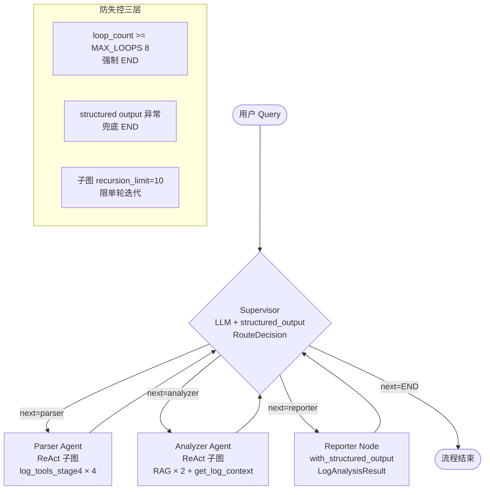

# 02 Supervisor 多 Agent 架构

> **一行定位** —— 从「线性流水线」升级为 LangGraph Supervisor 模式：一个 LLM 调度员动态路由到 3 个专家 Agent（Parser / Analyzer / Reporter），循环直到任务完成。

---

## 背景（Context）

在 02 之前，项目使用 LangGraph 的姿势还非常初级：

- **Stage 5 的 `monitor_main_langgraph.py`** 只是把 4 个节点（read → detect → analyze → send）串成一条直线，本质是用 LangGraph 写了个 DAG。
- **节点间没有「决策」**，就是线性的 `A → B → C → D → END`。和用 Java 的 `if/else/try` 写没区别。
- **没体现 LangGraph 真正的价值**——多 Agent 协作、LLM 动态路由、循环工作流。

目标：学到 LangGraph 最精髓的 **Supervisor 模式**：

- 一个 LLM 节点（Supervisor）看当前状态，**用自然语言决定**下一步路由。
- 多个专家 Agent 各司其职（Parser 拆日志、Analyzer 查 RAG、Reporter 生成报告）。
- 循环路由：每个专家 Agent 跑完都回到 Supervisor，由 Supervisor 再决定下一步。
- 有终止条件（既能回答完 END，也能防死循环强制 END）。

这个模式一通百通，改成业务场景就是「订单处理 supervisor + 信息收集 agent + 风控 agent + 放款 agent」。

---

## 架构图



---

## 设计决策

### 1. 3 个专家 Agent 都是 `create_agent` ReAct 子图（Reporter 例外）

**选项对比**：

- **A. 每个专家都是 ReAct Agent**（LLM + Tool 循环）
- **B. 每个专家都是普通 Node**（纯代码 + 一次 LLM 调用）
- **C. 混合**：Parser / Analyzer 要工具调用，用 ReAct；Reporter 只需格式化输出，用 `with_structured_output`。

**最终选 C**，理由：

- Parser 需要查不同类型的日志（ERROR / WARN / 按时间 / 按服务），不同 query 要调不同 Tool，天然适合 ReAct 让 LLM 自己选工具。
- Analyzer 需要 RAG 检索 + 上下文拉取，也需要 LLM 选择查什么。
- Reporter 任务是「把前面的信息整理成结构化报告」——**不需要调 Tool**，直接一次 `with_structured_output(LogAnalysisResult)` 搞定，更快更便宜。

**Tool 分工**：

| Agent | Tool 集 |
|---|---|
| Parser | `get_error_logs_structured` / `get_warn_logs_structured` / `get_logs_by_time_range` / `get_logs_by_service` |
| Analyzer | `search_error_patterns` / `search_service_issues`（RAG）+ `get_log_context` |
| Reporter | 无 Tool（`with_structured_output`） |

### 2. 用 `langchain.agents.create_agent`，不用已废弃的 `langgraph.prebuilt.create_react_agent`

LangGraph V1.0 大改，旧 API `from langgraph.prebuilt import create_react_agent` 被标记 deprecated，新 API 在 `langchain` 包里：

```python
# 旧（已废弃）
from langgraph.prebuilt import create_react_agent
agent = create_react_agent(llm, tools, prompt="你是日志解析专家")

# 新
from langchain.agents import create_agent
agent = create_agent(model=llm, tools=tools, system_prompt="你是日志解析专家")
```

关键参数变化：

- `llm` → `model`
- `prompt` → `system_prompt`

**陷阱**：两个包都还能 import，但行为略有差异，新项目无脑用新 API。

### 3. Supervisor 用 LLM + `RouteDecision`（Pydantic + Literal）强约束

核心技巧：让 Supervisor 的 LLM 产出**严格枚举值**而不是自由文本，否则路由判断要做一堆字符串匹配，脆弱。

```python
from typing import Literal
from pydantic import BaseModel, Field

class RouteDecision(BaseModel):
    """Supervisor 的路由决策"""
    next: Literal["parser", "analyzer", "reporter", "END"] = Field(
        description="下一步路由目标。parser=拆日志；analyzer=根因分析；reporter=结构化报告；END=结束"
    )
    reason: str = Field(description="一句话说明为什么这么路由")

# 使用
structured_llm = llm.with_structured_output(RouteDecision)
decision = structured_llm.invoke(messages)  # 类型上就是 RouteDecision 实例
```

**好处**：

- `decision.next` 肯定是 4 个字符串之一（Pydantic 会做 validate，不合规自动报错）。
- `decision.reason` 可以写进日志或注入 LangSmith metadata，事后 debug 极有用。

**为什么选 qwen-plus 够用**：测试下来 qwen-plus 的 structured output 稳定性很高（> 99%）；qwen2.5:7b（本地 Ollama）在相同 prompt 下偶发返回非 JSON 导致 validate 失败，所以切到 DashScope（见 03）。

### 4. 防失控三层兜底

**为什么需要**：LLM 做路由决策是概率行为，可能陷入「Parser → Supervisor → Parser → ...」死循环，也可能因为网络/解析错误崩在中间。Java 世界里无限递归会 StackOverflow，这里虽然不会栈溢出，但会无限烧 Token。

三层保险：

1. **`loop_count >= MAX_LOOPS(8)` 强制 END**：Supervisor 状态里记录路由次数，8 次后无论 LLM 说什么都 END。8 是实测数字（正常 2-4 轮收敛，留一倍冗余）。
2. **structured output 异常兜底 END**：
   ```python
   try:
       decision = structured_llm.invoke(msgs)
   except Exception as e:
       logger.warning(f"Supervisor structured_output 失败，兜底 END: {e}")
       return {"next_agent": "END", "loop_count": loop_count + 1}
   ```
3. **子图 `recursion_limit=10`**：每个 ReAct 子图内部循环（思考→调用→观察）也限 10 次，防止单个专家 Agent 自己死循环。

### 5. 单文件 ~450 行，延续 `all_in_one.py` 风格

尽管业务复杂度明显上升，仍坚持**单文件**：

- Supervisor 代码是学习材料，阅读/修改/复盘便利性 > 模块化清晰。
- 每个 Agent 的工厂函数（`build_parser_agent()` / `build_analyzer_agent()` / `build_reporter_node()`）在一个文件里，上下文压缩度好。
- 450 行仍在「一屏可浏览」的范围内。

真正上生产才拆成 `agents/parser.py` / `agents/analyzer.py` / `graph.py`。学习阶段先不过度设计。

### 6. `SupervisorState` 用 `Annotated[List[str], add]` 累加消息

```python
from typing import Annotated, TypedDict
from operator import add

class SupervisorState(TypedDict):
    query: str                              # 用户原始 query
    next_agent: str                         # Supervisor 决策结果
    agent_outputs: Annotated[List[str], add]  # 各 Agent 产出累加
    loop_count: int                         # 路由轮次
    final_report: Optional[LogAnalysisResult]
    # 06 引入：
    conversation_history: str
```

**关键技巧 `Annotated[List[str], add]`**：LangGraph 会用 `add` reducer 把新值**拼接到原 list**，而不是覆盖。如果用普通 `List[str]`，Parser 产出会覆盖 Analyzer 产出。

这是 LangGraph State 最容易踩的坑——默认是 overwrite，想累加必须显式标注 reducer。

---

## 核心代码

### 文件清单

| 文件 | 改动 | 关键函数 |
|---|---|---|
| `tech_showcase/langgraph_supervisor.py` | 新建 ~450 行 | `SupervisorState`、`supervisor_node`、`build_supervisor_graph`、3 个 Agent 工厂 |
| `schemas/output.py` | 复用 | `LogAnalysisResult` Pydantic 模型 |
| `tools/log_tools_stage4.py` | 复用 | 4 个结构化 Tool |
| `rag/log_retriever.py` | 复用 | RAG Tool |

### 关键片段 1：SupervisorState 定义（State 就是请求上下文）

```python
from typing import Annotated, List, Optional, TypedDict
from operator import add
from schemas.output import LogAnalysisResult

class SupervisorState(TypedDict):
    """多 Agent 共享状态。
    注意 agent_outputs 用 Annotated[..., add] 做累加 reducer，
    不然后面的 Agent 产出会覆盖前面的。
    """
    query: str
    next_agent: str
    agent_outputs: Annotated[List[str], add]
    loop_count: int
    final_report: Optional[LogAnalysisResult]
    conversation_history: str  # 06 session memory 引入
```

**解读**：
- `TypedDict` 是 Python 的「弱类型 DTO」——运行时就是普通 dict，但静态分析器（mypy / Pyright）会按字段校验。
- `Annotated[List[str], add]` 的 `add` 来自 `operator.add`，就是 `a + b`。LangGraph 看到这个 annotation 就知道「State 里这个字段要 merge 不要覆盖」。Java 开发者可以类比成 `@Builder(toBuilder=true)` 的合并语义。

### 关键片段 2：`supervisor_node` LLM 决策 + 兜底

```python
from langchain_core.messages import HumanMessage, SystemMessage

SUPERVISOR_SYSTEM = """你是日志分析多 Agent 工作流的 Supervisor。

你能调度 3 个专家：
- parser：从 app.log 提取结构化数据（错误次数/服务名/时间段等）
- analyzer：基于已提取的数据做根因分析，会查 RAG 知识库
- reporter：把前面的信息整理成结构化报告

决策规则：
1. 如果还没有原始数据（agent_outputs 里没有 parser 的产出），先 parser
2. 如果 query 要求「为什么」「根因」「根据知识库」这类，需要 analyzer
3. 如果 query 要求「报告」「总结」「结构化输出」，最后 reporter
4. 如果已有足够信息回答，直接 END（不必重复已答过的内容）
5. loop_count 超过 5 务必结束
"""

def supervisor_node(state: SupervisorState) -> dict:
    loop_count = state.get("loop_count", 0) + 1

    # 第一层防失控：强制熔断
    if loop_count > MAX_LOOPS:
        logger.warning(f"Supervisor 达到最大轮次 {MAX_LOOPS}，强制 END")
        return {"next_agent": "END", "loop_count": loop_count}

    # 构造决策上下文
    user_msg = f"""用户 query: {state['query']}

已有 Agent 产出（按时间顺序）:
{_format_outputs(state.get('agent_outputs', []))}

{_build_history_section(state.get('conversation_history', ''))}

请输出下一步路由决策。"""

    structured_llm = get_llm().with_structured_output(RouteDecision)

    # 第二层防失控：结构化输出异常兜底
    try:
        decision = structured_llm.invoke([
            SystemMessage(content=SUPERVISOR_SYSTEM),
            HumanMessage(content=user_msg),
        ])
    except Exception as e:
        logger.error(f"Supervisor LLM 失败兜底 END: {e}")
        return {"next_agent": "END", "loop_count": loop_count}

    logger.info(f"[Supervisor #{loop_count}] next={decision.next} reason={decision.reason}")
    return {"next_agent": decision.next, "loop_count": loop_count}
```

**解读**：
- Supervisor 是一个节点，输入完整 State，输出 **只返回要更新的字段**（`next_agent`、`loop_count`），LangGraph 会自动 merge。
- 两层 try 兜底 + 一层 loop_count 熔断，三层并行防失控。
- 日志里打 `decision.reason` 极有价值——事后复盘时能直接看到「Supervisor 为什么选 parser」。

### 关键片段 3：`build_supervisor_graph` 建图

```python
from langgraph.graph import StateGraph, END

def build_supervisor_graph(checkpointer=None, interrupt_before=None):
    """构建 Supervisor 子图。

    Args:
        checkpointer: 09 HITL 时注入，默认 None（单轮无状态）
        interrupt_before: 09 HITL 时指定 ["reporter"]
    """
    graph = StateGraph(SupervisorState)

    # 注册节点
    graph.add_node("supervisor", supervisor_node)
    graph.add_node("parser", build_parser_agent())
    graph.add_node("analyzer", build_analyzer_agent())
    graph.add_node("reporter", build_reporter_node())

    # 入口：supervisor
    graph.set_entry_point("supervisor")

    # supervisor → 条件路由
    def route(state: SupervisorState):
        next_agent = state.get("next_agent", "END")
        return next_agent if next_agent != "END" else END

    graph.add_conditional_edges(
        "supervisor",
        route,
        {
            "parser": "parser",
            "analyzer": "analyzer",
            "reporter": "reporter",
            END: END,
        },
    )

    # 每个专家跑完回到 supervisor
    graph.add_edge("parser", "supervisor")
    graph.add_edge("analyzer", "supervisor")
    graph.add_edge("reporter", "supervisor")

    return graph.compile(
        checkpointer=checkpointer,
        interrupt_before=interrupt_before or [],
    )
```

**解读**：
- `add_conditional_edges` 是 LangGraph 的条件边，等价于 Spring Cloud Gateway 的路由规则。
- 每个专家 Agent 固定回到 Supervisor，形成「星形」拓扑，Supervisor 是唯一的调度中枢。
- `compile()` 返回一个 Runnable，之后 `compiled.invoke(state)` / `compiled.astream(state)` 就能跑图。
- `checkpointer=None` / `interrupt_before=None` 默认参数支持：CLI 场景无状态，FastAPI HITL 场景再传入（见 09）。

---

## 踩过的坑

### 坑 1：LangGraph V1.0 `create_react_agent` 已废弃

- **症状**：`from langgraph.prebuilt import create_react_agent` 启动时 `DeprecationWarning`；部分版本直接 import 不到。
- **根因**：LangGraph V1.0 把 prebuilt Agent 工厂迁到了 `langchain.agents`，`prompt` 参数改名 `system_prompt`。
- **修复**：
  ```python
  # Before
  from langgraph.prebuilt import create_react_agent
  parser = create_react_agent(llm, tools, prompt="你是...")

  # After
  from langchain.agents import create_agent
  parser = create_agent(model=llm, tools=tools, system_prompt="你是...")
  ```
- **教训**：LangGraph 1.x 是个大版本跃迁，旧教程（2024 年早期写的）几乎全需要重写。学新东西优先看官方文档的 **date** 字段。

### 坑 2：Ollama qwen2.5:7b 跑不动结构化输出

- **症状**：`structured_llm.invoke()` 偶发 `llama runner process has terminated: exit status 1`，跑 5-10 次必炸一次。
- **根因**：本地 Ollama 7B 模型在 `with_structured_output` 场景下内存+显存压力大（要同时持有原始推理上下文 + schema 约束），笔记本只剩 1GB 空闲时跑不动。
- **修复**：切到 DashScope qwen-plus，具体见 [03-dashscope-provider.md](03-dashscope-provider.md)。
- **教训**：本地小模型适合学 LangChain 基础 API，**跑 Supervisor 这种多 Agent 场景必须用商用云端模型**，省下的内存远超 API 费用。

### 坑 3：`agent_outputs` 用普通 `List[str]` 导致前一个 Agent 产出被覆盖

- **症状**：Parser 跑完产出了「6 条 ERROR，主要在 OrderService」，Analyzer 跑完 State 里只有 Analyzer 的产出，Parser 的丢了。
- **根因**：LangGraph State 默认用 **overwrite merge**，普通字段后写覆盖先写。
- **修复**：
  ```python
  from typing import Annotated
  from operator import add

  class SupervisorState(TypedDict):
      agent_outputs: Annotated[List[str], add]   # 用 add reducer 做 append
  ```
- **教训**：LangGraph State 的字段语义一定要显式声明 reducer。默认是 overwrite 不是 append。这个坑每个 LangGraph 初学者都会踩一次。

---

## 验证方法

```bash
# 1. CLI 跑 Supervisor（单轮）
cd /Users/photonpay/java-to-agent
python tech_showcase/langgraph_supervisor.py
# 会交互式让你输入 query，比如「今天有多少 ERROR？报错最多的 3 个服务？」

# 2. 测路由是否正确
# 输入 "帮我生成一份结构化日志报告"
# 预期路由：supervisor → parser → supervisor → reporter → supervisor → END

# 3. 测防失控
# 输入 "抽象的问题，让 Supervisor 头疼的那种"
# 预期 loop_count 不会超过 8，到 8 强制 END

# 4. 看 LangSmith 瀑布图（07 配好后）
# https://smith.langchain.com/ → 项目 → 最新 run
```

---

## Java 类比速查

| AI Agent 概念 | Java 世界 |
|---|---|
| Supervisor | DispatcherServlet / Controller 分发 |
| 专家 Agent | 业务 Service |
| Tool | Service 内的方法 |
| 条件边（`add_conditional_edges`） | URL Mapping / Spring Cloud Gateway Route |
| State（`SupervisorState`） | 请求上下文 / ThreadLocal / RequestContextHolder |
| `Annotated[..., add]` reducer | 无直接对应，最像 Kafka Streams 的 aggregator |
| `RouteDecision`（Pydantic + Literal） | `@Valid DTO` with enum |
| ReAct 子图 | 嵌套 Workflow（Activiti 子流程） |
| `recursion_limit` / `MAX_LOOPS` | 线程池 `maxPoolSize` + `queue.size()` 限流 |
| `compile()` | `applicationContext.refresh()` 冻结配置 |

---

## 学习资料

- [LangGraph Supervisor 官方教程](https://langchain-ai.github.io/langgraph/tutorials/multi_agent/agent_supervisor/)
- [create_agent 迁移指南（旧 react → 新 create_agent）](https://python.langchain.com/docs/how_to/migrate_agent/)
- [Pydantic Literal 类型用法](https://docs.pydantic.dev/latest/api/types/)
- [LangGraph State 与 Reducers 详解](https://langchain-ai.github.io/langgraph/concepts/low_level/#reducers)
- [Anthropic: Building Effective Agents（Supervisor 模式原始文献）](https://www.anthropic.com/research/building-effective-agents)

---

## 已知限制 / 后续可改

- **Supervisor 路由偶有「反复横跳」**：07 的 LangSmith 发现，追问类 query（如「那 Payment 呢？」）Supervisor 偶尔先调 Analyzer，Analyzer 空手而归再调 Parser，浪费一次调用。修复方向：prompt 里加「追问类必须先 parser」，用 08 的回归测试验证效果。
- **3 个专家都用同一个 qwen-plus 模型**：实际 Parser 是结构化 Tool 调用，qwen-turbo 就够；Reporter 需要生成可读中文，qwen-plus 合适。可以按 Agent 分配不同 model。
- **子图 prompt 尚未用 few-shot**：Parser 的 system_prompt 仅给出任务说明，没放示例。加 2-3 个 few-shot 样例（query → 该调哪个 Tool）能明显降低路由错误。
- **没做 Agent 间的并行**：Parser 和 Analyzer 其实可以并行（先拉原始数据 + 同时搜 RAG 知识库）。现在是严格串行。LangGraph 支持 `parallel branches`，后续改成并行能砍一半延迟。

后续可改项汇总见 [99-future-work.md](99-future-work.md)。
