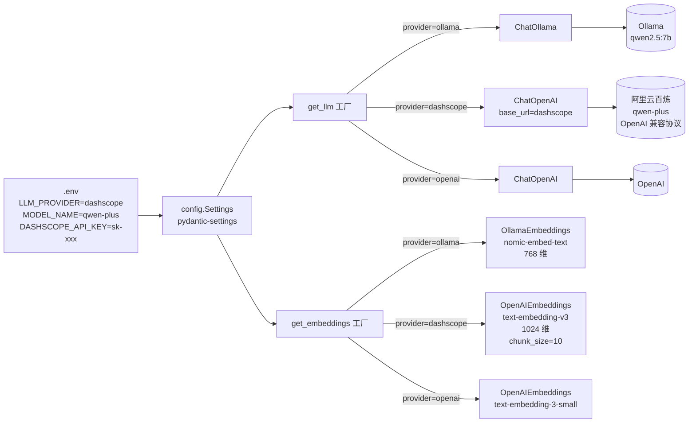

# 03 DashScope Provider 切换 + LLM/Embedding 工厂

> **一行定位** —— 把 LLM 从本地 Ollama 切到阿里云百炼 qwen-plus，同时引入工厂模式 + `pydantic-settings`，业务代码一行不动，改 `.env` 就能切 provider。

---

## 背景（Context）

02 的 Supervisor 跑本地 Ollama qwen2.5:7b 经常崩：

- **内存压力**：qwen2.5:7b 常驻约 6GB，笔记本被其他进程占走后只剩 1GB 空闲，频繁触发 `llama runner process has terminated: exit status 1`。
- **Structured Output 稳定性差**：小模型在 `with_structured_output` 场景下偶发返回非合法 JSON，Supervisor 路由崩。
- **硬编码导致切换困难**：早期代码到处 `ChatOllama(model="qwen2.5:7b")`，想切 provider 要改十几个地方。

目标：

1. 业务代码统一通过 `get_llm()` / `get_embeddings()` 工厂拿 LLM 和 Embedding 实例，**不关心底层是哪个 provider**。
2. 切 provider 改 `.env` 一行（`LLM_PROVIDER=dashscope`），重启即可。
3. 钥匙等敏感配置走 `.env` + `pydantic-settings`，绝不 hardcode 到代码。
4. 支持 Ollama（本地开发兜底）/ DashScope（生产）/ OpenAI（可选）三种 provider。

---

## 架构图



---

## 设计决策

### 1. 工厂模式 + `pydantic-settings`：业务代码与 provider 解耦

**反模式（之前）**：

```python
# 散落在各业务文件里
from langchain_community.chat_models import ChatOllama
llm = ChatOllama(model="qwen2.5:7b", base_url="http://localhost:11434")
```

**正模式（现在）**：

```python
# config.py 集中定义
from config import get_llm
llm = get_llm()  # 业务代码只依赖这一行
```

这完全对应 Spring 的 `@ConditionalOnProperty` + 多实现 Bean：

```java
// Java 世界
@Configuration
public class LlmConfig {
    @Bean
    @ConditionalOnProperty(name = "llm.provider", havingValue = "ollama")
    public Llm ollamaLlm() { ... }

    @Bean
    @ConditionalOnProperty(name = "llm.provider", havingValue = "dashscope")
    public Llm dashScopeLlm() { ... }
}
```

### 2. DashScope 走 **OpenAI 兼容协议**（不用原生 `dashscope` SDK）

阿里云百炼提供了两套接入方式：

- **原生 SDK**：`pip install dashscope`，API 调用是 `dashscope.Generation.call(...)`
- **OpenAI 兼容**：走 OpenAI SDK 的 `base_url` 切换，发 `POST /v1/chat/completions`

选 **OpenAI 兼容**，理由：

- 可以直接复用 LangChain 成熟的 `ChatOpenAI` / `OpenAIEmbeddings`，所有 LangChain 特性（tool calling、structured output、callbacks）开箱即用。
- 换供应商（DeepSeek / Moonshot / 本地 vLLM）只改 `base_url` 和 `api_key`，零代码改动。
- 原生 SDK 的 LangChain 集成 `langchain-dashscope` 维护较慢，时常滞后于官方新特性。

**副作用**：部分 DashScope 专属特性（如某些企业级 feature）原生 SDK 才能用。学习项目用不到。

### 3. LLM 和 Embedding 分开两个工厂

不同 provider 可能只支持一侧：

- 早期测试时用 **Ollama LLM + OpenAI Embedding** 的混合方案（Ollama 的 embedding 维度不一致问题较多）。
- 生产可能用 **DashScope LLM + 自建 Qdrant + BGE Embedding**。

两个工厂独立：

```python
def get_llm() -> BaseChatModel:
    if settings.llm_provider == "ollama":
        ...
    elif settings.llm_provider == "dashscope":
        ...

def get_embeddings() -> Embeddings:
    if settings.embedding_provider == "ollama":
        ...
    elif settings.embedding_provider == "dashscope":
        ...
```

`llm_provider` 和 `embedding_provider` 独立配置，默认两者都从 `provider` 读（大部分场景一致）。

### 4. API Key 只从 `.env` 读，`.gitignore` 把 `.env` 挡在仓库外

`pydantic-settings` 自动加载 `.env`：

```python
from pydantic_settings import BaseSettings, SettingsConfigDict

class Settings(BaseSettings):
    model_config = SettingsConfigDict(env_file=".env", extra="ignore")

    llm_provider: str = "dashscope"
    model_name: str = "qwen-plus"
    dashscope_api_key: str = ""
    dashscope_base_url: str = "https://dashscope.aliyuncs.com/compatible-mode/v1"
    # ...
```

配套 `.gitignore` 严格屏蔽：

```
# 绝对不能进 git
.env
.env.local
.env.*.local
```

只 tracked `.env.example`（作为模板）：

```
# .env.example
LLM_PROVIDER=dashscope
MODEL_NAME=qwen-plus
DASHSCOPE_API_KEY=sk-xxx-please-fill-in
```

这遵守全局规范里「**密钥不得硬编码 / 不得进 git**」的强制要求。

### 5. Ollama 兜底保留

**不是**彻底删掉 Ollama 分支。三个理由：

- 无网环境能跑（演示、出差）。
- Ollama 完全免费，API key 泄露恐慌小，是教学首选。
- Provider 工厂有 2+ 实现才叫工厂，只有 1 个分支不如 hardcode。

---

## 核心代码

### 文件清单

| 文件 | 改动 | 关键函数/行号 |
|---|---|---|
| `config.py` | 新建/重写 | `Settings` 类、`get_llm()`、`get_embeddings()` |
| `.env.example` | 新建 | 配置模板 |
| `.env` | 本地创建，**不入 git** | 真实 key |
| `.gitignore` | 追加 | 屏蔽 `.env` |

### 关键片段 1：`config.py` 的 Settings 类

```python
from pydantic_settings import BaseSettings, SettingsConfigDict

class Settings(BaseSettings):
    """从 .env 读配置，支持多 provider。"""

    model_config = SettingsConfigDict(
        env_file=".env",
        extra="ignore",            # 未知字段忽略，防止加新变量时 validate fail
        case_sensitive=False,
    )

    # Provider
    llm_provider: str = "dashscope"         # ollama | dashscope | openai
    embedding_provider: str = "dashscope"

    # 模型名
    model_name: str = "qwen-plus"           # LLM 模型
    embedding_model_name: str = "text-embedding-v3"

    # Ollama
    ollama_base_url: str = "http://localhost:11434"

    # DashScope（OpenAI 兼容）
    dashscope_api_key: str = ""
    dashscope_base_url: str = "https://dashscope.aliyuncs.com/compatible-mode/v1"

    # OpenAI
    openai_api_key: str = ""

    # 通用参数
    temperature: float = 0.0
    request_timeout: int = 60

settings = Settings()
```

**解读**：
- `pydantic-settings` 自动读 `.env`，不需要手动 `os.getenv`。
- 字段默认值是 fallback，`.env` 里的覆盖默认。
- `extra="ignore"` 很重要：后续会加 `LANGSMITH_*` 字段（见 07），不加这句旧字段会炸。

### 关键片段 2：`get_llm()` 工厂

```python
from langchain_core.language_models import BaseChatModel

def get_llm() -> BaseChatModel:
    """根据 settings.llm_provider 返回对应的 LLM 实例。"""
    provider = settings.llm_provider.lower()

    if provider == "ollama":
        from langchain_ollama import ChatOllama
        return ChatOllama(
            model=settings.model_name,
            base_url=settings.ollama_base_url,
            temperature=settings.temperature,
        )

    if provider in ("dashscope", "openai"):
        from langchain_openai import ChatOpenAI
        if provider == "dashscope":
            api_key = settings.dashscope_api_key
            base_url = settings.dashscope_base_url
            if not api_key:
                raise RuntimeError("LLM_PROVIDER=dashscope 但 DASHSCOPE_API_KEY 未配置")
        else:
            api_key = settings.openai_api_key
            base_url = None
            if not api_key:
                raise RuntimeError("LLM_PROVIDER=openai 但 OPENAI_API_KEY 未配置")

        return ChatOpenAI(
            model=settings.model_name,
            api_key=api_key,
            base_url=base_url,
            temperature=settings.temperature,
            timeout=settings.request_timeout,
        )

    raise ValueError(f"未知 LLM_PROVIDER: {provider}")
```

**解读**：
- 分支里 `import` 让「没装 ollama 包也能用 dashscope」成立（Java 世界类似 `@ConditionalOnClass`）。
- 每条路径都校验 api_key，早失败优于运行时某次 invoke 报 401。
- 返回类型 `BaseChatModel` 是 LangChain 顶层接口，业务代码只依赖这层抽象。

### 关键片段 3：`get_embeddings()` 工厂（注意 DashScope 两个坑）

```python
from langchain_core.embeddings import Embeddings

def get_embeddings() -> Embeddings:
    provider = settings.embedding_provider.lower()

    if provider == "ollama":
        from langchain_ollama import OllamaEmbeddings
        return OllamaEmbeddings(
            model="nomic-embed-text",  # 768 维
            base_url=settings.ollama_base_url,
        )

    if provider in ("dashscope", "openai"):
        from langchain_openai import OpenAIEmbeddings
        base_url = settings.dashscope_base_url if provider == "dashscope" else None
        api_key = settings.dashscope_api_key if provider == "dashscope" else settings.openai_api_key

        return OpenAIEmbeddings(
            model=settings.embedding_model_name,
            api_key=api_key,
            base_url=base_url,
            # 坑 1 兜底：禁用 tiktoken 预切分，DashScope 只收字符串
            check_embedding_ctx_length=False,
            # 坑 2 兜底：DashScope text-embedding-v3 的 batch 上限 10
            chunk_size=10 if provider == "dashscope" else 1000,
        )

    raise ValueError(f"未知 EMBEDDING_PROVIDER: {provider}")
```

**解读**：
- `check_embedding_ctx_length=False` 和 `chunk_size=10` 是专门为 DashScope 加的兜底，见下方踩坑记录。
- Ollama 的 `nomic-embed-text` 是 768 维；DashScope 的 `text-embedding-v3` 是 1024 维。**切 provider 必须重建向量库**（维度不兼容）。

---

## 踩过的坑（本节重头戏，4 个坑）

### 坑 1：DashScope embedding 不接受 OpenAI SDK 默认的 pre-tokenize 格式

- **症状**：切到 DashScope 后跑 `index_logs()`，报：
  ```
  openai.BadRequestError: Error code: 400 - {'error': {'code': 'invalid_parameter_error',
   'message': 'Value error, contents is neither str nor list of str.'}}
  ```
- **根因**：`OpenAIEmbeddings` 为了绕过 OpenAI 的 token 限制，默认会**先用 tiktoken 把文本切成 `List[int]`（token 数组）**再发给服务端，OpenAI 官方收。但 DashScope 只收字符串或字符串数组，不接受 token 数组，直接报 `contents is neither str nor list of str`。
- **修复**：在 `OpenAIEmbeddings` 构造时传 `check_embedding_ctx_length=False`，禁用预切分：
  ```python
  OpenAIEmbeddings(
      ...,
      check_embedding_ctx_length=False,
  )
  ```
- **教训**：**OpenAI SDK 的「OpenAI 兼容」只是协议兼容，数据格式细节仍有差异**。切国产 provider 必开 `check_embedding_ctx_length=False`。这个参数名也太隐晦，不看文档很难发现。

### 坑 2：DashScope text-embedding-v3 限制 `batch_size ≤ 10`

- **症状**：索引 24 行日志（会被切成 ~24 个 chunk），报：
  ```
  openai.BadRequestError: Error code: 400 - {'error': {'code': 'invalid_parameter_error',
   'message': 'batch size is invalid, it should not be larger than 10'}}
  ```
- **根因**：`OpenAIEmbeddings` 默认 `chunk_size=1000`（每批给服务端 1000 条）。OpenAI 自己能扛，DashScope text-embedding-v3 有严格上限 10。
- **修复**：`chunk_size=10` 强制分小批：
  ```python
  OpenAIEmbeddings(..., chunk_size=10)
  ```
  LangChain 内部会按 10 条一批循环调用 embed API。
- **教训**：每个 provider 的 **rate / batch 限额**要提前查文档，不然小数据集能跑、真实数据量一跑就炸。

### 坑 3（最危险）：安全事故——API Key 两次泄露到对话上下文

- **症状**：第一次配置 `.env.example` 时，想着「反正是示例文件」，不小心直接把真 key 写进去 commit 了。事后发现可以在 commit history 看到。
- **第二次**：修复时又误操作，把 key 临时粘贴到工作日志（没 commit 但发到了会话里）。
- **根因**：`.env.example` 会被 git 追踪（这就是它的目的——作为模板），写真 key 进去 = 直接泄露。
- **修复流程**（严格按公司安全规范）：
  1. **立即吊销**：登录阿里云百炼控制台 → 删除泄露的 key。
  2. **新建 key**：生成新 key，仅写入本地 `.env`。
  3. **历史清理**：`git filter-repo` 清掉 commit 历史中的泄露 key（或者如果仓库还没推远程，直接 reset）。
  4. **加固**：
     - `.env.example` 永远只写占位符：`DASHSCOPE_API_KEY=sk-xxx-please-fill-in`
     - 加 pre-commit hook（如 `detect-secrets`）扫描 commit 防止再泄露。
- **教训**：
  - `.example` 文件**会进 git**，绝不能写真数据。
  - API key 绝不进任何 git-tracked 文件（包括测试脚本、文档、日志）。
  - 对照全局规范 `sercurity-dev-rule.md` 的 1.1 节——「密钥、Secret、Token 严禁明文存储，严禁提交到 Git 仓库」。这不是建议，是强制。

### 坑 4：切 provider 后向量维度不兼容

- **症状**：之前用 Ollama `nomic-embed-text`（768 维）索引过数据存在 `chroma_db/`，切 DashScope 后（1024 维）跑 similarity search 报：
  ```
  chromadb.errors.InvalidDimensionException: Embedding dimension 1024 does not match collection dimensionality 768
  ```
- **根因**：ChromaDB 的 collection 在首次写入时固定了维度，之后所有查询/写入必须维度一致。
- **修复**：删掉旧 collection 重建：
  ```bash
  rm -rf chroma_db/
  python -c "from rag.log_indexer import index_logs; index_logs(force=True)"
  ```
- **教训**：切 embedding 模型 = 向量库重建。生产环境要加版本化命名（`logs_collection_v3` vs `logs_collection_ollama_v1`），避免误查错库。

---

## 验证方法

```bash
# 1. 不配 .env 应该立即报错
mv .env .env.bak
python -c "from config import get_llm; get_llm().invoke('你好')"
# 期望：RuntimeError: LLM_PROVIDER=dashscope 但 DASHSCOPE_API_KEY 未配置

mv .env.bak .env

# 2. 切换 provider 测试
echo "LLM_PROVIDER=dashscope" > .env.local_test
LLM_PROVIDER=ollama python -c "from config import get_llm; print(type(get_llm()).__name__)"
# 期望：ChatOllama

LLM_PROVIDER=dashscope python -c "from config import get_llm; print(type(get_llm()).__name__)"
# 期望：ChatOpenAI

# 3. 简单调用
python -c "from config import get_llm; print(get_llm().invoke('1+1=?').content)"
# 期望：2（或带简短说明的中文）

# 4. Embedding 维度确认
python -c "
from config import get_embeddings
emb = get_embeddings()
vec = emb.embed_query('test')
print(f'dim={len(vec)}')
"
# dashscope: 1024 / ollama: 768
```

---

## Java 类比速查

| 概念 | Java 世界 |
|---|---|
| `get_llm()` 工厂 | Spring `@ConditionalOnProperty` + 多实现 Bean |
| `pydantic-settings` | `@ConfigurationProperties` + Jakarta Validation |
| `.env` | `application-{profile}.yaml` |
| `.env.example` | `application.yml` 默认配置 |
| `extra="ignore"` | `@ConfigurationProperties(ignoreUnknownFields = true)` |
| `settings = Settings()` 单例 | `@Component` 单例 Bean |
| provider 切换 | `spring.profiles.active=prod` |
| OpenAI 兼容协议 | JDBC URL 换驱动（`jdbc:mysql://` ↔ `jdbc:postgresql://`） |

---

## 学习资料

- [阿里云百炼 OpenAI 兼容模式官方文档](https://help.aliyun.com/zh/dashscope/developer-reference/compatibility-of-openai-with-dashscope)
- [LangChain OpenAI 集成文档](https://python.langchain.com/docs/integrations/chat/openai/)
- [pydantic-settings 官方文档](https://docs.pydantic.dev/latest/concepts/pydantic_settings/)
- [OpenAIEmbeddings 参数详解](https://python.langchain.com/api_reference/openai/embeddings/langchain_openai.embeddings.base.OpenAIEmbeddings.html)
- 本仓库 `~/.claude/rules/sercurity-dev-rule.md`（密钥安全强制规范）
- [detect-secrets pre-commit hook](https://github.com/Yelp/detect-secrets)

---

## 已知限制 / 后续可改

- **Settings 实例模块级单例无法热更**：改 `.env` 后必须重启进程。生产可配合 Spring Cloud Config 类似机制（Nacos + 自动刷新），或用 `watchdog` 监听 `.env` 变更。
- **缺少 fallback 机制**：当前 DashScope 挂了直接报错。可以实现「主 provider 挂 → 自动切次 provider」（LangChain 的 `.with_fallbacks()` 支持）。
- **未区分 LLM 和 judge 的 model**：qwen-plus 既当业务 LLM 又当 RAG 评估 judge，省钱但有 self-bias 嫌疑。严谨做法：judge 用 qwen-max 甚至不同家模型（DeepSeek / Moonshot）。见 04。
- **无法按 Agent 分配不同 model**：Parser 本来用 qwen-turbo 就够，Reporter 才需要 qwen-plus。目前全局一个 model，砍成本空间大。

后续可改项汇总见 [99-future-work.md](99-future-work.md)。
