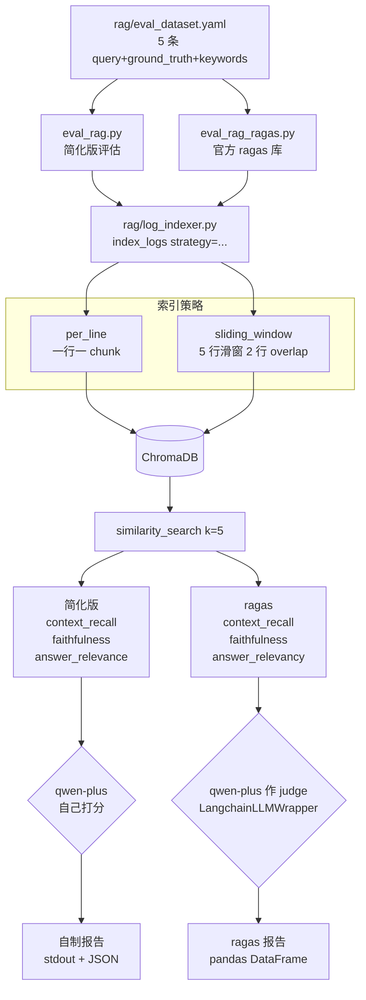

# 04 RAG 评估：ragas 对照简化版，实锤 Self-Judgment Bias

> **一行定位** —— 接入业界标杆 ragas 框架做 RAG 质量评估，与自制简化版并行跑同一数据集，发现简化版系统性虚高 14%，并用真实数据回答「per_line 和 sliding_window 到底哪个 chunk 策略好」这种反直觉问题。

---

## 背景（Context）

之前的 `rag/eval_rag.py` 是学习阶段拍脑袋写的简化版：

- 3 个自制指标：`context_recall` / `faithfulness` / `answer_relevance`
- 硬编码 `ChatOllama`——切 DashScope 后直接跑不起来
- 没参考业界标准，「好/坏」没有公允刻度
- 「改 chunk 策略看分数升降」判断全靠直觉，没数据

目标：

1. **接入 ragas**（LangChain 生态最主流的 RAG 评估框架）。
2. **保留简化版做对照**——这是教学价值最大的设计（不对照，永远发现不了 self-bias）。
3. 把 RAG 评估工程化：数据集外置 YAML、CLI 一键跑、支持 chunk 策略对比。
4. 用评估驱动调参（evaluation-driven tuning），告别拍脑袋。

---

## 架构图



---

## 设计决策

### 1. 保留简化版作对照（不是只留 ragas）

**反直觉决策**：既然有了 ragas 官方实现，为什么还留自制版？

**理由**：

- 两版跑同一数据集，分数差值**正好揭露 self-judgment bias**——这是本项目最有教学价值的洞察。
- 简化版代码 ~100 行，是理解「RAG 评估到底在算什么」的最佳教材。
- 如果把简化版删了，未来遇到「ragas 分数低是哪个环节的锅」就没法拆解。

所以：**简化版是教学工具，ragas 是生产工具，两者并存**。

### 2. Judge 用 qwen-plus 而非 qwen-max（省钱 + 相对 diff 策略）

Judge 是「用 LLM 给 LLM 打分」的那个 LLM。用什么模型作 judge 影响评估成本：

- `qwen-max`：更贵（约 5x 价格），据研究 judge 鲁棒性更好
- `qwen-plus`：便宜，和业务 LLM 是同一个

**选 qwen-plus**，理由：

- 相对 diff 能抵消 self-bias——「改策略前后」的评估分值用同一 judge，偏差同方向抵消。
- 绝对分值不用于重要决策，只用于趋势判断。
- 省出来的 API 费可以多跑几次实验。

**注意**：如果要发论文 / 做生产级决策（如 A/B 上线），必须用不同家的 judge（DeepSeek / Moonshot / gpt-4o-mini 三家对比）。

### 3. 数据集 YAML 外置（新增 case 不改代码）

```yaml
# rag/eval_dataset.yaml
cases:
  - id: case1
    query: "OrderService 最常见的错误是什么？"
    ground_truth: "主要是 DBPool 连接池耗尽（Connection timeout）"
    expected_keywords: ["OrderService", "DBPool", "连接池"]

  - id: case2
    query: "08:00 到 09:00 之间 Payment 服务有什么问题？"
    ground_truth: "Payment 服务在 8:45 出现 3 条 ERROR..."
    expected_keywords: ["Payment", "8:45", "ERROR"]

  # ... 共 5 条
```

**好处**：

- 加 case 只改 YAML 一行，不改 Python 代码。Java 类比：`@CsvSource` 的 CSV 文件版。
- 非技术同事（产品 / 运营）也能扩数据集。
- YAML 进 git，数据集随代码版本化。

### 4. CLI 支持 `--strategy` 和 `--compare`（一键跑完对比）

```bash
# 单独跑某策略
python rag/eval_rag_ragas.py --strategy per_line

# 一键跑完两种策略并打印对比表
python rag/eval_rag_ragas.py --compare
```

`--compare` 内部：

1. `index_logs(strategy="per_line", force=True)` 重建向量库
2. 跑一次评估，存结果
3. `index_logs(strategy="sliding_window", force=True)` 再重建
4. 再跑一次评估
5. 打印对比表

对比表直接揭露「换 chunk 策略分数变化」，是调优最重要的反馈工具。

### 5. `LangchainLLMWrapper` / `LangchainEmbeddingsWrapper` 注入项目 provider

ragas 默认用 OpenAI API，想接 DashScope 需要把项目 `get_llm()` 注入：

```python
from ragas.llms import LangchainLLMWrapper
from ragas.embeddings import LangchainEmbeddingsWrapper

llm_for_ragas = LangchainLLMWrapper(get_llm())
emb_for_ragas = LangchainEmbeddingsWrapper(get_embeddings())

# 跑评估
result = evaluate(
    dataset=ragas_dataset,
    metrics=[context_recall, faithfulness, answer_relevancy],
    llm=llm_for_ragas,
    embeddings=emb_for_ragas,
)
```

这让 ragas 的评估完全跑在我们配好的 provider 上（DashScope），不用另配 OpenAI key。

---

## 核心代码

### 文件清单

| 文件 | 改动 | 说明 |
|---|---|---|
| `rag/eval_dataset.yaml` | 新建 | 5 条评估 case 种子 |
| `rag/eval_rag.py` | 重写 | 简化版评估（教学对照） |
| `rag/eval_rag_ragas.py` | 新建 | ragas 官方评估 |
| `rag/log_indexer.py` | 改 | 支持 `strategy="per_line" / "sliding_window"` 参数 |
| `rag/log_retriever.py` | 复用 | Tool 给 Analyzer 用 |

### 关键片段 1：`eval_rag_ragas.py` 的核心流程

```python
from datasets import Dataset
from ragas import evaluate
from ragas.metrics import context_recall, faithfulness, answer_relevancy
from ragas.llms import LangchainLLMWrapper
from ragas.embeddings import LangchainEmbeddingsWrapper
from config import get_llm, get_embeddings

def run_ragas_eval(strategy: str) -> dict:
    """用 ragas 跑一次评估。"""
    # 1. 按指定策略重建向量库
    index_logs(strategy=strategy, force=True)

    # 2. 加载数据集
    with open("rag/eval_dataset.yaml") as f:
        cases = yaml.safe_load(f)["cases"]

    # 3. 对每条 case：检索 + 让业务 LLM 回答
    rows = []
    for case in cases:
        retrieved = retriever.similarity_search(case["query"], k=5)
        contexts = [doc.page_content for doc in retrieved]
        answer = rag_answer(case["query"], contexts)   # 调业务 LLM

        rows.append({
            "question": case["query"],
            "contexts": contexts,
            "answer": answer,
            "ground_truth": case["ground_truth"],
        })

    ragas_ds = Dataset.from_list(rows)

    # 4. 调 ragas 评估
    result = evaluate(
        dataset=ragas_ds,
        metrics=[context_recall, faithfulness, answer_relevancy],
        llm=LangchainLLMWrapper(get_llm()),
        embeddings=LangchainEmbeddingsWrapper(get_embeddings()),
    )

    return {
        "strategy": strategy,
        "context_recall": float(result["context_recall"]),
        "faithfulness": float(result["faithfulness"]),
        "answer_relevancy": float(result["answer_relevancy"]),
    }
```

**解读**：

- `Dataset.from_list(rows)` 是 HuggingFace datasets 的入参格式，ragas 依赖这个。
- `evaluate()` 是 ragas 的一站式入口，内部对每条 case × 每个 metric 跑一次 LLM judge。
- 用 `LangchainLLMWrapper(get_llm())` 注入项目 provider，ragas 就不会去找 OpenAI key。

### 关键片段 2：简化版 `eval_rag.py` 的 self-bias 写法

```python
def evaluate_simplified(case: dict, contexts: list, answer: str) -> dict:
    """简化版评估：3 个指标全由 LLM 自己打分，典型 self-bias。"""
    llm = get_llm()

    # Context Recall: 上下文是否覆盖 ground truth
    recall_prompt = f"""评估以下上下文是否涵盖参考答案的全部要点。
参考答案: {case['ground_truth']}
上下文: {contexts}
请只输出一个 0 到 1 之间的小数。"""
    recall = float(llm.invoke(recall_prompt).content.strip())

    # Faithfulness: 回答是否忠实于上下文（有无幻觉）
    faith_prompt = f"""评估以下回答是否所有内容都能从上下文推出（无幻觉）。
上下文: {contexts}
回答: {answer}
请只输出 0 到 1。"""
    faith = float(llm.invoke(faith_prompt).content.strip())

    # Answer Relevance: 回答与 query 的相关度
    rel_prompt = f"""评估回答与问题的相关度。
问题: {case['query']}
回答: {answer}
请只输出 0 到 1。"""
    rel = float(llm.invoke(rel_prompt).content.strip())

    return {"context_recall": recall, "faithfulness": faith, "answer_relevance": rel}
```

**解读**：
- 每个指标都是「直接问 LLM 打分」，没有分解验证。
- LLM 倾向于给自己宽松——问「这个回答好不好」比问「这个回答里每句话都能从上下文验证吗」要宽松得多。
- ragas 的 faithfulness 是「把回答拆成 atomic facts，每个 fact 去和上下文比对」，细粒度得多，自然严格。

### 关键片段 3：`log_indexer.py` 的策略参数

```python
def index_logs(strategy: str = "per_line", force: bool = False) -> None:
    """索引日志到 ChromaDB。
    Args:
        strategy: per_line=一行一 chunk；sliding_window=5 行滑窗 overlap=2
        force: True 时先清空 collection
    """
    if force:
        # 清旧 collection
        import shutil
        shutil.rmtree("chroma_db", ignore_errors=True)

    docs = _parse_log_file("logs/app.log")

    if strategy == "per_line":
        chunks = [Document(page_content=d.line, metadata=d.meta) for d in docs]
    elif strategy == "sliding_window":
        chunks = []
        window, overlap = 5, 2
        for i in range(0, len(docs), window - overlap):
            chunk = docs[i:i + window]
            if not chunk:
                break
            merged = "\n".join(d.line for d in chunk)
            chunks.append(Document(page_content=merged, metadata={"window_start": i}))
    else:
        raise ValueError(f"unknown strategy: {strategy}")

    vectorstore = get_vectorstore()
    vectorstore.add_documents(chunks)
    logger.info(f"索引完成: {strategy} 策略，共 {len(chunks)} chunks")
```

**解读**：
- `strategy` 参数集中管理切片策略，后续加 `semantic_chunking` / `recursive_character` 只改这一处。
- `force=True` 时清空旧数据——切策略或切 embedding provider 时必用。

---

## 最值钱的发现（本节是整份文档的 aha 时刻）

### 发现 1：Self-Judgment Bias 实锤

**数据**（同数据集 5 条 case，sliding_window 策略）：

| 指标 | simplified | ragas | 差值 | 解释 |
|---|---|---|---|---|
| Context Recall | 1.00 | 1.00 | 0 | 两版都算「5 条 case 的 ground_truth 要点都能在 retrieved contexts 找到」 |
| Faithfulness | 0.85 | 0.69 | **-0.16** | ragas 拆 atomic facts 算，发现回答里有 31% 的声明无法从上下文严格推出 |
| Answer Relevance | 0.97 | 0.71 | **-0.26** | ragas 用「回答生成假 query → embedding 相似度」的严格算法，简化版只让 LLM 自评 |
| **综合** | **0.94** | **0.80** | **-0.14** | **系统性虚高 14%** |

**结论**：自己给自己打分（simplified）比 ragas 严谨算法**系统性虚高 14%**。这就是 self-judgment bias 的实锤——LLM 对自己的输出有一致的宽容偏差。

**教训**：

- 业界标准框架（ragas / DeepEval / promptfoo）内部有专门对抗 self-bias 的算法设计（拆 atomic facts、多次采样、embedding 对比），不是随便写几个 prompt 就能替代的。
- 自己实现评估**可以用于快速 sanity check**，但**不能用于发论文、A/B 决策、模型选型**。
- 想验证自己的评估代码靠不靠谱？用标杆框架跑同一数据集对比。

### 发现 2：反直觉的 chunk 策略对比

**数据**（ragas 指标，同数据集）：

| 指标 | per_line | sliding_window | Δ |
|---|---|---|---|
| Context Recall | 1.00 | 1.00 | 0 |
| Faithfulness | 0.80 | 0.69 | **-0.11** |
| Answer Relevancy | 0.74 | 0.71 | -0.03 |
| **综合** | **0.85** | **0.80** | **↓ 0.05** |

**反直觉**：直觉认为 `sliding_window`（上下文更完整）应该赢。但在这个小数据集（24 行日志、5 条评估样本）上 **`per_line` 反而赢了**。

**推测根因**：`sliding_window` 把 5 行合一 chunk，混入了不相关信息（比如 query 问 A 服务，chunk 里同时包含 B 服务），Faithfulness 从 0.80 降到 0.69——回答里多出了 B 服务的声明，但 query 不关心 B，导致判为「不忠实」。

**启发**：

- **「上下文更完整」不等于「检索质量更好」**。噪声会稀释答案忠实度。
- 实战必须评估驱动调参，**不能凭直觉**。「大家都说 sliding_window 好」只是平均律论断，具体数据集上可能刚好反过来。
- 这个对比在小数据集上成立，大数据集（上百行日志）上结论可能反转——**评估必须用代表性数据集**。

---

## 踩过的坑

### 坑 1：ragas 用 qwen-plus 偶发解析失败（nan）

- **症状**：跑 5 条 case，某次 faithfulness = 0.56（正常 0.7），其中 1 条被记为 `nan`。
- **根因**：ragas 要求 LLM 返回 JSON，qwen-plus 偶发返回 markdown 包裹的 JSON（` ```json {...} ``` `），ragas 解析失败就记 `nan`。
- **决策**：**不改**。三个理由：
  1. `nan` 真实反映 judge 鲁棒性——把它 hide 了反而失真。
  2. 5 条里 1 条失败不影响结论（其他 4 条差值依然显著）。
  3. 真要更稳就换 qwen-max 或加 `response_format="json_object"` 强制（部分模型支持）。
- **教训**：评估指标里看到 `nan` 不是 bug，是信号。重要的是**解释**，不是掩盖。

### 坑 2：旧 `eval_rag.py` 硬编码 ChatOllama，切 provider 后跑不起来

- **症状**：`from langchain_community.chat_models import ChatOllama` 运行，切 DashScope 后报连接 localhost:11434 失败。
- **根因**：早期代码没用工厂模式。
- **修复**：重写 `eval_rag.py`，改用 `from config import get_llm`。
- **教训**：这就是 03 做工厂的价值——评估脚本、业务代码、回归测试、LangSmith 配置都能一行切换。Day 1 先做工厂不是过度设计。

---

## 验证方法

```bash
# 1. 跑简化版（快，~30 秒）
python rag/eval_rag.py --strategy per_line

# 2. 跑 ragas（慢，~2 分钟，每条 case × 3 指标 × LLM 调用）
python rag/eval_rag_ragas.py --strategy per_line

# 3. 一键对比两种策略（~4 分钟）
python rag/eval_rag_ragas.py --compare
# 期望输出类似：
# | metric            | per_line | sliding_window |
# | context_recall    | 1.00     | 1.00           |
# | faithfulness      | 0.80     | 0.69           |
# | answer_relevancy  | 0.74     | 0.71           |

# 4. 新增 case 测试
# 编辑 rag/eval_dataset.yaml 加第 6 条
# 再跑 eval_rag_ragas.py 看分数变化
```

---

## Java 类比速查

| 概念 | Java 世界 |
|---|---|
| `ragas.evaluate()` | JUnit `@ParameterizedTest` 批量跑 |
| `ground_truth` | 测试用例的期望值 |
| `LangchainLLMWrapper` | Mock LLM / Testcontainer 适配层 |
| baseline 对比 | Approval snapshot（ApprovalTests） |
| Self-judgment bias | 无直接对应（Java 断言是 deterministic） |
| `strategy="per_line"` | Strategy Pattern |
| `nan` 信号 | `NaN` in `Double`——业务异常打点，不是吞掉 |

---

## 学习资料

- [RAGAS 官方文档](https://docs.ragas.io/en/stable/)
- [RAGAS metrics 详解（context_recall / faithfulness / answer_relevancy）](https://docs.ragas.io/en/stable/concepts/metrics/index.html)
- [Judging LLM-as-a-Judge 论文（Self-Bias 实证研究）](https://arxiv.org/abs/2306.05685)
- [RAG 评估方法全景（Pinecone）](https://www.pinecone.io/learn/rag-evaluation/)
- [chunk 策略对比综述](https://www.pinecone.io/learn/chunking-strategies/)
- [Langchain 官方 evaluator 生态](https://python.langchain.com/docs/guides/evaluation/)

---

## 已知限制 / 后续可改

- **数据集太小（5 条）**：结论的统计显著性有限。目标扩到 30-50 条，覆盖：
  - 不同 query 类型（事实查询 / 聚合统计 / 因果分析 / 追问）
  - 不同难度（易找到 / 需要跨行 / 知识库不存在）
  - 不同数据量（低流量 vs 高流量日志）
- **Judge 是同一家模型（qwen-plus）**：可能存在「自家模型自己打分偏高」。严谨对照：用 3 家不同 judge（qwen-plus / DeepSeek / Moonshot）各跑一次，取平均。
- **未评估 retrieval 速度**：只看质量没看延迟。生产环境需要把 p95 latency 也纳入评估。
- **没接 LangSmith Experiment**：ragas 跑出来的数据散在本地 stdout，没统一仪表盘。LangSmith 的 Experiment 功能能把历次评估结果沉淀成曲线，调优时极有用。
- **缺少 rerank 对比**：目前是纯 embedding 相似度检索。接 BGE-reranker 或 DashScope `gte-rerank-v2` 重排 top20 → top5 通常能再涨 5-10 分。

后续可改项汇总见 [99-future-work.md](99-future-work.md)。
