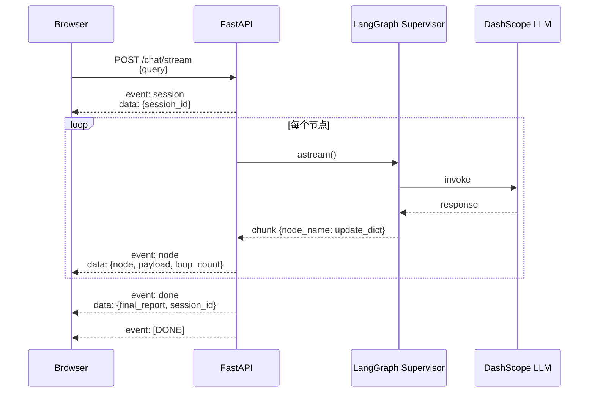

# 05 FastAPI + SSE 节点级流式服务化

> **一行定位** —— 把 CLI 版 Supervisor 包装成 HTTP 服务，`/chat/stream` 端点用 SSE（Server-Sent Events）把每个节点的中间结果推给浏览器，用户能实时看到「Supervisor 决策 → Parser 在跑 → Analyzer 在跑 → 最终报告」。

---

## 背景（Context）

之前所有入口都是 CLI `python xxx.py`，功能虽然完整但：

- **不能多人用**：每次跑都是本地进程，同事没法通过浏览器访问。
- **没有流式体验**：Supervisor 从 query 到 END 要 20+ 秒，CLI 只能干等，不像 ChatGPT 那样逐字或逐节点推送。
- **不能集成到真实产品**：所有 Agent 最终都要嵌在 Web / App / Slack 里，HTTP + SSE 是事实上的标准。
- **无法借助浏览器开发者工具 debug**：Network 面板看不到任何东西。

目标：

1. FastAPI 包装所有 Agent 调用，暴露 `/chat` 和 `/chat/stream` 两个端点。
2. `/chat/stream` 用 SSE，**节点级流式**（不是 token 级）——每个 Agent 跑完 yield 一个 chunk。
3. 一个极简前端 `index.html`，原生 JS + fetch + Response.body.getReader()，无前端框架。
4. 跟 Supervisor / Parser / Analyzer / Reporter 的实现**完全解耦**，FastAPI 只是一层薄壳。

---

## 架构图



---

## 端点设计

| 端点 | 方法 | 作用 | 备注 |
|---|---|---|---|
| `/` | GET | 返回 `static/index.html` | 极简聊天页 |
| `/health` | GET | 返回 `{provider, model, langsmith_tracing}` | 运维探针 |
| `/chat` | POST | 阻塞式，`asyncio.to_thread` 包同步 invoke | 供非流式客户端用 |
| `/chat/stream` | POST | **SSE 流式**（主打） | 浏览器用这个 |
| `/session/{id}` | GET/DELETE | session 管理（06 引入） | 多轮对话 |
| `/chat/resume` | POST | HITL 恢复（09 引入） | 确认/拒绝 Reporter |

---

## 设计决策

### 1. SSE 用 POST 而非 GET

**反直觉决策**：浏览器原生 `EventSource` 只支持 GET，按「标准 SSE 做法」应该用 GET。但本项目用 **POST + fetch + `Response.body.getReader()`**。

**理由**：

- GET 把 query 暴露在 URL 和浏览器历史、服务器访问日志里——用户隐私泄露。
- Query 可能超长（多轮对话上下文），GET 的 URL 长度受限（某些代理 2KB 就截断）。
- POST body 是 JSON（`{query, session_id}`），天然结构化。
- 代价：不能用 `new EventSource(url)`，要手写 fetch + reader + 字节流解析。

### 2. 节点级而非 token 级流式

**选项对比**：

- **A. Token 级**：LLM 每生成一个 token 就推一个 chunk（ChatGPT 那种逐字效果）。用 `astream_events("v2")` + 过滤 `on_chat_model_stream`。
- **B. 节点级**：每个 LangGraph Node（Supervisor / Parser / Analyzer / Reporter）完成后推一次。用 `compiled.astream()`。

**选 B（节点级）**，理由：

- 代码简单得多（一个 `async for chunk in compiled.astream(...)` 循环就完事）。
- UX 体验够——用户看到「Supervisor 决策中...」「Parser 查到 6 条 ERROR」「Analyzer 查 RAG...」「生成最终报告」分段推送，已经接近 ChatGPT 感觉。
- Token 级在多 Agent 场景意义不大——用户不在乎 Parser 内部思考过程的每个字。
- 未来需要再升级到 token 级（见 99），改一个方法即可。

### 3. `sse-starlette` 的 `EventSourceResponse`

**选项对比**：

- **A. 手写 StreamingResponse** + 手动拼 `event: ...\n data: ...\n\n`
- **B. 用 `sse-starlette` 的 `EventSourceResponse`**

选 B。`EventSourceResponse` 接受一个 async generator，yield `{"event": "node", "data": json.dumps(...)}`，框架帮你补 `event:`、`data:`、CRLF、心跳（keep-alive）。

代价：多一个依赖。但收益大于代价——心跳 + 断开检测这些细节手写容易忘。

### 4. 同步 `invoke` 包进 `asyncio.to_thread()`

FastAPI 是 async 框架，所有 handler 应该 async。但 LangGraph 的 `compiled.invoke()` 是同步的（`astream` 才是 async）。`/chat` 阻塞接口想复用 `invoke`：

```python
@app.post("/chat")
async def chat(req: ChatRequest):
    result = await asyncio.to_thread(
        compiled_graph.invoke,
        {"query": req.query, ...},
    )
    return result
```

`asyncio.to_thread` 把同步函数扔到线程池跑，不阻塞事件循环。

**Java 类比**：等价于「Spring WebFlux 里把 blocking 调用扔到 `Schedulers.boundedElastic()`」。这是跨 sync/async 世界的标准桥。

### 5. 端口 8765（非 8000）

`8000` 是 FastAPI 默认，也是 Django / npm dev-server 等无数工具的默认，本地多项目并存时冲突常见。改 `8765`（容易记、少冲突）。

---

## 核心代码

### 文件清单

| 文件 | 改动 | 大小 |
|---|---|---|
| `tech_showcase/fastapi_service.py` | 新建 | ~280 行（后续扩到 ~450 行） |
| `tech_showcase/static/index.html` | 新建 | ~230 行（原生 JS） |
| `rag/log_indexer.py` | 改 | 加模块级单例 + Lock（见坑 2） |

### 关键片段 1：SSE 流式端点主循环

```python
import json
import uuid
from fastapi import FastAPI
from sse_starlette.sse import EventSourceResponse

app = FastAPI(title="Log Supervisor API")

compiled_graph = build_supervisor_graph()  # 启动时编译一次

@app.post("/chat/stream")
async def chat_stream(req: ChatRequest):
    session_id = req.session_id or str(uuid.uuid4())

    async def event_generator():
        # 1. 发送 session 事件
        yield {
            "event": "session",
            "data": json.dumps({"session_id": session_id}),
        }

        state = {
            "query": req.query,
            "agent_outputs": [],
            "loop_count": 0,
            "final_report": None,
            "conversation_history": _load_history(session_id),
        }

        final_state = state.copy()

        # 2. 节点级流式
        async for chunk in compiled_graph.astream(state):
            if not isinstance(chunk, dict):
                continue  # 09 HITL 坑的兜底
            for node_name, update in chunk.items():
                if not isinstance(update, dict):
                    continue
                final_state.update(update)
                yield {
                    "event": "node",
                    "data": json.dumps({
                        "node": node_name,
                        "loop_count": final_state.get("loop_count", 0),
                        "payload": _safe_payload(update),
                    }, ensure_ascii=False),
                }

        # 3. 完成事件
        _save_session(session_id, req.query, final_state)
        yield {
            "event": "done",
            "data": json.dumps({
                "session_id": session_id,
                "final_report": _serialize_report(final_state.get("final_report")),
            }, ensure_ascii=False),
        }

    return EventSourceResponse(event_generator())
```

**解读**：
- `async for chunk in compiled_graph.astream(state)` 是 LangGraph 流式入口，每个节点完成 yield 一次。
- yield 的每个 dict 会被 `EventSourceResponse` 格式化为标准 SSE 事件。
- `ensure_ascii=False` 让中文不被 `\uXXXX` 转义，前端直接看得懂。
- 两层 `isinstance(..., dict)` 防御：09 HITL 场景下 chunk 可能是 tuple（LangGraph 1.x 的 stream 格式差异）。

### 关键片段 2：前端 SSE 消费（原生 JS，无框架）

```javascript
// static/index.html 的核心片段
async function streamChat(query) {
  const response = await fetch('/chat/stream', {
    method: 'POST',
    headers: {'Content-Type': 'application/json'},
    body: JSON.stringify({ query, session_id: getSessionId() })
  });

  const reader = response.body.getReader();
  const decoder = new TextDecoder();
  let buffer = '';

  while (true) {
    const { value, done } = await reader.read();
    if (done) break;
    buffer += decoder.decode(value, { stream: true });

    // 坑 1 修复：用正则匹配 LF 和 CRLF 两种行尾
    const events = buffer.split(/\r?\n\r?\n/);
    buffer = events.pop();   // 最后一段可能不完整，留到下次

    for (const raw of events) {
      if (!raw.trim()) continue;
      const { event, data } = parseSseEvent(raw);
      handleEvent(event, data);
    }
  }
}

function parseSseEvent(raw) {
  let event = 'message';
  const dataLines = [];
  for (const line of raw.split(/\r?\n/)) {
    if (line.startsWith('event:')) event = line.slice(6).trim();
    else if (line.startsWith('data:')) dataLines.push(line.slice(5).trim());
  }
  return { event, data: dataLines.join('\n') };
}

function handleEvent(event, data) {
  const payload = data ? JSON.parse(data) : {};
  switch (event) {
    case 'session':   onSession(payload.session_id); break;
    case 'node':      onNode(payload.node, payload.payload); break;
    case 'done':      onDone(payload); break;
    case 'interrupt': onInterrupt(payload); break;    // 09 引入
  }
}
```

**解读**：
- `response.body.getReader()` 是 Fetch API 提供的低阶 stream 读取，绕过 `EventSource` 的 GET-only 限制。
- `buffer` + `split` 处理「一次 read 可能收到半个事件」——必须缓冲到下一个 `\n\n` 才是完整事件。
- **正则 `/\r?\n\r?\n/`** 是坑 1 的修复（见下文）。

### 关键片段 3：`rag/log_indexer.py` 的单例修复（坑 2）

```python
import threading
from langchain_community.vectorstores import Chroma

_vectorstore: Chroma | None = None
_vectorstore_lock = threading.Lock()

def get_vectorstore() -> Chroma:
    """线程安全的 ChromaDB 单例，解决 FastAPI 并发下 RustBindings 竞争。"""
    global _vectorstore
    if _vectorstore is not None:   # fast path
        return _vectorstore
    with _vectorstore_lock:
        if _vectorstore is not None:   # double-checked locking
            return _vectorstore
        _vectorstore = Chroma(
            persist_directory="chroma_db",
            embedding_function=get_embeddings(),
            collection_name="logs",
        )
        return _vectorstore
```

**解读**：
- 经典 DCL（Double-Checked Locking），Java 写过无数遍。
- 两层 `if` 让 fast path 不过 lock（绝大多数调用），只有首次初始化过 lock。
- 必须做单例的原因见坑 2。

---

## 踩过的坑（两个大坑）

### 坑 1（最关键）：SSE 行尾兼容

- **症状**：浏览器卡住不显示任何事件，但服务端日志显示 graph 完整跑完、事件全都 yield 了。
- **根因**：`sse-starlette` 按 HTTP/SSE 规范用 **CRLF (`\r\n\r\n`)** 作事件分隔符。前端原始代码 `buffer.split('\n\n')` 按 LF 分隔，永远切不开——第一个事件里包含 `\r` 字符，变成一个永不闭合的 buffer。
- **调试方法**：用 `curl` + `xxd` 看原始字节：
  ```bash
  curl -N -X POST http://localhost:8765/chat/stream \
       -H "Content-Type: application/json" \
       -d '{"query":"今天有多少 ERROR？"}' | xxd | head -30
  ```
  看到 `0d 0a 0d 0a`（CR LF CR LF）时就确定是 CRLF。
- **修复**：前端 split 改正则 `split(/\r?\n\r?\n/)`，同时兼容 LF 和 CRLF。
- **教训**：
  - **SSE 规范是 CRLF**，这是 HTTP 老传统（回车 + 换行）。大多数浏览器的 `EventSource` 帮你处理了，手写 fetch 要自己处理。
  - 调试文本协议（HTTP / SSE / WebSocket text frame）**要看字节**，不能只看可打印字符——`\r` 在终端显示不出来，但会破坏 split。
  - `xxd` / `hexdump` / `od -c` 是必备技能。

### 坑 2：ChromaDB 并发 RustBindings 竞争

- **症状**：单元测试跑通，CLI 跑通，FastAPI 上 3 个并发请求（比如一个浏览器同时开 3 个 tab），Analyzer 偶发失败：
  ```
  AttributeError: 'RustBindingsAPI' object has no attribute 'bindings'
  ```
- **根因**：`rag/log_retriever.py` 里每次被 Tool 调用时都 `Chroma(persist_directory=...)` 新建实例。ChromaDB 底层是 Rust（PyO3 绑定），每次 new 会初始化 Rust client，并发下两个线程同时初始化同一个 persist_directory 就撞到了。
- **调试方法**：先确认单线程能跑（排除逻辑 bug），再用 `python -c "import threading; threading.Thread(target=...).start()"` 复现并发炸。
- **修复**：把 `get_vectorstore()` 改为模块级单例 + `threading.Lock` 做 DCL（代码见关键片段 3）。
- **教训**：
  - **用 Rust bindings 的 Python 包（PyO3 / Maturin）对并发初始化不友好**，必须单例化。ChromaDB、tantivy、polars、某些 tokenizer 都有这问题。
  - FastAPI 默认开多线程 worker，并发是常态。**任何带状态的资源（DB 连接、向量库、缓存）都要考虑并发安全**。
  - Java 世界 DCL 是常识，Python 世界很多人不写锁（靠 GIL），但 GIL 只保护 bytecode 层，Rust 调用是 GIL 外的，GIL 保护不到。

---

## 验证方法

```bash
# 1. 启动服务
cd /Users/photonpay/java-to-agent
uvicorn tech_showcase.fastapi_service:app --host 0.0.0.0 --port 8765

# 2. 健康检查
curl http://localhost:8765/health
# 期望：{"provider":"dashscope","model":"qwen-plus",...}

# 3. 阻塞式 chat
curl -X POST http://localhost:8765/chat \
     -H "Content-Type: application/json" \
     -d '{"query":"今天有多少 ERROR？"}'

# 4. SSE 流式（看到逐事件输出）
curl -N -X POST http://localhost:8765/chat/stream \
     -H "Content-Type: application/json" \
     -d '{"query":"今天有多少 ERROR？"}'

# 5. 并发测试（验证坑 2 修复）
for i in 1 2 3 4 5; do
  curl -X POST http://localhost:8765/chat \
       -H "Content-Type: application/json" \
       -d '{"query":"报错最多的 3 个服务？"}' &
done
wait
# 期望：5 个都成功，没有 RustBindingsAPI 错误

# 6. 浏览器访问
open http://localhost:8765/
# 输入 query，看侧栏逐个节点亮起
```

---

## Java 类比速查

| AI Agent | Java 世界 |
|---|---|
| FastAPI | Spring WebFlux（原生 async） |
| `@app.post("/chat")` | `@PostMapping("/chat")` |
| `async def` | `Mono` / `Flux` 响应式 handler |
| Pydantic BaseModel | DTO + `@Valid` |
| `EventSourceResponse` | `SseEmitter` / `Flux<ServerSentEvent>` |
| `compiled.astream()` | Reactor `Flux.onNext` |
| `asyncio.to_thread` | 扔到 `@Async` 线程池 / `Schedulers.boundedElastic()` |
| 模块级 DCL 单例 | 经典 Java DCL（`volatile` + `synchronized`） |
| `uvicorn` 启动 | `SpringApplication.run()` |
| `fetch + getReader` 前端 | `HttpURLConnection` 流式读 |

---

## 学习资料

- [FastAPI Streaming Responses 官方文档](https://fastapi.tiangolo.com/advanced/custom-response/#streamingresponse)
- [sse-starlette 文档](https://github.com/sysid/sse-starlette)
- [MDN Server-Sent Events 规范](https://developer.mozilla.org/en-US/docs/Web/API/Server-sent_events/Using_server-sent_events)
- [LangGraph stream modes 对比](https://langchain-ai.github.io/langgraph/how-tos/stream-values/)
- [Python asyncio.to_thread](https://docs.python.org/3/library/asyncio-task.html#asyncio.to_thread)
- [Fetch API - Response.body.getReader()](https://developer.mozilla.org/en-US/docs/Web/API/ReadableStreamDefaultReader)
- [Double-Checked Locking 模式（Python 版）](https://refactoring.guru/design-patterns/singleton/python/example#example-1)

---

## 已知限制 / 后续可改

- **不是 token 级流式**：目前每个节点一次性推全量 payload，长回答用户需要等整个 Reporter 跑完。升级方案：用 `astream_events("v2")` + 过滤 `on_chat_model_stream`，分 token 推送。
- **没有鉴权**：端点全部开放。生产必加 OAuth2 / API Key。可以用 FastAPI 的 `Depends(HTTPBearer())`。
- **没有限流**：理论上能被刷爆（每次 invoke 烧 Token）。加 `slowapi` / nginx rate limit / Redis 计数器。
- **`/health` 没报告 graph 是否可用**：只报配置，不 ping LLM。可以加 liveness probe 做一次轻量 invoke。
- **前端无框架 HTML 直接用**：功能够但 UX 粗糙。升级 React / Vue + 现代 UI 库（shadcn/ui）能大幅提升。
- **SSE 连接超时处理未完善**：用户关闭浏览器后，后端还会把 graph 跑完（浪费 Token）。应该捕获 `ConnectionClosed` 立即取消 `astream`。

后续可改项汇总见 [99-future-work.md](99-future-work.md)。
