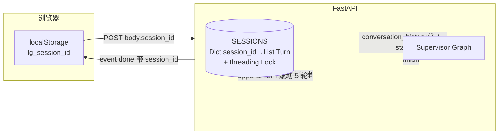

# 06 Session 多轮对话（Session Memory）

> **一行定位** —— 在 FastAPI 层加「应用层 session」让 Supervisor 能看到历史 Q&A，支持自然追问；通过 prompt 注入 + 滚动窗口实现，不用 LangGraph 的 Checkpointer。

---

## 背景（Context）

05 做完 `/chat/stream` 后发现最大的体验缺口：

- 每次 `/chat/stream` 都是独立请求，Supervisor 完全**无记忆**。
- 用户问完「今天有多少 ERROR？」接着问「那 Payment 呢？」——Supervisor 不知道「Payment」是在说「Payment 服务的 ERROR」，只能当全新 query 处理。
- 没法做追问、迭代、对比这些真正有用的对话交互。

目标：

1. 让 Supervisor 能看到**近 N 轮**的 Q&A 历史。
2. 浏览器端感知 session（用 localStorage 存 session_id），关闭标签再打开能续接。
3. 加最小改动——不引入复杂机制（Checkpointer）。
4. 前端提供「新对话」按钮清空 session。

---

## 架构图



---

## 设计决策

### 1. 应用层 dict 而非 LangGraph Checkpointer（关键决策）

**反直觉决策**：LangGraph 自己有 Checkpointer 机制专门干这事，为什么不用？

**对比两种方案**：

| 方案 | 实现 | 语义 | 复杂度 |
|---|---|---|---|
| A. LangGraph Checkpointer | `InMemorySaver()` + `thread_id` | State 跨轮累积：每次调用用同一 thread_id，State 自动 merge | 高，`Annotated[List, add]` 字段跨轮累积难清空 |
| B. 应用层 dict | FastAPI 维护 `Dict[session_id, List[Turn]]` | State 单轮无状态，历史通过 prompt 注入 | 低，concept 清晰 |

**选 B**，理由：

- **Checkpointer 的 `Annotated[List, add]` 跨轮会持续累加**——第 10 轮对话时 `agent_outputs` 里堆了 50 条产出，prompt 要重新消化这些，严重膨胀 Token。清空很难（要 reset thread_id，又失去 Checkpointer 价值）。
- 应用层 dict 明确区分「单轮状态」（每次 invoke 都是 fresh State）和「对话历史」（注入为一个 `conversation_history` 字符串）。Checkpointer 机制留到 HITL 场景（见 09）才真正发挥价值。
- 应用层 dict 换 Redis 就是生产就绪的方案（见 99）。

**Java 类比**：等于选「业务层 `ConcurrentHashMap<sessionId, List<Turn>>`」而不是「Spring Session 全量保存请求上下文」。更可控。

### 2. 滚动窗口 5 轮（Rolling Window）

超过 5 轮丢最早的：

```python
MAX_HISTORY = 5

def save_turn(session_id: str, query: str, answer: str):
    with SESSIONS_LOCK:
        turns = SESSIONS.setdefault(session_id, [])
        turns.append({"query": query, "answer": answer, "ts": time.time()})
        if len(turns) > MAX_HISTORY:
            turns.pop(0)
```

**为什么 5**：

- 经验值，足够覆盖「主题 + 追问 + 追问」这种 3 层深度对话。
- 超过 5 轮历史对后续决策影响已经很弱（LLM 注意力衰减）。
- 5 × (query + answer 截断 200 字) ≈ 2KB history，在 qwen-plus 的 32K token 上下文里占比 <1%。

**适合场景**：短对话（聊天、问答）。长对话（调查、coding）需要升级到 LLM 压缩历史（见 99）。

### 3. 历史摘要规则：`final_report.summary > agent_outputs[-1]` 截断 200 字

不是把 answer 全量塞进历史——Parser + Analyzer + Reporter 输出可能几千字。截断策略：

```python
def extract_answer_summary(final_state: dict) -> str:
    """优先用 final_report.summary，否则用最后一个 agent 产出。"""
    report = final_state.get("final_report")
    if report and report.summary:
        text = report.summary
    else:
        outs = final_state.get("agent_outputs", [])
        text = outs[-1] if outs else ""
    return text[:200]   # 截断
```

**理由**：

- `final_report.summary` 是 Reporter 生成的精炼摘要（1-2 句），最适合做历史。
- 没走到 Reporter 时退而求其次用最后一个 agent 产出。
- 200 字是实测——足够让 LLM 理解「上轮大致聊了啥」，又不会让 history 膨胀。

### 4. 前端用 `localStorage` 持久 session_id

```javascript
function getSessionId() {
  let id = localStorage.getItem('lg_session_id');
  return id;  // 首次为 null，服务端生成后再回写
}

function setSessionId(id) {
  localStorage.setItem('lg_session_id', id);
}

// 收到 done 事件时回写
function onDone(payload) {
  if (payload.session_id) setSessionId(payload.session_id);
}
```

**为什么不用 cookie**：cookie 会自动带到所有请求，污染 `/health` 等非对话端点；localStorage 只用在对话 fetch 里显式读取，职责清晰。

**为什么不用 sessionStorage**：sessionStorage 关闭 tab 就丢，用户想「关电脑、第二天继续问」就断了。localStorage 持久存储。

### 5. 新增 `GET /session/{id}` 和 `DELETE /session/{id}`

- `GET /session/{id}`：返回该 session 的 turns（用于调试 + 前端「查看历史」）。
- `DELETE /session/{id}`：清空历史（前端「新对话」按钮）。

```python
@app.get("/session/{session_id}")
def get_session(session_id: str):
    with SESSIONS_LOCK:
        return {"session_id": session_id, "turns": SESSIONS.get(session_id, [])}

@app.delete("/session/{session_id}")
def delete_session(session_id: str):
    with SESSIONS_LOCK:
        SESSIONS.pop(session_id, None)
    return {"deleted": True}
```

---

## SupervisorState 改动（只加一个 scalar 字段）

```python
class SupervisorState(TypedDict):
    query: str
    next_agent: str
    agent_outputs: Annotated[List[str], add]
    loop_count: int
    final_report: Optional[LogAnalysisResult]
    # 06 新增
    conversation_history: str    # 不用 Annotated，不跨调用累积
```

**关键**：**`conversation_history` 是普通 `str`，不带 `Annotated[..., add]`**——

- 服务端**一次性注入**完整历史字符串到 state。
- 单次 invoke 内部不更新这个字段。
- 每次新请求都从 SESSIONS dict 重建。

这个设计保持了 SupervisorState 的**单轮无状态语义**——跨轮记忆完全由应用层管理。

---

## Supervisor Prompt 改动

```python
def _build_history_section(history: str) -> str:
    """如果有历史就在 prompt 里显示，没有就返回空串。"""
    if not history.strip():
        return ""
    return f"""
【历史对话】（仅供理解上下文，不要重复已回答过的内容）
{history}
"""

# 在 supervisor_node 里
user_msg = f"""用户 query: {state['query']}

已有 Agent 产出:
{_format_outputs(state.get('agent_outputs', []))}

{_build_history_section(state.get('conversation_history', ''))}

请输出下一步路由决策。"""
```

**关键**：空历史时整段不显示（避免空 prompt 干扰 LLM）。有历史时明确告诉 LLM「别重复回答」。

---

## 核心代码

### 文件清单

| 文件 | 改动行数 | 关键改动 |
|---|---|---|
| `tech_showcase/langgraph_supervisor.py` | +15 行 | `SupervisorState` 加字段 + `_build_history_section` helper + prompt 改造 |
| `tech_showcase/fastapi_service.py` | +80 行 | SESSIONS dict + Lock + 3 个 helper + 2 个新端点 |
| `tech_showcase/static/index.html` | +30 行 | localStorage + session 栏 + 新对话按钮 |

### 关键片段 1：FastAPI 的 SESSIONS 管理

```python
import threading
import time
import uuid
from collections import OrderedDict

MAX_HISTORY = 5
MAX_SESSIONS = 1000     # 防内存无限增长

SESSIONS: OrderedDict[str, list] = OrderedDict()
SESSIONS_LOCK = threading.Lock()

def load_history(session_id: str) -> str:
    """把 session 的 turns 拼成一个 string 给 Supervisor 用。"""
    with SESSIONS_LOCK:
        turns = SESSIONS.get(session_id, [])
    if not turns:
        return ""
    parts = []
    for i, t in enumerate(turns, 1):
        parts.append(f"Q{i}: {t['query']}")
        parts.append(f"A{i}: {t['answer'][:200]}")
    return "\n".join(parts)

def save_turn(session_id: str, query: str, final_state: dict) -> None:
    """一轮结束后追加 turn，超过 MAX_HISTORY 丢最早的。"""
    answer = extract_answer_summary(final_state)
    with SESSIONS_LOCK:
        turns = SESSIONS.setdefault(session_id, [])
        turns.append({
            "query": query,
            "answer": answer,
            "ts": time.time(),
        })
        if len(turns) > MAX_HISTORY:
            turns.pop(0)

        # LRU 淘汰最老 session
        SESSIONS.move_to_end(session_id)
        while len(SESSIONS) > MAX_SESSIONS:
            SESSIONS.popitem(last=False)
```

**解读**：
- `OrderedDict` + `move_to_end` + `popitem(last=False)` 是 Python 经典的 LRU 实现。
- `SESSIONS_LOCK` 保护并发写入——FastAPI 多请求并发时必须的。
- `MAX_SESSIONS=1000` 是兜底防内存泄漏，生产换 Redis 时这层淘汰逻辑也用得上。

### 关键片段 2：在 `/chat/stream` 集成 session

```python
@app.post("/chat/stream")
async def chat_stream(req: ChatRequest):
    session_id = req.session_id or str(uuid.uuid4())

    async def event_generator():
        yield {"event": "session", "data": json.dumps({"session_id": session_id})}

        state = {
            "query": req.query,
            "agent_outputs": [],
            "loop_count": 0,
            "final_report": None,
            "conversation_history": load_history(session_id),   # ★ 注入
        }

        final_state = state.copy()
        async for chunk in compiled_graph.astream(state):
            # ... 节点推送（略）
            pass

        # ★ 结束时保存 turn
        save_turn(session_id, req.query, final_state)

        yield {
            "event": "done",
            "data": json.dumps({
                "session_id": session_id,
                "final_report": _serialize_report(final_state.get("final_report")),
            }, ensure_ascii=False),
        }

    return EventSourceResponse(event_generator())
```

**解读**：
- 一次 invoke 前 `load_history` 注入，一次 invoke 后 `save_turn` 追加。简洁对称。
- session_id 首次请求由服务端生成，随 `event: session` 返回前端；之后前端每次带上。

### 关键片段 3：前端 localStorage + 新对话按钮

```html
<!-- index.html 核心片段 -->
<div id="session-bar">
  Session: <code id="session-id">(新会话)</code>
  <button onclick="resetSession()">新对话</button>
</div>
<div id="chat"></div>
<form id="form" onsubmit="submitQuery(event)">
  <input id="query" placeholder="问点什么..." />
  <button>发送</button>
</form>

<script>
function getSessionId() {
  return localStorage.getItem('lg_session_id');
}

function setSessionId(id) {
  localStorage.setItem('lg_session_id', id);
  document.getElementById('session-id').textContent = id.slice(0, 8);
}

async function resetSession() {
  const id = getSessionId();
  if (id) {
    await fetch(`/session/${id}`, { method: 'DELETE' });
  }
  localStorage.removeItem('lg_session_id');
  document.getElementById('session-id').textContent = '(新会话)';
  document.getElementById('chat').innerHTML = '';
}

async function submitQuery(e) {
  e.preventDefault();
  const query = document.getElementById('query').value;
  const response = await fetch('/chat/stream', {
    method: 'POST',
    headers: {'Content-Type':'application/json'},
    body: JSON.stringify({ query, session_id: getSessionId() })
  });
  // ... SSE 解析（见 05）
}
</script>
```

**解读**：
- session_id 只显示前 8 位（UUID 长，UI 美观）。
- 「新对话」按钮既清空服务端又清空前端，彻底重置。

---

## 最值钱的发现（写进文档的 aha 时刻）

**Supervisor 会「变聪明」**——滚动测试第 5 轮相同问题的实验：

**实验设置**：浏览器打开 `/`，连续 5 次问相同的「今天有多少 ERROR？」，观察 Supervisor 路由。

**结果**：

| 轮次 | Supervisor 决策 | 备注 |
|---|---|---|
| 1 | supervisor → parser → supervisor → END | 正常，调 Parser 拿数据 |
| 2 | supervisor → parser → supervisor → END | 仍调 Parser（历史里还只有 1 条，LLM 不确定） |
| 3 | supervisor → parser → supervisor → END | 仍调 Parser |
| 4 | supervisor → **END**（loop_count=1） | ★ 直接结束，不调 Parser！ |
| 5 | supervisor → END（loop_count=1） | 同上 |

**LangSmith trace 里能看到 Supervisor 的 `reason` 字段**：

```
第 4 轮 reason: "历史中已有 3 条相同 Q&A，用户在重复确认，直接基于历史回答即可，不需要重新 Parser"
```

**为什么这就是 aha 时刻**：

1. **自然语言规则真的生效了**：Supervisor prompt 里写「不必重复已答过的内容」，LLM 真的会根据 history 数量做路由决策。这对 Java 开发者最反直觉——业务规则不是 `if` 写的，是自然语言写的。

2. **真实多轮对话的产品价值**：想象客服场景，用户第 3 次确认「订单号 12345 发货了吗？」如果每次都调数据库查一遍是浪费。Supervisor 的这个「记性」能节省大量重复调用。

3. **这是 Agent 比传统 Chatbot 强的地方**：传统 rule-based chatbot 要硬编码「相同 query N 次就缓存」；Agent 是 LLM 自主判断，会识别「相似但不完全相同」的场景（比如「Payment 的错误多少条？」和「Payment 有多少 ERROR？」Supervisor 会判为同一类问题）。

**反面**：也可能「太聪明」——有时候用户就是想刷新数据，Supervisor 返回缓存答案让人困惑。解决：prompt 里加「若用户明确说『再查一次』则必须重新调 Parser」。这就是 Prompt 工程的日常工作。

---

## 踩过的坑

基本没有——这次设计**一次过**。唯一小坑：

### 小坑：首次请求没 session_id，前端拿不到回写

- **症状**：第一次打开浏览器输入 query，`event: session` 事件回传了 session_id，但前端用 `EventSource`-style 的回调没来得及处理就把请求发完了。
- **调试**：F12 看 Network 里 `/chat/stream` 响应的 event stream，确认 `event: session` 确实先到。
- **根因**：前端代码的 onDone 才回写 session_id，但 onDone 是最后一个事件。中间如果用户点「发送」第二次，第二次请求还没拿到第一次的 session_id。
- **修复**：前端在 `event: session` 到达时立即 `setSessionId`，不等 done。
- **教训**：SSE 事件是**流式按序**处理的——需要早写的 metadata 就早写，别等到最后。

---

## 验证方法

```bash
# 1. 启动服务
uvicorn tech_showcase.fastapi_service:app --port 8765

# 2. 第一轮对话（不带 session_id，服务端生成）
curl -N -X POST http://localhost:8765/chat/stream \
     -H "Content-Type: application/json" \
     -d '{"query":"今天有多少 ERROR？"}'
# 观察第一个 event: session 返回的 session_id，记录下来（假设是 abc-def）

# 3. 第二轮对话（带上同一 session_id）
curl -N -X POST http://localhost:8765/chat/stream \
     -H "Content-Type: application/json" \
     -d '{"query":"那 Payment 呢？","session_id":"abc-def"}'
# 观察 Supervisor 能理解「Payment」是接着上轮的话题

# 4. 查询 session
curl http://localhost:8765/session/abc-def
# 期望：{"session_id":"abc-def","turns":[{...},{...}]}

# 5. 删除 session
curl -X DELETE http://localhost:8765/session/abc-def

# 6. 浏览器测试
open http://localhost:8765/
# 连续问 5 次相同问题，观察第 4-5 轮是否直接 END
```

---

## Java 类比速查

| 概念 | Java 世界 |
|---|---|
| SESSIONS dict | `ConcurrentHashMap<String, List<Turn>>` |
| `threading.Lock` | `synchronized` 块 |
| `OrderedDict` + LRU | Guava `Cache` / Caffeine `LRU` |
| `localStorage` | HttpSession（浏览器端版本） |
| 滚动窗口 5 轮 | 固定大小 FIFO Queue |
| `conversation_history` prompt 注入 | 请求头透传 traceId |
| `DELETE /session/{id}` | Spring Cache `@CacheEvict` |

---

## 学习资料

- [LangChain 对话 Memory 模式对比](https://langchain-ai.github.io/langgraph/concepts/memory/)
- [浏览器 localStorage 用法（MDN）](https://developer.mozilla.org/en-US/docs/Web/API/Window/localStorage)
- [Python OrderedDict LRU 实现](https://docs.python.org/3/library/collections.html#collections.OrderedDict)
- [Session 管理最佳实践](https://owasp.org/www-community/attacks/Session_hijacking_attack)
- [Prompt 上下文窗口管理综述](https://www.promptingguide.ai/techniques/prompt_chaining)

---

## 已知限制 / 后续可改

- **单机内存**：SESSIONS 是进程内 dict，多实例部署（k8s 扩 3 个 pod）会出现 session 漂移。升级：Redis 存储（结构已为此准备）。
- **无 session 过期**：只有 MAX_SESSIONS 上限，没按时间过期。生产应该加 TTL（比如 7 天不活跃淘汰）。
- **历史摘要硬截断 200 字**：语义可能断句到一半。升级：LLM 压缩摘要（用小模型总结上一轮到 1-2 句）。见 99。
- **没按用户隔离**：session_id 是 uuid 随机生成，任何人知道别人的 session_id 就能查历史（`GET /session/{id}` 无鉴权）。生产必加 user_id 绑定 + 鉴权。
- **没处理历史冲突**：当用户在多个 tab 同时对话时，SESSIONS 的 turn 顺序可能错乱（两个 tab 的并发写入）。可加 version 字段乐观锁。

后续可改项汇总见 [99-future-work.md](99-future-work.md)。
