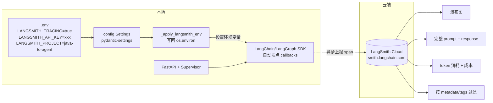

# 07 LangSmith 可观测性

> **一行定位** —— 给所有 LangChain / LangGraph 调用接入分布式追踪（等于 Java 世界的 Zipkin / SkyWalking），瀑布图 + 全 prompt + token 成本 + metadata 过滤一站到位，**trace 比 log 值钱 10 倍**。

---

## 背景（Context）

在 07 之前，我们的 observability 水平停留在「CLI 打日志」：

- 一次 `/chat/stream` 内部 Supervisor 可能路由 3-5 次、每次触发 2-3 个 LLM 调用、每个 Agent 又有 1-5 个 Tool 调用——**总共 10-20 次 LLM/Tool 调用**。
- CLI 日志只能看到每个阶段的「摘要」，看不到每次 LLM 调用的**原始 prompt**（可能上千字）、**完整 response**、**每次 token 数**。
- 没法回答这类问题：
  - Supervisor 为什么第 2 轮决策错了？它看到的 prompt 长什么样？
  - 这次 `/chat` 总共烧了多少 token？哪个 Agent 最费？
  - 昨天同一个 query 跑得好好的，今天响应慢 2 倍，瓶颈在哪个节点？
- 生产级 Agent 必须有这些能力，否则等于盲飞。

目标：

1. **零改业务代码**——所有 LangChain/LangGraph 调用自动被追踪。
2. 有「session 维度」的聚合视图——同一 session 的所有轮次一键查出来。
3. 给每次调用打 tag（`chat-stream` / `chat-blocking` / `regression` / `hitl-resume`），dashboard 可筛选。
4. API key 安全：只从 `.env` 读，不进代码。

---

## 架构图



---

## 设计决策

### 1. 用新前缀 `LANGSMITH_*`（非 `LANGCHAIN_*`）

LangChain 早期的 tracing env 是 `LANGCHAIN_TRACING_V2` / `LANGCHAIN_API_KEY`。V1.0 后推荐新命名 `LANGSMITH_TRACING` / `LANGSMITH_API_KEY`，两种都兼容，但**新项目用新前缀**：

- 更清晰——tracing 服务本身叫 LangSmith，不是 LangChain。
- 避免和未来 `LANGCHAIN_*` 可能的业务 env 冲突。

### 2. 增强版而非最简版（metadata + tags）

**最简版**：只配 3 个环境变量：

```bash
LANGSMITH_TRACING=true
LANGSMITH_API_KEY=ls__...
LANGSMITH_PROJECT=java-to-agent
```

什么业务代码都不改，自动上传所有 LangChain 调用到 LangSmith。**简**到极致。

**增强版**：给每次 `invoke()` / `astream()` 加 `config`：

```python
result = compiled_graph.invoke(
    state,
    config={
        "metadata": {
            "session_id": "abc-def",
            "query_preview": query[:80],
            "user_agent": req.headers.get("user-agent", ""),
        },
        "tags": ["chat-stream"],   # 或 "chat-blocking" / "regression" / "hitl-resume"
    },
)
```

**选增强版**，理由：

- 在 LangSmith dashboard 按 `metadata.session_id` 过滤——多轮对话的所有轮次一键聚合（**这是 session memory 调试最重要的能力**）。
- 按 `tags` 过滤——区分「线上业务调用」vs「回归测试」vs「HITL 确认」不同来源，dashboard 更清爽。
- `query_preview` 在 trace 列表里直接看得到 query 内容，不用点进去看。

代价：每次 invoke 多传一个 config dict，~10 行胶水代码。相对于 dashboard 工作流价值，完全值得。

### 3. Key 全程不进代码

**正确流程**：

1. `.env` 里写 `LANGSMITH_API_KEY=ls__xxxxxxxx`（`.gitignore` 屏蔽 `.env`）。
2. `config.Settings` 字段 `langsmith_api_key: str = ""` 自动读。
3. FastAPI 启动时 `_apply_langsmith_env()` 把 settings 写回 `os.environ`——**LangChain SDK 只认环境变量**，不认 Settings 对象。
4. LangChain SDK 读 `os.environ["LANGSMITH_API_KEY"]`，开始上报。

为什么要「写回 `os.environ`」：LangChain 的 callbacks 机制用环境变量作开关（全局生效），所以 settings 读完必须再 set env。

```python
# config.py
def _apply_langsmith_env(settings: Settings) -> None:
    """把 settings 里的 langsmith_* 字段写回 os.environ，给 LangChain SDK 使用。"""
    if settings.langsmith_tracing:
        os.environ["LANGSMITH_TRACING"] = "true"
    if settings.langsmith_api_key:
        os.environ["LANGSMITH_API_KEY"] = settings.langsmith_api_key
    if settings.langsmith_project:
        os.environ["LANGSMITH_PROJECT"] = settings.langsmith_project
    if settings.langsmith_endpoint:
        os.environ["LANGSMITH_ENDPOINT"] = settings.langsmith_endpoint
```

### 4. 启动日志打印 tracing 状态

```python
# fastapi_service.py 启动段
logger.info(f"LangSmith tracing: {'ENABLED' if settings.langsmith_tracing else 'DISABLED'}")
if settings.langsmith_tracing:
    logger.info(f"  project: {settings.langsmith_project}")
    logger.info(f"  endpoint: {settings.langsmith_endpoint or '(default)'}")
```

**价值**：一眼确认「tracing 到底开了没」。坑的经验：以为开了结果 .env 写错变量名，查了半小时发现根本没上报。

---

## 核心代码

### 文件清单

| 文件 | 改动行数 | 关键改动 |
|---|---|---|
| `config.py` | +15 行 | `Settings` 加 4 个 `langsmith_*` 字段 + `_apply_langsmith_env()` |
| `tech_showcase/fastapi_service.py` | +20 行 | 启动日志 + `_build_run_config()` 加 metadata/tags |
| `.env.example` | +4 行 | 占位符 |
| `.env` | 用户本地填真 key | **不入 git** |

### 关键片段 1：Settings 扩展

```python
# config.py
class Settings(BaseSettings):
    # ... 已有字段
    # LangSmith 追踪
    langsmith_tracing: bool = False
    langsmith_api_key: str = ""
    langsmith_project: str = "java-to-agent"
    langsmith_endpoint: str = ""       # 空=用 LangSmith 官方；企业版填自己的

settings = Settings()
_apply_langsmith_env(settings)   # 模块级调用，import config 就生效
```

**解读**：
- 4 个字段一一对应 LangSmith 官方的 env。
- `_apply_langsmith_env(settings)` 在 `config.py` 的 module 级别调用——任何 `from config import ...` 都会触发，无须手动初始化。

### 关键片段 2：`_build_run_config()` 生成 tag/metadata

```python
# fastapi_service.py
def _build_run_config(session_id: str, query: str, tag: str) -> dict:
    """统一构造 invoke/astream 的 config 参数。"""
    return {
        "metadata": {
            "session_id": session_id,
            "query_preview": query[:80],
        },
        "tags": [tag],
    }

@app.post("/chat/stream")
async def chat_stream(req: ChatRequest):
    session_id = req.session_id or str(uuid.uuid4())
    run_config = _build_run_config(session_id, req.query, tag="chat-stream")

    async def event_generator():
        # ... session 事件
        state = {...}
        async for chunk in compiled_graph.astream(state, config=run_config):
            # ... 节点推送
            pass
        # ... done 事件

    return EventSourceResponse(event_generator())

@app.post("/chat")
async def chat(req: ChatRequest):
    session_id = req.session_id or str(uuid.uuid4())
    run_config = _build_run_config(session_id, req.query, tag="chat-blocking")
    result = await asyncio.to_thread(
        compiled_graph.invoke,
        {"query": req.query, ...},
        config=run_config,
    )
    return result
```

**解读**：
- 统一 helper 生成 config，避免各 handler 拼错。
- tag 区分请求来源（调试时 dashboard 筛选极爽）。

### 关键片段 3：`.env.example` 配置占位

```bash
# .env.example（tracked 到 git）
LLM_PROVIDER=dashscope
MODEL_NAME=qwen-plus
DASHSCOPE_API_KEY=sk-xxx-please-fill-in

# LangSmith（见 docs/milestones/07-langsmith-observability.md）
LANGSMITH_TRACING=false
LANGSMITH_API_KEY=ls__xxx-please-fill-in
LANGSMITH_PROJECT=java-to-agent
LANGSMITH_ENDPOINT=
```

**解读**：
- `LANGSMITH_TRACING=false` 默认关闭——第一次 clone 的人不至于没 key 就炸。
- 所有真 key 位置放 `please-fill-in` 占位符，绝不写真值。

---

## 能看到什么（Dashboard 演示）

打开 `https://smith.langchain.com/` 登录后：

### 1. 瀑布图（Waterfall）

一次 `/chat/stream` 的完整内部调用链：

```
LangGraph (root) - 20.83s
├─ supervisor                     500ms   (decision=parser)
│  └─ ChatOpenAI                  480ms   tokens=1k in / 50 out
├─ parser                         5.46s   ★ 耗时最大
│  ├─ ChatOpenAI                  2.1s
│  ├─ get_error_logs_structured   30ms
│  ├─ ChatOpenAI                  1.8s
│  └─ get_logs_by_service         20ms
├─ supervisor                     350ms   (decision=analyzer)
│  └─ ChatOpenAI                  340ms
├─ analyzer                       8.2s    (含 RAG embedding 调用)
│  ├─ ChatOpenAI                  1.2s
│  ├─ search_error_patterns       2.5s   (embedding + chroma query)
│  └─ ChatOpenAI                  3.9s
├─ supervisor                     300ms   (decision=reporter)
│  └─ ChatOpenAI                  290ms
└─ reporter                       6.00s   (structured_output)
   └─ ChatOpenAI                  5.95s
```

一眼看到：

- Parser 占 5.46s，远超 Supervisor 的决策时间——**如果想优化延迟先攻 Parser**。
- Analyzer 8.2s 里 RAG 2.5s 占 30%——**RAG 重建 embedding 是可优化点**。
- supervisor 节点有 3 次被调用，每次 300-500ms——**单次 Supervisor 决策延迟可控**。

### 2. 完整 Prompt + Response

点开任一 `ChatOpenAI` span：

```
[Messages]
SystemMessage: 你是日志分析多 Agent 工作流的 Supervisor...
HumanMessage: 用户 query: 今天有多少 ERROR？
              已有 Agent 产出（按时间顺序）:
              1. [Parser] 共找到 6 条 ERROR，主要在 OrderService、Payment...

[Response]
{"next": "reporter", "reason": "数据已齐，用户要求报告"}

[Token Usage]
input: 1,247 | output: 52 | total: 1,299
[Cost]
input: $0.0025 | output: $0.0013 | total: $0.0038
```

**对比 CLI 日志**——CLI 只能看到 `[Supervisor] next=reporter`，看不到 LLM 实际看到的 prompt 和原始返回。瀑布图里这些全在。

### 3. Metadata 过滤

Dashboard 左侧过滤器：

- `metadata.session_id = abc-def` → 同一会话所有 5 轮 run 一键列出。
- `tags contains regression` → 只看回归测试（不污染业务 trace 视图）。
- `error = true` → 只看失败的 run（快速定位 bug）。

---

## Trace 实际帮我们发现的问题（真实案例）

**背景**：多轮对话第 2 轮，用户问「那 Payment 呢？」（前一轮问的是 OrderService）。CLI 看起来一切正常：

```
[Supervisor] next=parser
[Parser] 找到 Payment 相关 3 条 ERROR
[Supervisor] next=END
[最终报告] Payment 服务报错 3 次...
```

**但 LangSmith 瀑布图暴露真相**：

```
LangGraph (root) - 15.2s
├─ supervisor       500ms   next=analyzer   ★ 第一次决策：错了！
├─ analyzer         3.1s    产出："没有找到 Payment 相关数据"
├─ supervisor       400ms   next=parser     ← 回退
├─ parser           5.2s    产出：3 条 Payment ERROR
├─ supervisor       300ms   next=END
```

**结论**：Supervisor 第一次决策直接调 Analyzer（错了——Analyzer 是根因分析不是原始数据提取），失败后回退再调 Parser。**整个流程其实浪费了 3.1 秒 + 1 次 LLM 调用**。

**没 LangSmith 怎么办**：根本发现不了。CLI 把 Supervisor 的 3 次决策压成 1 行输出，看不到中间的「错-退-正」。

**修复方向**：Prompt 里加「追问类（那 XX 呢？）必须先 parser 重新收集新数据，不能直接 analyzer」。用 08 的回归测试验证修复效果。

**教训**：**Trace 比 Log 值钱 10 倍**。Java 世界的 Zipkin/SkyWalking 价值在 AI 场景放大——LLM 调用贵、慢、不确定，没 trace 等于盲调试。

---

## 踩过的坑

### 坑 1：Key 泄露到 `.env.example`

- **症状**：第一次配 LangSmith 时，把真 `ls__xxxxxx` 写到 `.env.example` 就 commit 了。
- **根因**：`.env.example` 是 tracked 文件（目的就是作模板）。
- **修复**：
  1. 立即去 LangSmith 控制台 revoke 泄露的 key。
  2. 新建 key，只写入本地 `.env`。
  3. `.env.example` 改为 `please-fill-in` 占位。
  4. Commit history 清理（`git filter-repo` 或仓库 reset）。
- **教训**：**`.example` 文件绝不能写真 key**。这和 03 的 DashScope key 泄露是同一个坑——反复犯说明是系统性问题，不是偶发失误。加 pre-commit hook（如 `detect-secrets`）扫描是根治办法。

### 坑 2：老前缀 `LANGCHAIN_*` 和新前缀 `LANGSMITH_*` 混用

- **症状**：`.env` 写了 `LANGCHAIN_API_KEY`（旧文档教的），`LANGSMITH_TRACING=true`，结果 dashboard 上没 trace。
- **根因**：两个前缀**都还能用**但是两套变量，不能混（`LANGSMITH_API_KEY` 不会自动 fallback 到 `LANGCHAIN_API_KEY`）。
- **修复**：统一改为 `LANGSMITH_*`。
- **教训**：遇到新老前缀同时兼容的场景，**全用新的**，不要半新半旧。

### 坑 3：以为开了 tracing 结果没开

- **症状**：跑了一堆 invoke，dashboard 空空如也。
- **根因**：`LANGSMITH_TRACING=true`（带不带 `LANGSMITH_TRACING_V2` 都兼容），但我写成了 `LANGSMITH_TRACING=True`（Python boolean），pydantic-settings 解析是没问题的但 LangChain SDK 读 env 是字符串比较，严格要求小写 `true`。
- **修复**：`.env` 里用字符串 `true`。
- **教训**：**写 env 用小写 `true`/`false`**，跨语言最安全的约定。

---

## 验证方法

```bash
# 1. 确认配置生效
python -c "
from config import settings
print(f'tracing: {settings.langsmith_tracing}')
print(f'project: {settings.langsmith_project}')
"

# 2. 启动 FastAPI，看启动日志
uvicorn tech_showcase.fastapi_service:app --port 8765
# 应该看到：
# LangSmith tracing: ENABLED
#   project: java-to-agent

# 3. 发一次请求
curl -N -X POST http://localhost:8765/chat/stream \
     -H "Content-Type: application/json" \
     -d '{"query":"今天有多少 ERROR？"}'

# 4. 访问 LangSmith Dashboard
open https://smith.langchain.com/
# 切到 java-to-agent 项目
# 最新 run 应该立即出现（异步上报，~1-2 秒）
# 点开看瀑布图

# 5. 验证 session 过滤
# 多跑几次同一 session_id，dashboard 用 metadata.session_id 筛选
```

---

## Java 类比速查

| 概念 | Java 世界 |
|---|---|
| LangSmith | Zipkin / Jaeger / SkyWalking / Datadog APM |
| trace | 一次完整请求的调用链 |
| span | 单次方法调用的埋点 |
| tags / metadata | Baggage / MDC 上下文 / Sleuth annotations |
| 瀑布图 | Zipkin / Grafana Tempo 的火焰图 |
| `_apply_langsmith_env` 写回 env | `System.setProperty` 给 Sleuth 用 |
| `config={"tags":[...]}` | `Tracer.currentSpan().tag("key", "value")` |
| 异步上报 | Sleuth 的 `AsyncReporter` |

---

## 学习资料

- [LangSmith 官方 Quickstart](https://docs.smith.langchain.com/)
- [LangSmith Tracing 概念](https://docs.smith.langchain.com/observability/concepts)
- [LangChain Tracing 指南（debugging）](https://python.langchain.com/docs/how_to/debugging/#tracing)
- [OpenTelemetry 概念（Java 类比）](https://opentelemetry.io/docs/concepts/)
- [Zipkin 与 LangSmith 的架构对比博客](https://blog.langchain.dev/langsmith-for-production/)
- [LangChain config 参数文档（metadata/tags）](https://python.langchain.com/api_reference/core/runnables/langchain_core.runnables.config.RunnableConfig.html)

---

## 已知限制 / 后续可改

- **默认上云 LangSmith**：数据离开内网。企业场景可用 **Self-hosted LangSmith**（收费）或自建 OpenTelemetry + Grafana Tempo 方案（免费但工作量大）。
- **没在 tool 里手动加 custom span**：LangChain 自动埋点的粒度是「LLM 调用 + Tool 调用」。想看 tool 内部的 DB 查询时间需要手动 `with tracing_v2_enabled(...)` 或用 `@traceable` 装饰器。
- **没接成本告警**：一次 `/chat` 可能烧 1k-5k token，量大时月账单惊人。LangSmith 能看单次 cost 但没预算告警。可加 Prometheus exporter + Grafana alert。
- **trace 采样率 100%**：所有请求都上报。高 QPS 生产环境需要采样（10% 采样率 / 失败请求必采样）。
- **未与 Java 世界打通**：如果 Agent 被 Java 微服务调用，trace 链路会断——Java 用 Sleuth/SkyWalking，LangSmith 用自己一套。跨栈方案：OpenTelemetry（两边都支持）。

后续可改项汇总见 [99-future-work.md](99-future-work.md)。
