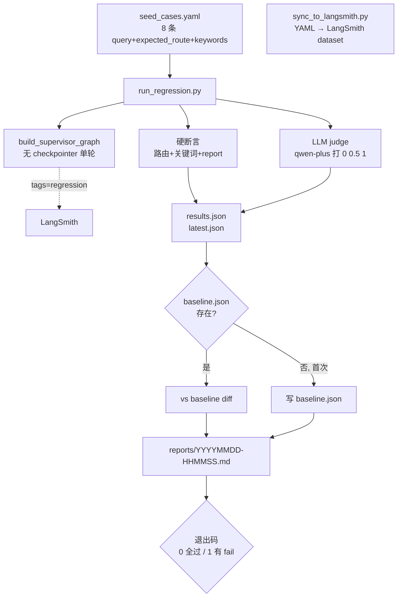

# 08 Prompt 回归测试

> **一行定位** —— 建立「seed YAML + baseline + LLM judge + Markdown 报告」完整闭环，Prompt 改动用数据说话，像 JUnit 一样「改完 → 跑 → 红绿一目了然」。

---

## 背景（Context）

做完 Supervisor / Session / LangSmith 后进入调优期，想改进：

- Supervisor 的 routing prompt（「追问类必须先 parser」之类）。
- 切模型对比（qwen-plus vs qwen-max）。
- 换 Tool 实现（更智能的日志解析器）。

但之前改完 Prompt 全靠感觉：随便问几个 query 看似乎变好了就 commit，第二天发现另一组 case 坏了。**没有数据驱动的回归机制，Prompt 调优就是走一步退两步**。

目标：

1. 搭建**种子数据集**（YAML，8-30 条 representative query）。
2. 每次改动跑一遍，得到每条 case 的「硬断言（pass/fail）+ LLM judge 评分 + 耗时」。
3. **baseline 对比**：和上次满意的锚点对比，趋势可视化。
4. 退出码 0/1 支持未来 CI 集成（git push → GitHub Actions → 自动跑回归）。
5. 衔接 LangSmith——给回归 trace 打 `tags=[regression]`，事后可过滤。

**这段是本项目工程化的里程碑**。真正把 AI Agent 项目从「玩具」提到「可以持续迭代的产品」水平。

---

## 架构图



---

## 设计决策

### 1. YAML 本地为主，LangSmith 作副本（源分离）

**选项对比**：

- A. 数据集只在 LangSmith 上（UI 操作，版本化差）
- B. 数据集只在本地 YAML（CI 友好但无 UI）
- C. **YAML 是 source of truth，LangSmith 作副本（通过 sync_to_langsmith.py 同步）**

**选 C**，理由：

- YAML 进 git，Code Review 可审、历史可追溯、CI 直接用。
- LangSmith UI 看 example 列表/在 UI 里运行单条的体验还是比 CLI 好。
- 同步脚本幂等——改 YAML 一跑，LangSmith 自动对齐。
- 万一 LangSmith 挂了，本地能跑；改 source of truth 不会丢。

### 2. 三层评估（硬断言 / LLM judge / 性能）

| 层 | 是什么 | 是否进 pass 门槛 |
|---|---|---|
| 硬断言 | 路由是否符合预期 / 关键词是否出现 / report 是否非空 | **是**（决定 pass/fail） |
| LLM judge | qwen-plus 对回答打 0 / 0.5 / 1 | 否（进趋势对比） |
| 性能 | 本次耗时 | 否（进趋势对比） |

**为什么 LLM judge 不进 pass 门槛**：

- self-bias 让绝对分不可靠（04 章已经实锤）。
- 但**相对 diff**（改前改后）在同一 judge 下稳定，能看趋势。
- 硬断言覆盖「确定性指标」，judge 补充「模糊但有信号」的评估。

### 3. Baseline 入 git，Latest 不入 git

- `baseline.json`：上次满意的运行结果，入 git。改 Prompt 前它就是「锚点」。
- `latest.json`：每次跑生成，本地瞬态文件，加 `.gitignore`。
- `reports/YYYYMMDD-HHMMSS.md`：每次跑的报告，入 git（作为调优历史档案）。

**流程**：

1. 改 Prompt。
2. 跑 `run_regression.py` → 生成 latest.json + diff baseline + Markdown 报告。
3. 看报告，满意 → `cp latest.json baseline.json` 更新锚点 → commit。
4. 不满意 → 调整 → 再跑。

### 4. 退出码 0/1（CI 预留）

```python
if any(case["status"] == "fail" for case in results):
    sys.exit(1)
else:
    sys.exit(0)
```

未来加 GitHub Actions：

```yaml
- run: python tech_showcase/regression/run_regression.py
# 失败自动 PR 阻塞
```

### 5. 8 条种子覆盖主要路由组合

```yaml
# tech_showcase/regression/seed_cases.yaml
cases:
  - id: simple_count
    query: "今天有多少 ERROR？"
    expected_route: [parser]
    expected_keywords: ["6"]
    expect_report: false

  - id: top_services
    query: "报错最多的 3 个服务？"
    expected_route: [parser]
    expected_keywords: ["OrderService"]
    expect_report: false

  - id: time_filter
    query: "08:00-09:00 的 ERROR？"
    expected_route: [parser]
    expected_keywords: ["DBPool"]   # 这条后来发现 seed 错了
    expect_report: false

  - id: root_cause
    query: "DBPool 为什么失败？"
    expected_route: [parser, analyzer]
    expected_keywords: ["连接池"]
    expect_report: false

  - id: structured_report
    query: "生成结构化日志报告"
    expected_route: [parser, reporter]
    expected_keywords: []
    expect_report: true

  - id: ambiguous
    query: "帮我分析一下"
    expected_route: [parser]
    expected_keywords: ["ERROR"]
    expect_report: false

  - id: out_of_scope
    query: "今天天气怎么样？"
    expected_route: []
    expected_keywords: []
    expect_report: false

  - id: follow_up_payment
    query: "那 Payment 呢？"
    history: "Q1: 今天 OrderService 有多少 ERROR?\nA1: 3 条。"
    expected_route: [parser]
    expected_keywords: ["Payment"]
    expect_report: false
```

**设计**：覆盖 `parser only` / `parser + analyzer` / `parser + reporter` / 多轮追问 / 越界问题 / 模糊问题——**每种典型路由组合至少一条**。

---

## 8 条种子 Case（表格全列）

| # | name | query | expected_route | 期望关键词 | 意图 |
|---|---|---|---|---|---|
| 1 | simple_count | 今天有多少 ERROR？ | parser | 6 | 最基础计数 |
| 2 | top_services | 报错最多的 3 个服务？ | parser | OrderService | 聚合分析 |
| 3 | time_filter | 08:00-09:00 的 ERROR？ | parser | DBPool | 时间范围过滤 |
| 4 | root_cause | DBPool 为什么失败？ | parser+analyzer | 连接池 | 根因分析（要调 RAG） |
| 5 | structured_report | 生成结构化日志报告 | parser+reporter | (report=true) | 报告生成 |
| 6 | ambiguous | 帮我分析一下 | parser | ERROR | 模糊问题容错 |
| 7 | out_of_scope | 今天天气怎么样？ | [] | - | 越界识别 |
| 8 | follow_up_payment | 那 Payment 呢？（带 history） | parser | Payment | 多轮追问 |

---

## 首次跑的真实结果（5/8 pass）

| # | case | pass/fail | 备注 |
|---|---|---|---|
| 1 | simple_count | ✅ | 正常 |
| 2 | top_services | ✅ | 正常 |
| 3 | time_filter | ❌ | keyword "DBPool" 没出现 |
| 4 | root_cause | ✅ | 正常 |
| 5 | structured_report | ✅ | 正常 |
| 6 | ambiguous | ❌ | Parser 循环 7 次要澄清 |
| 7 | out_of_scope | ✅ | 正常 |
| 8 | follow_up_payment | ❌ | 直接调 Analyzer 跳过 Parser |

3 条失败揭露的真实问题（**这是回归测试最大的价值——暴露隐性 bug**）：

### 失败分析 1：`time_filter` —— **seed YAML 错了**

- **表面现象**：期望关键词 "DBPool" 没出现在 Parser 产出里。
- **真实根因**：查了日志原文，`08:00-09:00` 这个时段**真没有 DBPool 错误**（DBPool 错误集中在 10:00 后）。
- **修复**：改 YAML：把 `expected_keywords: ["DBPool"]` 改成 `["OrderService"]`（这个时段确实有 OrderService 错误）。
- **教训**：**不是所有失败都是 Agent 问题**，seed 数据本身可能错了。第一次跑回归时要用它反向验证 seed 质量。

### 失败分析 2：`ambiguous` —— **真 bug**

- **表面现象**：Parser 循环 7 次要求用户「请澄清具体想问什么」，loop_count 达到上限被兜底 END。
- **真实根因**：面对「帮我分析一下」这种模糊 query，Parser 调 `get_error_logs_structured` 拿了数据后，Supervisor 还是路由到 Parser 让它继续；Parser 思考不出新东西就要求澄清；Supervisor 没识破「重复要求澄清」这个信号。
- **修复方向**：Supervisor prompt 加规则「检测到 Parser 连续 2 次要求澄清，直接 END 并返回已有数据」。
- **教训**：Agent 面对边界输入的表现，只有这种 case 设计才暴露得出。**开发过程中大多数测试都跑 happy path**，边界 case 是真发现问题的地方。

### 失败分析 3：`follow_up_payment` —— **老 bug（07 也见过）**

- **表面现象**：带着 history「Q1: OrderService 有多少 ERROR?」追问「那 Payment 呢？」Supervisor 第一次决策直接路由到 Analyzer，Analyzer 没数据兜兜转转，才回退到 Parser。
- **真实根因**：07 LangSmith 章节已经暴露过这个问题——Supervisor 对追问类 query 的第一次决策不稳定。
- **修复方向**：Prompt 里加「追问类问题（"那 XX 呢？"、"接着呢"）必须先调 parser 收集新数据，不能直接 analyzer」。
- **教训**：**同一 bug 跨多个 milestone 反复暴露 = 系统性问题**。修之前用回归测试先跑一遍（看 red），改完再跑（看 green），diff 就是 prompt 改动的效果报告。

---

## 核心代码

### 文件清单

| 文件 | 新建/改 | 说明 |
|---|---|---|
| `tech_showcase/regression/seed_cases.yaml` | 新建 | 8 条种子 case |
| `tech_showcase/regression/run_regression.py` | 新建 ~260 行 | 主入口 |
| `tech_showcase/regression/sync_to_langsmith.py` | 新建 ~60 行 | YAML → LangSmith dataset 同步 |
| `tech_showcase/regression/README.md` | 新建 | 持续迭代手册 |
| `tech_showcase/regression/baseline.json` | 运行生成 | 入 git |
| `tech_showcase/regression/latest.json` | 运行生成 | 不入 git |
| `tech_showcase/regression/reports/*.md` | 运行生成 | 入 git（调优档案） |

### 关键片段 1：`run_regression.py` 主循环

```python
import json
import sys
import time
from pathlib import Path
import yaml
from tech_showcase.langgraph_supervisor import build_supervisor_graph

SEED = Path("tech_showcase/regression/seed_cases.yaml")
BASELINE = Path("tech_showcase/regression/baseline.json")
LATEST = Path("tech_showcase/regression/latest.json")

def run_one_case(case: dict, graph) -> dict:
    """跑单条 case，返回结构化结果。"""
    start = time.perf_counter()
    route_trace = []
    final_state = {
        "query": case["query"],
        "agent_outputs": [],
        "loop_count": 0,
        "final_report": None,
        "conversation_history": case.get("history", ""),
    }

    try:
        for chunk in graph.stream(final_state, config={
            "tags": ["regression"],
            "metadata": {"case_id": case["id"]},
        }):
            if not isinstance(chunk, dict):
                continue
            for node_name, update in chunk.items():
                if not isinstance(update, dict):
                    continue
                if node_name in ("parser", "analyzer", "reporter"):
                    route_trace.append(node_name)
                final_state.update(update)
    except Exception as e:
        return {"id": case["id"], "status": "error", "error": str(e), "duration_s": 0}

    elapsed = time.perf_counter() - start

    # 硬断言
    checks = check_assertions(case, route_trace, final_state)
    # LLM judge
    judge_score = llm_judge(case, final_state)

    return {
        "id": case["id"],
        "query": case["query"],
        "status": "pass" if all(c["pass"] for c in checks) else "fail",
        "route_trace": route_trace,
        "checks": checks,
        "judge_score": judge_score,
        "duration_s": round(elapsed, 2),
        "final_state_preview": summarize_state(final_state),
    }

def main():
    with open(SEED) as f:
        cases = yaml.safe_load(f)["cases"]

    graph = build_supervisor_graph()  # 无 checkpointer 无 interrupt 单轮
    results = [run_one_case(c, graph) for c in cases]

    LATEST.write_text(json.dumps(results, ensure_ascii=False, indent=2))

    baseline = None
    if BASELINE.exists():
        baseline = json.loads(BASELINE.read_text())

    report_md = render_report(results, baseline)
    Path(f"tech_showcase/regression/reports/{time.strftime('%Y%m%d-%H%M%S')}.md").write_text(report_md)

    if not BASELINE.exists():
        BASELINE.write_text(LATEST.read_text())
        print("首次运行，已写入 baseline.json")

    print_summary(results)
    sys.exit(0 if all(r["status"] == "pass" for r in results) else 1)
```

**解读**：
- `graph.stream` 同步迭代（不是 astream，回归脚本不需要 async）。
- 每个 case 带 `tags=regression` 和 `metadata.case_id`，LangSmith 可按 case_id 过滤。
- `sys.exit(0/1)` 是 CI 集成的关键——失败就阻塞合并。

### 关键片段 2：硬断言

```python
def check_assertions(case: dict, route_trace: list, final_state: dict) -> list:
    checks = []

    # 1. 路由断言
    expected = case.get("expected_route", [])
    if expected:
        matched = all(node in route_trace for node in expected)
        checks.append({
            "name": "route",
            "pass": matched,
            "expected": expected,
            "actual": route_trace,
        })
    else:
        # expected_route=[] 表示期望「没有调任何专家」（越界问题直接 END）
        checks.append({
            "name": "route",
            "pass": len(route_trace) == 0,
            "expected": [],
            "actual": route_trace,
        })

    # 2. 关键词断言
    keywords = case.get("expected_keywords", [])
    if keywords:
        all_text = " ".join(final_state.get("agent_outputs", []))
        missing = [k for k in keywords if k not in all_text]
        checks.append({
            "name": "keywords",
            "pass": len(missing) == 0,
            "missing": missing,
        })

    # 3. Report 存在性
    if case.get("expect_report"):
        checks.append({
            "name": "report",
            "pass": final_state.get("final_report") is not None,
        })

    return checks
```

### 关键片段 3：LLM judge

```python
def llm_judge(case: dict, final_state: dict) -> float:
    """让 qwen-plus 给 0/0.5/1 分"""
    llm = get_llm()
    answer = extract_final_answer(final_state)
    prompt = f"""评估回答对问题的解决质量，只输出 0 / 0.5 / 1 之一：

问题: {case['query']}
参考信息 / 预期: {case.get('expected_keywords') or '-'}
Agent 回答: {answer}

评分标准:
1 = 完全答到点上
0.5 = 基本答上但有瑕疵
0 = 答错或答非所问
"""
    raw = llm.invoke(prompt).content.strip()
    try:
        return float(raw)
    except ValueError:
        # qwen-plus 偶发返回解释文字，容错
        for v in ("1", "0.5", "0"):
            if v in raw[:10]:
                return float(v)
        return float("nan")
```

### 关键片段 4：Markdown 报告渲染

```python
def render_report(results: list, baseline: list | None) -> str:
    lines = [f"# Regression Report ({time.strftime('%Y-%m-%d %H:%M:%S')})\n"]
    lines.append(f"总计: {len(results)} | pass: {sum(1 for r in results if r['status']=='pass')} | fail: {sum(1 for r in results if r['status']=='fail')}\n")

    # 详细表格
    lines.append("| ID | Status | Judge | Duration | vs Baseline |\n|---|---|---|---|---|")
    for r in results:
        base = next((b for b in (baseline or []) if b["id"] == r["id"]), None)
        diff = ""
        if base:
            d_judge = r["judge_score"] - base["judge_score"] if not any(
                _is_nan(x) for x in [r["judge_score"], base["judge_score"]]
            ) else "-"
            diff = f"judge {d_judge:+.2f}" if isinstance(d_judge, float) else d_judge
        lines.append(f"| {r['id']} | {r['status']} | {r['judge_score']} | {r['duration_s']}s | {diff} |")

    # fail case 详情
    fails = [r for r in results if r["status"] == "fail"]
    if fails:
        lines.append("\n## 失败详情\n")
        for r in fails:
            lines.append(f"### {r['id']}")
            lines.append(f"- query: {r['query']}")
            lines.append(f"- route: {r['route_trace']}")
            for c in r["checks"]:
                if not c.get("pass"):
                    lines.append(f"- ❌ {c['name']}: {c}")

    return "\n".join(lines)
```

---

## 踩过的坑

几乎无明显坑，首次跑就通。设计当时已经参考了多个 LangChain evaluation 教程，坑都规避了。

唯一小注意：`llm_judge` 有 `nan` 的情况（qwen-plus 偶发返回非数字），`render_report` 做了兜底（跳过 nan 的 diff 计算），不至于整个报告炸掉。

---

## 验证方法

```bash
# 1. 首次跑（生成 baseline）
cd /Users/photonpay/java-to-agent
python tech_showcase/regression/run_regression.py
# 输出：
# 总计: 8 | pass: 5 | fail: 3
# 首次运行，已写入 baseline.json
# exit code: 1

# 2. 查看报告
open tech_showcase/regression/reports/$(ls -t tech_showcase/regression/reports | head -1)

# 3. 改 prompt 后再跑（看趋势）
# 编辑 tech_showcase/langgraph_supervisor.py 的 SUPERVISOR_SYSTEM
python tech_showcase/regression/run_regression.py
# 报告里的 "vs Baseline" 列会显示 judge +0.25 / -0.10 这种

# 4. 同步到 LangSmith
python tech_showcase/regression/sync_to_langsmith.py
# LangSmith dashboard 出现 dataset "java-to-agent-regression"

# 5. CI 集成预演
python tech_showcase/regression/run_regression.py; echo "exit=$?"
# pass 全部：exit=0
# 任何 fail：exit=1
```

---

## Java 类比速查

| 概念 | Java 世界 |
|---|---|
| seed_cases.yaml | `@ParameterizedTest` 的 CSV/CsvSource |
| run_regression.py | JUnit Runner + 自定义 Reporter |
| baseline.json | ApprovalTests 的 `*.approved.txt` |
| LLM judge | 无直接对应（Java 断言 deterministic） |
| latest.json | 瞬态 test output |
| reports/*.md | Surefire 报告 |
| 退出码 | Maven `test` BUILD SUCCESS/FAIL |
| sync_to_langsmith | 导 TestRail / Zephyr |
| tags=regression | JUnit `@Tag("regression")` |

---

## 学习资料

- [ApprovalTests 思想（Java 生态）](https://approvaltests.com/)
- [LangSmith Evaluation 文档](https://docs.smith.langchain.com/evaluation)
- [promptfoo（Prompt 评估框架）](https://www.promptfoo.dev/)
- [DeepEval（另一个主流 LLM 评估库）](https://docs.confident-ai.com/)
- [Prompt 工程的 TDD 思路](https://www.promptingguide.ai/techniques/fewshot)
- [LLM as Judge 方法论综述](https://arxiv.org/abs/2306.05685)

---

## 已知限制 / 后续可改

- **case 数量少（8 条）**：扩到 30 条更有统计意义，建议按「每遇到一次生产 bug 加一条 case 复现」+「从 LangSmith trace 里每月挑 5 条有趣的补充」。
- **Judge 是同一家（qwen-plus）**：绝对分存在 self-bias；换 3 家 judge 平均是严谨做法。
- **没集成 CI**：退出码已预留，但还没配 GitHub Actions。10 分钟改动（见 99）。
- **LLM judge 的 prompt 可优化**：目前只给 0/0.5/1，可升级为 rubric 式（「维度 1 = X 分，维度 2 = Y 分」）更细粒度。
- **没处理 flaky test**：LLM 的不确定性导致同一 case 不同次跑结果略异（尤其 judge 分）。严谨做法：每条 case 跑 3 次取中位数。但会翻 3 倍成本。
- **历史轨迹可视化缺失**：每次都生成一个 md 报告，没有「过去 30 天的 pass rate 曲线」。可以 parse reports/ 下的 md 生成 trend 图。

后续可改项汇总见 [99-future-work.md](99-future-work.md)。
