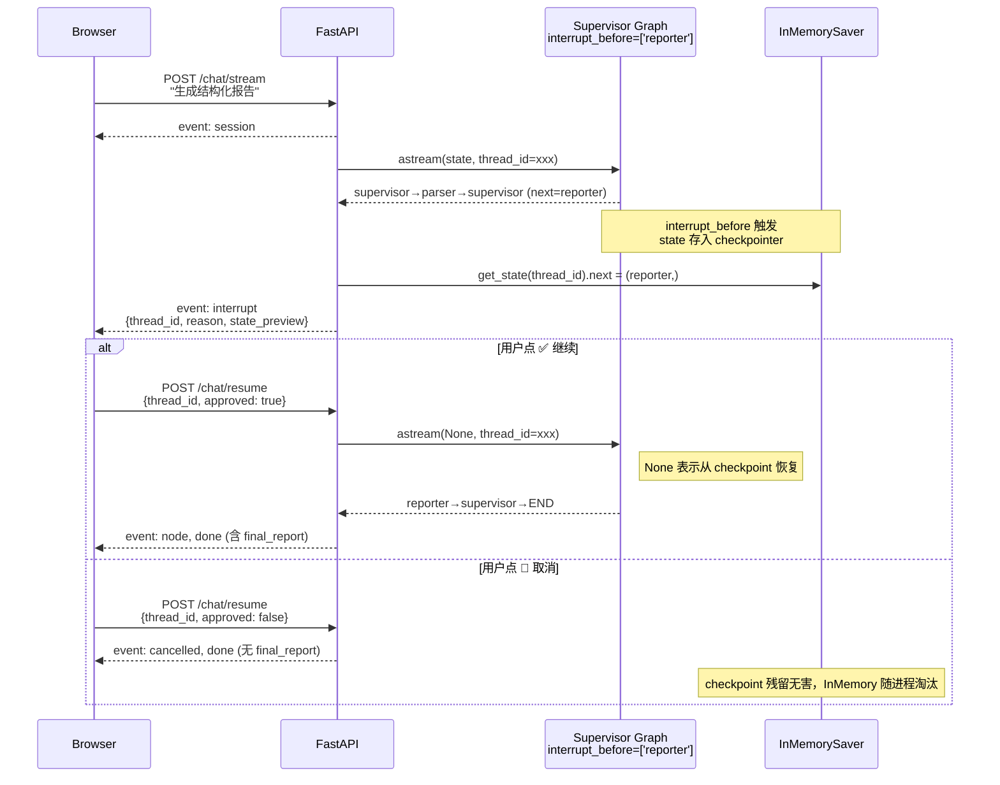

# 09 HITL（Human-in-the-Loop）Checkpointer + Interrupt

> **一行定位** —— 补齐 LangGraph 核心机制：Checkpointer + `interrupt_before=['reporter']`，让用户在昂贵节点（Reporter）执行前**人工确认**，确认通过才继续，拒绝就中止；并踩了 `astream` chunk 可能是 tuple 的关键坑。

---

## 背景（Context）

09 之前，LangGraph 的两个核心机制**还没真正用起来**：

- **Checkpointer**：06 session memory 刻意绕过它（用应用层 dict 替代），因为跨轮累积 State 太复杂。
- **interrupt_before**：没用过，Supervisor 跑起来就一路到 END，中间没法暂停。

这两个机制一起才是 LangGraph 在产品层面最强大的能力——**可中断、可恢复的工作流**。

目标：

1. **Reporter 前人工确认**：Reporter 会额外 +500~2000 tokens 成本，用户可能只想看数据不想要报告。让用户「二次确认」才跑。
2. 学透 Checkpointer 机制：状态持久化 + 按 `thread_id` 恢复。
3. 学透 `interrupt_before`：graph 跑到特定节点前暂停，等待外部恢复信号。
4. 前端加「✅ 继续 / 🛑 取消」按钮，体验接近 Claude / ChatGPT 的「确认执行工具调用」。
5. **不污染无状态场景**：CLI / 回归测试 / 多轮对话（已有应用层 dict）仍然按单轮跑，checkpoint 只在 FastAPI 启用。

---

## 架构图



---

## 设计决策

### 1. 只拦 Reporter，不拦 Parser/Analyzer

为什么不是「所有节点都确认」？——那体验太烦。

| 节点 | 是否拦截 | 原因 |
|---|---|---|
| Parser | 否 | 只是查日志，几乎免费 |
| Analyzer | 否 | 信息收集，不改外部状态 |
| **Reporter** | **是** | 生成结构化报告耗 500-2000 tokens，且用户可能只想看 Parser 产出不要报告 |
| Supervisor | 否 | 决策节点本身很轻 |

**扩展思路**：真生产场景还能拦「send_alert」这种「对外发消息」的节点（Slack / Email），属于不可逆 side effect。

### 2. InMemorySaver 不做持久化

**选项对比**：

- A. `InMemorySaver()`：内存 dict，进程重启丢
- B. `SqliteSaver` / `PostgresSaver`：磁盘持久化

**选 A**，理由：

- **HITL 用户点按钮典型 3-30 秒**——服务重启期间用户刚好在确认的概率极低。
- 重启场景下让 session 重来一次不严重（用户本来就在等确认，重问一句成本可接受）。
- 不装 `langgraph-checkpoint-sqlite` 保持依赖干净。
- 生产真需要持久化只改 1 行：`checkpointer = SqliteSaver.from_conn_string(":memory:")` → `SqliteSaver.from_conn_string("data/checkpoint.db")`。

### 3. `thread_id` ≠ `session_id`（两个独立概念，关键！）

这个决策极容易搞混，必须写清：

| 概念 | 作用域 | 生存期 | 来源 |
|---|---|---|---|
| `session_id` | 业务**多轮对话** | localStorage 长期（比如一周） | 06 session memory |
| `thread_id` | LangGraph checkpoint 的 key | 单次请求 | 09 HITL，每次 invoke uuid4 |

**为什么不合并**：

- 如果合并，同一 session 的 10 轮对话都用同一个 thread_id → checkpoint State 跨轮累积 → `Annotated[..., add]` 字段爆炸。
- `conversation_history` 应用层管理（06），`thread_id` 应用于「当前这一次 invoke 是否需要中断+恢复」——语义完全不同。

**代码上的分工**：

```python
# /chat/stream 入口
session_id = req.session_id or str(uuid.uuid4())   # 长期，前端 localStorage
thread_id = str(uuid.uuid4())                      # 单次请求，新生成
run_config = {
    "configurable": {"thread_id": thread_id},     # ← Checkpointer 用这个
    "metadata": {"session_id": session_id},       # ← LangSmith 过滤用这个
    "tags": ["chat-stream"],
}
```

### 4. `approved=false` 直接 cancel 不调 Reporter

两种设计：

- A. `approved=false` 跳过 Reporter，继续跑 Supervisor → END（走完整 graph）
- B. `approved=false` 立即响应 `cancelled` + `done`，不恢复 graph

**选 B**，理由：

- graph 已经在 interrupt 状态，State 已完整（Parser / Analyzer 都跑完了）。
- 用户明确说「不要 Reporter」，没必要再跑一次 Supervisor 决策（浪费一次 LLM 调用）。
- 直接返回已有的 agent_outputs 给用户看，UX 简洁。
- checkpoint 残留在 InMemorySaver 里无害——随进程重启自然淘汰，不会泄露资源。

```python
@app.post("/chat/resume")
async def chat_resume(req: ResumeRequest):
    if not req.approved:
        # 直接取消，不恢复 graph
        return EventSourceResponse(stream_cancel(req.thread_id))
    # 否则恢复
    return EventSourceResponse(stream_resume(req.thread_id))
```

### 5. CLI / 回归脚本保持无状态

**关键**：`build_supervisor_graph()` 默认参数**不传 checkpointer / interrupt_before**：

```python
def build_supervisor_graph(checkpointer=None, interrupt_before=None):
    # ...
    return graph.compile(
        checkpointer=checkpointer,                   # 默认 None
        interrupt_before=interrupt_before or [],     # 默认空 list
    )
```

- **CLI** (`python langgraph_supervisor.py`)：`build_supervisor_graph()` 无参，单轮跑到 END。
- **回归测试** (`run_regression.py`)：同 CLI，确保回归不受 HITL 影响。
- **FastAPI**：`build_supervisor_graph(checkpointer=InMemorySaver(), interrupt_before=["reporter"])`。

一个函数三种用法，**零配置差异 = 减少维护负担**。

---

## 核心代码

### 文件清单

| 文件 | 改动 | 说明 |
|---|---|---|
| `tech_showcase/langgraph_supervisor.py` | +5 行 | `build_supervisor_graph(checkpointer, interrupt_before)` 支持默认参数 |
| `tech_showcase/fastapi_service.py` | +~70 行 | `InMemorySaver` 单例 + `_interrupt_reason` + `stream_graph` 加中断检测 + `ResumeRequest` + `/chat/resume` + `stream_resume` + `stream_cancel` |
| `tech_showcase/static/index.html` | +~40 行 | `onInterrupt` 渲染 HITL 卡片 + `approveOrReject(bool)` 发送 resume |

### 关键片段 1：FastAPI 组装带 HITL 的 graph

```python
# fastapi_service.py
from langgraph.checkpoint.memory import InMemorySaver
from tech_showcase.langgraph_supervisor import build_supervisor_graph

# 模块级单例
HITL_CHECKPOINTER = InMemorySaver()

compiled_graph = build_supervisor_graph(
    checkpointer=HITL_CHECKPOINTER,
    interrupt_before=["reporter"],
)
```

### 关键片段 2:`stream_graph` 检测 interrupt

```python
async def stream_graph(query: str, session_id: str, thread_id: str):
    run_config = {
        "configurable": {"thread_id": thread_id},
        "metadata": {"session_id": session_id, "query_preview": query[:80]},
        "tags": ["chat-stream"],
    }

    yield {"event": "session", "data": json.dumps({"session_id": session_id, "thread_id": thread_id})}

    state = {
        "query": query,
        "agent_outputs": [],
        "loop_count": 0,
        "final_report": None,
        "conversation_history": load_history(session_id),
    }

    final_state = state.copy()
    async for chunk in compiled_graph.astream(state, config=run_config):
        # 坑 1 防御：chunk 可能不是 dict（interrupt 信号）
        if not isinstance(chunk, dict):
            continue
        for node_name, update in chunk.items():
            # 坑 1 第二层：update 可能是 tuple
            if not isinstance(update, dict):
                continue
            final_state.update(update)
            yield {
                "event": "node",
                "data": json.dumps({
                    "node": node_name,
                    "loop_count": final_state.get("loop_count", 0),
                    "payload": _safe_payload(update),
                }, ensure_ascii=False),
            }

    # ★ 关键：graph 跑完检测是否卡在 interrupt
    snapshot = compiled_graph.get_state(run_config)
    if snapshot.next:
        # 还有 pending 节点 = 触发了 interrupt_before
        yield {
            "event": "interrupt",
            "data": json.dumps({
                "thread_id": thread_id,
                "pending_node": snapshot.next[0],   # "reporter"
                "reason": _interrupt_reason(snapshot),
                "state_preview": summarize_state(final_state),
            }, ensure_ascii=False),
        }
        # ！不触发 done，让前端等用户决策
        return

    # 没 pending = 正常跑完
    save_turn(session_id, query, final_state)
    yield {
        "event": "done",
        "data": json.dumps({
            "session_id": session_id,
            "final_report": _serialize_report(final_state.get("final_report")),
        }, ensure_ascii=False),
    }


def _interrupt_reason(snapshot) -> str:
    """根据 pending 节点生成友好提示。"""
    node = snapshot.next[0] if snapshot.next else ""
    reasons = {
        "reporter": "继续生成结构化报告（会消耗额外 500-2000 tokens）",
    }
    return reasons.get(node, f"等待用户确认是否执行 {node}")
```

**解读**：
- graph 跑到 interrupt_before 节点前会停下，`astream` 自然结束（不是抛异常）。
- 结束后用 `compiled_graph.get_state(config)` 检查 `snapshot.next`——如果非空就是被 interrupt 了。
- 推送 `event: interrupt` 给前端，然后**不发 done**——前端会显示 HITL 确认卡片。

### 关键片段 3：`/chat/resume` 端点

```python
from pydantic import BaseModel

class ResumeRequest(BaseModel):
    thread_id: str
    approved: bool

@app.post("/chat/resume")
async def chat_resume(req: ResumeRequest):
    if req.approved:
        return EventSourceResponse(stream_resume(req.thread_id))
    else:
        return EventSourceResponse(stream_cancel(req.thread_id))


async def stream_resume(thread_id: str):
    """用户确认 → None 作第一个参数 + 同 thread_id → 从 checkpoint 恢复。"""
    run_config = {
        "configurable": {"thread_id": thread_id},
        "tags": ["chat-resume"],
    }

    final_state = {}
    # 坑 1：astream(None, config) 的 chunk 依然可能非 dict
    async for chunk in compiled_graph.astream(None, config=run_config):
        if not isinstance(chunk, dict):
            continue
        for node_name, update in chunk.items():
            if not isinstance(update, dict):
                continue
            final_state.update(update)
            yield {
                "event": "node",
                "data": json.dumps({
                    "node": node_name,
                    "payload": _safe_payload(update),
                }, ensure_ascii=False),
            }

    yield {
        "event": "done",
        "data": json.dumps({
            "final_report": _serialize_report(final_state.get("final_report")),
        }, ensure_ascii=False),
    }


async def stream_cancel(thread_id: str):
    """用户拒绝 → 立即推 cancelled + done，不恢复 graph。"""
    yield {"event": "cancelled", "data": json.dumps({"thread_id": thread_id})}
    yield {"event": "done", "data": json.dumps({"final_report": None})}
```

**解读**：
- `astream(None, config)` 里 **第一个参数是 None**——这是 LangGraph 恢复模式的标志（不是传新 state，而是从 checkpoint 继续）。
- 配合同一 `thread_id`，checkpoint 里存的 state 自动恢复执行。

### 关键片段 4：前端 HITL 卡片

```javascript
// static/index.html
function onInterrupt(payload) {
  const chat = document.getElementById('chat');
  const card = document.createElement('div');
  card.className = 'hitl-card';
  card.innerHTML = `
    <div class="hitl-reason">${escapeHtml(payload.reason)}</div>
    <div class="hitl-preview">${escapeHtml(payload.state_preview)}</div>
    <div class="hitl-buttons">
      <button onclick="approveOrReject('${payload.thread_id}', true)">✅ 继续</button>
      <button onclick="approveOrReject('${payload.thread_id}', false)">🛑 取消</button>
    </div>`;
  chat.appendChild(card);
}

async function approveOrReject(threadId, approved) {
  const resp = await fetch('/chat/resume', {
    method: 'POST',
    headers: {'Content-Type':'application/json'},
    body: JSON.stringify({ thread_id: threadId, approved })
  });
  // 同样是 SSE 流式响应，复用 streamParser
  await consumeSseStream(resp);
}
```

**解读**：
- 渲染一张「黄色警告卡片」，两个按钮。
- 按钮调 `/chat/resume`，响应还是 SSE 流——用户点 ✅ 后继续看 reporter 跑的节点事件。

---

## 踩过的坑（关键！）

### 坑（LangGraph 1.x 关键差异）：`astream` yield 的 chunk 结构不保证是 dict

- **症状**：step=4 Reporter 前崩：
  ```
  AttributeError: 'tuple' object has no attribute 'items'
  ```
  完整 trace：
  ```
  File "fastapi_service.py", line 92, in stream_graph
      for node_name, update in chunk.items():
  AttributeError: 'tuple' object has no attribute 'items'
  ```
- **根因**：LangGraph 1.x 在 `interrupt_before` 触发时，`astream` 会 yield **非字典类型的 chunk**（interrupt 信号本身是 tuple），且即使是 dict，value 也可能是 tuple 而非 dict（跟 state update 的触发源有关）。这是 LangGraph 1.x 和 0.x 的 stream 格式差异，文档里没明确写。
- **修复**：两层防御式 `isinstance(x, dict)` 判断：
  ```python
  async for chunk in compiled_graph.astream(...):
      if not isinstance(chunk, dict):
          continue                       # 非 dict 的 chunk 直接跳过
      for node_name, update in chunk.items():
          if not isinstance(update, dict):
              continue                   # value 非 dict 也跳过
          final_state.update(update)
          # ... 正常处理
  ```
- **教训**：
  - LangGraph 1.x 和 0.x 的 stream 格式有差异，工业级代码必须**防御式写法**。
  - 遇到 `AttributeError: 'tuple' object has no attribute 'items'` 这种错，第一反应应该是「给数据加 isinstance 检查」而不是「怎么把数据转成 dict」。
  - 异步流处理的通用原则：**每个 chunk 都要验证结构**（就像 Java 里 Reactor 的 `flatMap` 要处理空 Mono）。

还有一些小坑：

### 小坑 1：HITL_CHECKPOINTER 模块级创建位置

- **症状**：开始时把 `HITL_CHECKPOINTER = InMemorySaver()` 放在 `@app.on_event("startup")` 里，结果 `compiled_graph = build_supervisor_graph(checkpointer=HITL_CHECKPOINTER, ...)` 启动时拿到的是 `None`。
- **根因**：Python 模块加载顺序——`compiled_graph` 在模块级执行，那时 startup 事件还没触发。
- **修复**：`HITL_CHECKPOINTER` 也放模块级（创建 InMemorySaver 是纯内存操作，无副作用）。
- **教训**：FastAPI 的 `startup` event 是**请求响应周期**开始前的钩子，不是 import 完成后的钩子。模块级常量要在模块级创建。

### 小坑 2：`/chat/resume` 没验证 thread_id 存在性

- **症状**：前端传错了 thread_id（或 checkpointer 已淘汰），`compiled_graph.astream(None, config)` 报 LangGraph 内部 error。
- **修复**：先 `snapshot = compiled_graph.get_state(config)`，若 `snapshot` 为空或 `next` 为空则直接返回 `{event: "error", data: "thread_id 已过期"}`。
- **教训**：任何依赖外部 key 的端点都要先校验 key 有效性。

---

## 验证方法

```bash
# 1. 启动服务（HITL 已启用）
uvicorn tech_showcase.fastapi_service:app --port 8765

# 2. 发一个需要 Reporter 的 query
curl -N -X POST http://localhost:8765/chat/stream \
     -H "Content-Type: application/json" \
     -d '{"query":"生成一份结构化日志报告"}'
# 应该看到：
#   event: session
#   event: node (supervisor)
#   event: node (parser)
#   event: node (supervisor)
#   event: interrupt   ← 这里停下！thread_id=xxx
# 然后 stream 断开，没 done

# 3. 模拟「确认」
curl -N -X POST http://localhost:8765/chat/resume \
     -H "Content-Type: application/json" \
     -d '{"thread_id":"xxx","approved":true}'
# 应该看到：
#   event: node (reporter)
#   event: node (supervisor)
#   event: done (含 final_report)

# 4. 模拟「拒绝」
# 重新跑步骤 2 拿新 thread_id
curl -N -X POST http://localhost:8765/chat/resume \
     -H "Content-Type: application/json" \
     -d '{"thread_id":"yyy","approved":false}'
# 应该看到：
#   event: cancelled
#   event: done (final_report=null)

# 5. 浏览器端演示
open http://localhost:8765/
# 输入 "生成结构化日志报告"
# 看到黄色确认卡片 + ✅/🛑 按钮
# 分别测试两种点击

# 6. 验证不拦 Parser（反向测试）
curl -N -X POST http://localhost:8765/chat/stream \
     -H "Content-Type: application/json" \
     -d '{"query":"今天有多少 ERROR？"}'
# 应该直接跑完到 done，不触发 interrupt（Reporter 没被调用）
```

---

## Java 类比速查

| AI Agent | Java 世界 |
|---|---|
| HITL interrupt | Activiti / Camunda 的 UserTask（人工审批节点） |
| Checkpointer | Spring Batch 的 `JobExecutionContext` 持久化 |
| thread_id | 流程实例 ID（`processInstanceId`） |
| `astream(None, config)` 恢复 | `runtimeService.trigger(executionId)` |
| InMemorySaver | 内存里的流程引擎（非持久化测试用） |
| SqliteSaver（未启用） | ACT_RU_* 表持久化 |
| `interrupt_before=['reporter']` | `<userTask id="reporter">` 的 BPMN 标记 |
| approved=true/false | `approve()` / `reject()` 的审批结果 |

---

## 学习资料

- [LangGraph Human-in-the-loop 官方教程](https://langchain-ai.github.io/langgraph/concepts/human_in_the_loop/)
- [LangGraph Checkpointer API](https://langchain-ai.github.io/langgraph/concepts/persistence/)
- [LangGraph Breakpoints（interrupt 变体）](https://langchain-ai.github.io/langgraph/concepts/breakpoints/)
- [InMemorySaver 源码](https://github.com/langchain-ai/langgraph/blob/main/libs/checkpoint/langgraph/checkpoint/memory/__init__.py)
- [Activiti UserTask 对比参考](https://www.activiti.org/userguide/#bpmnUserTask)
- [Camunda 7 的人工任务模式](https://docs.camunda.org/manual/7.21/reference/bpmn20/tasks/user-task/)
- [Python asyncio 防御式编程](https://docs.python.org/3/library/asyncio-stream.html)

---

## 已知限制 / 后续可改

- **InMemorySaver 进程重启即失**：用户确认中途服务器重启 → thread_id 找不到 → 整个会话要重来。生产换 `SqliteSaver` 或 `PostgresSaver`（装一个包，改 1 行）。
- **没做 interrupt 的超时**：用户不点确认也不拒绝，就一直挂着。`SESSIONS` 有 LRU 但 checkpoint 没。可以加个后台 task 定期清理超过 10 分钟未确认的 thread。
- **HITL 卡片 UX 简陋**：只显示一行 reason + state_preview 截断。完整方案应该让用户看到 Parser/Analyzer 的完整输出决策是否要 Reporter。
- **只支持确认/拒绝，不支持「修改」**：用户没法「修改 state 再继续」（比如改一下 Parser 产出的事实再让 Reporter 生成）。LangGraph 支持 `update_state()` 实现，待补。
- **未覆盖多个 interrupt 节点场景**：目前只拦 `reporter`。如果同时拦 `reporter + send_alert`，要在前端做「多步确认流」UI，和现有卡片不兼容。
- **回归测试未覆盖 HITL**：`run_regression.py` 跑的是无 checkpointer 版本，没法测 HITL 流。可加一个 `run_hitl_regression.py` 专门 mock 确认/拒绝流程。

后续可改项汇总见 [99-future-work.md](99-future-work.md)。
