# 文档生成计划（Generation Plan）

> 本文件是一份**转交说明**：本会话里完成的 9 大改造 + 收尾总结，需要由一个**新终端**批量生成为 11 份 Markdown 文档。
>
> 阅读本文件的不是人类读者，而是**新终端里的 Claude**。它会基于本计划 zero-shot 生成文档，不再向用户提问。

---

## 一、你的任务（给新终端 Claude）

**目标**：在 `/Users/photonpay/java-to-agent/docs/milestones/` 下生成 11 份 Markdown 文档。

**顺序**（先生成 00 作为风格锚定，再 01→09，最后 99）：

```
00-summary.md                    整体总结 + 知识图谱
01-legacy-archive.md             项目归档（legacy_learning + all_in_one）
02-supervisor-multi-agent.md     LangGraph Supervisor 多 Agent
03-dashscope-provider.md         DashScope 切换 + LLM/Embedding 工厂
04-rag-evaluation.md             RAG 评估（ragas + 简化版对照）
05-fastapi-sse.md                FastAPI + SSE 节点级流式
06-session-memory.md             多轮对话 session
07-langsmith-observability.md    LangSmith 可观测性
08-regression-testing.md         Prompt 回归测试
09-hitl-checkpointer.md          HITL（Checkpointer + interrupt）
99-future-work.md                后续优化清单
```

**标准**：
- 全中文正文，技术术语保留英文（如 `checkpointer`、`interrupt_before`、`SSE`）
- **详细版**：每份约 **300-500 行**（包含代码片段、架构图、踩坑记录）
- 架构图用 **Mermaid**（GitHub 原生渲染）
- 每份都要有 **Java 后端视角的类比**（读者是 5 年 Java 开发转 AI Agent 的工程师）
- 不要问任何问题，按本文件决策直接做

**完成信号**：`docs/milestones/` 下有 11 份 `.md` 文件，全部包含 Mermaid 图 + Java 类比 + 学习资料链接。

---

## 二、读者画像（写作定位）

- **主身份**：5 年 Java 后端经验，转 AI Agent 方向
- **熟悉**：Spring Boot / JDBC / 分布式追踪 / JUnit / @Transactional / 线程池 / Sentinel / SSE（Spring `SseEmitter`）
- **陌生**：Python 异步生态、LangChain/LangGraph 抽象、Prompt 工程、向量检索
- **语气**：工程师对工程师，不要讲概念基础，直接给"**决策 + 理由 + 代码位置**"
- **每份必有**：一个小的 Java 类比表（2-5 行），帮助读者把新概念挂到已有知识上

---

## 三、统一的文档模板

每份 01-09 文档用这个骨架（新终端生成时复制并填充）：

```markdown
# NN 标题

> **一行定位** —— 这次改动解决了什么问题

## 背景（Context）

改之前的痛点是什么。为什么值得做。

## 架构图

\`\`\`mermaid
（一张图）
\`\`\`

## 设计决策

### 1. 决策标题
**选了什么 / 为什么选它 / 当时权衡的 alternative**

### 2. 决策标题
...

（通常 3-6 条）

## 核心代码

### 文件清单

| 文件 | 改动 | 关键函数/行号 |

### 关键片段 1：XXX

\`\`\`python
# 片段，20-50 行足够，不要贴完整文件
\`\`\`

**解读**：2-3 句话说为什么这样写

### 关键片段 2：...

## 踩过的坑

### 坑 1：标题
- **症状**：
- **根因**：
- **修复**：
- **教训**：

（每个大改动通常 1-3 个坑）

## 验证方法

\`\`\`bash
# 一两条命令能跑通的自测
\`\`\`

## Java 类比速查

| AI Agent 概念 | Java 世界 |
|---|---|

## 学习资料

- [官方文档链接](url)
- [博客链接](url)

## 已知限制 / 后续可改

- ...（衔接到 99-future-work.md）
```

---

## 四、11 份文档的具体要点

> **每一份的要点都尽量完整**，新终端读完该小节即可直接开写，**不需要再查代码**。

---

### 00-summary.md（总结，300-400 行）

**定位**：整个项目的知识图谱和 Java 转 AI Agent 的经验提炼。放在最前方便读者快速了解全貌。

**结构**（建议）：
1. **项目简介** — 一句话：一个 Java 后端开发者从零学习 AI Agent 开发的完整实践项目
2. **技术栈总览**（Mermaid flowchart 展示层级）：
   - 配置层 config.py（provider 工厂）
   - 业务层 tools/rag/alert/schemas
   - Agent 核心 tech_showcase/langgraph_supervisor.py
   - 服务化 tech_showcase/fastapi_service.py + static/index.html
   - 质量保障 rag/eval_rag_*.py + tech_showcase/regression/
   - 可观测性 LangSmith
3. **已完成能力清单**（表格）：9 项改造，每项一行简介 + 链接到对应 milestone md
4. **Java 后端迁移路线建议**（这段最值钱）：
   - 哪些 Java 经验能直接用（事务边界 → Agent 状态管理、分布式追踪 → LangSmith、@Transactional → Checkpointer）
   - 哪些要重新学（Python 异步、Prompt 工程、向量检索）
   - 推荐学习顺序（阶段 1: ReAct → 阶段 2: RAG → 阶段 3: 服务化 → 阶段 4: 可观测/评估/HITL）
5. **3 个"啊哈时刻"**（最有教学价值的洞察）：
   - **Self-judgment bias 实锤**：同一个数据集，simplified 评估打 0.94，ragas 官方打 0.77。告诉我们评估必须用业界标准框架
   - **Supervisor 会"变聪明"**：多轮对话第 5 轮相同问题，Supervisor 直接 END 不再调 Parser，因为 prompt 里看到"这个问题答过"
   - **Trace 比 log 多看到 10x**：LangSmith 瀑布图一眼看到 parser 占 5.46s / 20.83s 是瓶颈；CLI 日志只能看到"[Parser] 产出：xxx"
6. **项目能力水平自评**：入门偏进阶 → 能独立搭建 LangChain/LangGraph/FastAPI/RAG/评估体系的完整 Agent 应用
7. **时间投入估算**：总约 3-4 周投入（不含学习代码阅读时间）
8. **给 Java 后端同行的 5 条建议**（文末，带一点温度）：
   - 用 LLM 取代"不能确定写什么条件"的 if-else，而不是用它做结构化任务（结构化任务给 Tool）
   - 分布式追踪这类 Java 老技能，在 Agent 场景放大 10x 价值
   - 事务/锁/幂等这类硬功夫，直接对应 Agent 可靠性工程
   - 先做评估体系再调 Prompt，否则改动等于拍脑袋
   - 工厂模式 + 环境变量切换 provider 是 AI 基建工程师的日常

**Mermaid 示例**（技术栈总览）：

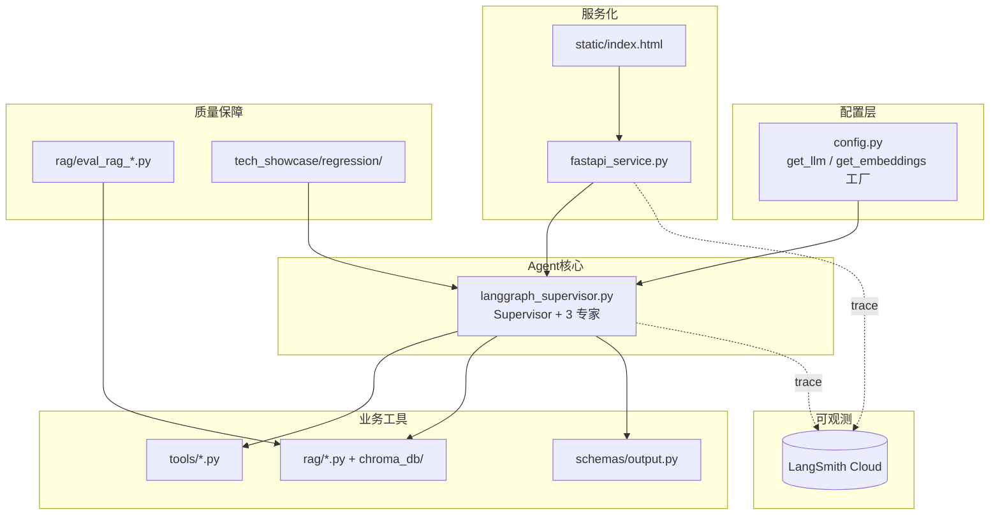

---

### 01-legacy-archive.md（项目归档，300 行）

**定位**：学习阶段代码归档整理 + 提炼为技术总览单文件。

**Context**：
- 学习阶段代码散在 7 个 `main_stageN.py` 里，想看某技术点要在多文件间跳
- 需要区分"已学会（只读归档）"和"在开发（tech_showcase）"

**关键动作**：
- 新建 `legacy_learning/` 放 8 个旧入口脚本 + `docs/` 放旧讲解文档
- 用 `git mv` 迁移（保留历史，`log --follow` 仍能追溯）
- 新建 `tech_showcase/all_in_one.py`（~580 行）把 7 个 section 压到一个文件，`--section N` 命令行参数选跑哪一段
- 新建 `tech_showcase/README.md` 作导航

**设计决策**：
1. **单文件 vs 多文件**（选单文件）：学习回顾场景下 Ctrl+F 快速定位技术点比模块化清晰更重要
2. **按编号分段（§1 §2 ...）**：和原来 main_stage1-5 命名对齐
3. **all_in_one 每段内部各自 import**：不是顶部集中 import，这样 `--section 4b` 只加载该段依赖，启动快

**核心代码**：指向 `tech_showcase/all_in_one.py`、`legacy_learning/README.md`

**踩过的坑**：
- `main_rag.py` 是未 tracked 文件，`git mv` 会报错 → 分开用 `git mv`（tracked）+ `mv`（untracked）
- 中文文件名 `向量数据简介.md` git ls-files 查不到 → 用 `mv`

**Java 类比**：
| 操作 | Java 世界 |
|---|---|
| all_in_one.py | Spring Cheat Sheet 速查手册 |
| legacy_learning 归档 | 旧项目 archive 到独立 repo |
| §1 §2 编号 | Java 练习册的章节编号 |

**学习资料**：
- [git-mv 保留历史的最佳实践](https://git-scm.com/docs/git-mv)
- [Monorepo vs Polyrepo 的讨论](https://monorepo.tools/)

---

### 02-supervisor-multi-agent.md（Supervisor，400 行，**详细版重头戏**）

**定位**：LangGraph 最精髓的"多 Agent 调度"模式实战，把 CLI 版 Supervisor 写扎实。

**Context**：
- 之前 LangGraph 使用停留在告警场景的**线性流水线**（read→detect→analyze→send），不是真正多 Agent
- 目标：学到 Supervisor 模式 = LLM 动态调度 + 专家 Agent 各司其职 + 循环路由

**架构图**（Mermaid flowchart）：

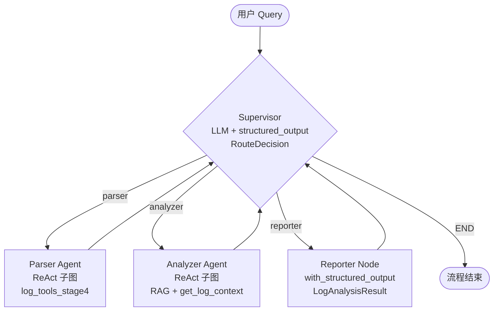

**设计决策**：
1. **3 个专家 Agent 都是 `create_agent` ReAct 子图**（Reporter 例外，纯 `with_structured_output`）：
   - 用 `langchain.agents.create_agent`（LangGraph V1.0 新 API），不用已废弃的 `langgraph.prebuilt.create_react_agent`
   - Parser Tool 集：4 个结构化 Tool（`get_error_logs_structured` 等）
   - Analyzer Tool 集：2 个 RAG Tool + `get_log_context`
   - Reporter 无 Tool：一次 `llm.with_structured_output(LogAnalysisResult).invoke()`
2. **Supervisor 用 LLM + RouteDecision（Pydantic Literal）**：
   - `next: Literal["parser","analyzer","reporter","END"]` 强约束
   - qwen-plus 配合 structured output 稳定性足够
   - 异常兜底：`except` → END，防止死循环
3. **防失控三层**：
   - `loop_count >= MAX_LOOPS(8)` 强制 END
   - structured output 异常兜底 END
   - 每个子图 `recursion_limit=10` 限单轮迭代
4. **单文件 ~450 行**：延续 all_in_one 风格，学习体量可控

**核心代码**（关键片段 3 个）：
- `SupervisorState`（TypedDict + `Annotated[List[str], add]`）
- `supervisor_node()`（LLM 决策 + 兜底）
- `build_supervisor_graph()`（建图）

**踩过的坑**：
- LangGraph V1.0 `create_react_agent` 已废弃 → 用 `langchain.agents.create_agent`，参数 `prompt` 改名 `system_prompt`
- Ollama qwen2.5:7b 跑不动结构化输出（runner terminated），切 DashScope qwen-plus 解决（见 03）

**Java 类比**：
| AI Agent | Java 世界 |
|---|---|
| Supervisor | DispatcherServlet / Controller 分发 |
| 专家 Agent | 业务 Service |
| Tool | Service 内的方法 |
| 条件边 | URL Mapping / Exclusive Gateway |
| State | 请求上下文 / ThreadLocal |
| RouteDecision schema | `@Valid DTO` |

**学习资料**：
- [LangGraph Supervisor 官方教程](https://langchain-ai.github.io/langgraph/tutorials/multi_agent/agent_supervisor/)
- [create_agent 迁移指南（旧 react → 新 create_agent）](https://python.langchain.com/docs/how_to/migrate_agent/)
- [Pydantic Literal 类型用法](https://docs.pydantic.dev/latest/api/types/#pydantic.types.Literal)

---

### 03-dashscope-provider.md（provider 切换，350 行）

**定位**：把 LLM 从本地 Ollama 切到阿里云百炼 qwen-plus，同时引入工厂模式支持多 provider。

**Context**：
- Ollama 跑 qwen2.5:7b 要 ~6GB 内存，用户笔记本只剩 1GB，触发 `llama runner process has terminated`
- 需要可配置切换 provider（不想硬编码 `ChatOllama`）

**架构图**：

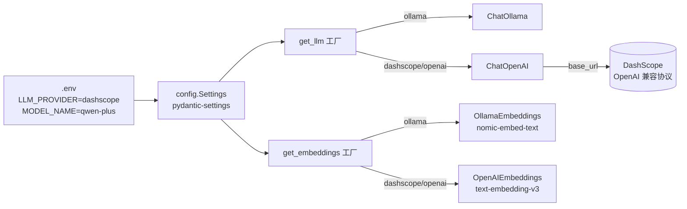

**设计决策**：
1. **工厂模式 + pydantic-settings**：业务代码统一 `from config import get_llm`，切 provider 改 `.env` 一行
2. **DashScope 走 OpenAI 兼容协议**（不用 `dashscope` 原生 SDK）：
   - `base_url=https://dashscope.aliyuncs.com/compatible-mode/v1`
   - 复用 LangChain 成熟的 `ChatOpenAI`
3. **LLM 和 Embedding 分开两个工厂**：不同 provider 可能只支持一侧
4. **key 从 .env 读**：`pydantic-settings` 自动加载；`.gitignore` 挡住 `.env`

**核心代码**：`config.py` 的 `Settings` + `get_llm()` + `get_embeddings()`

**踩过的坑**（重头戏，至少 3 个）：
1. **DashScope embedding 不接受 OpenAI SDK 默认的 pre-tokenize 格式**
   - 症状：`Value error, contents is neither str nor list of str.`
   - 根因：`OpenAIEmbeddings` 默认会用 tiktoken 把文本切成 token 数组发过去
   - 修复：`check_embedding_ctx_length=False` 禁用 pre-tokenize，直接发字符串
2. **DashScope text-embedding-v3 限制 batch_size ≤ 10**
   - 症状：`batch size is invalid, it should not be larger than 10`
   - 修复：`chunk_size=10` 让 OpenAIEmbeddings 分批
3. **安全事故：API key 两次泄露到对话上下文**
   - 教训：别把 `.env.example` 和 `.env` 混，真 key 只写 `.env`
   - 吊销流程：阿里云百炼控制台删 key → 新建 → 仅写本地 `.env`
4. **切 provider 后向量维度不兼容**（ollama 768 vs DashScope 1024）
   - 必须删除 `chroma_db/` 后 `index_logs(force=True)` 重建

**Java 类比**：
| 概念 | Java 世界 |
|---|---|
| get_llm 工厂 | Spring `@ConditionalOnProperty` + 多实现 Bean |
| pydantic-settings | `@ConfigurationProperties` |
| provider 切换 | `spring.profiles.active=prod` |
| .env | application-{profile}.yaml |

**学习资料**：
- [阿里云百炼 OpenAI 兼容模式文档](https://help.aliyun.com/zh/dashscope/developer-reference/compatibility-of-openai-with-dashscope)
- [LangChain OpenAI 集成](https://python.langchain.com/docs/integrations/chat/openai/)
- [pydantic-settings 文档](https://docs.pydantic.dev/latest/concepts/pydantic_settings/)
- 本仓库 sercurity-dev-rule（密钥安全规范）

---

### 04-rag-evaluation.md（RAG 评估，400 行）

**定位**：建立 RAG 评估体系，用官方 ragas 对照自制简化版，发现 **self-judgment bias**。

**Context**：
- 之前的 `eval_rag.py` 是自己写的简化版（3 指标），硬编码 `ChatOllama` 切到 DashScope 后跑不起来
- 业内标杆是 **ragas** 库，之前没接入；想建立评估体系支撑后续 chunk 策略/retrieval 调优

**架构图**：

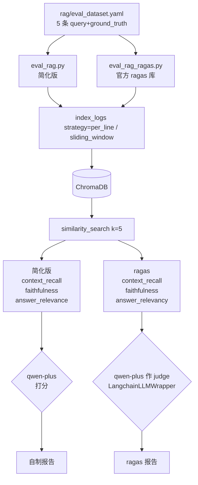

**设计决策**：
1. **保留简化版作对照**：两版跑同一数据集，分数差值正好揭露 self-judgment bias
2. **judge 用 qwen-plus 而非 qwen-max**：相对 diff 能抵消 self-bias，省钱
3. **数据集 YAML 外置**：新增 case 追加 YAML 一行，不改代码
4. **CLI 支持 `--strategy` 和 `--compare`**：一键跑完 per_line vs sliding_window 对比

**核心代码**：
- `rag/eval_rag.py`（重写，切 `get_llm` 工厂 + YAML 加载 + 真切换 strategy）
- `rag/eval_rag_ragas.py`（新增，`LangchainLLMWrapper` + `LangchainEmbeddingsWrapper` 注入项目 provider）
- `rag/eval_dataset.yaml`（5 条种子）

**最值钱的发现**（两组数据，必须写进文档）：

**发现 1：Self-judgment bias 实锤**（同数据集 sliding_window）：

| 指标 | simplified | ragas | 差值 |
|---|---|---|---|
| Context Recall | 1.00 | 1.00 | 持平 |
| Faithfulness | 0.85 | 0.69 | **-0.16** |
| Answer Relevance | 0.97 | 0.71 | **-0.26** |
| 综合 | 0.94 | 0.80 | **-0.14** |

**结论**：自己给自己打分（simplified）比 ragas 严谨算法**系统性虚高 14%**。

**发现 2：反直觉的 chunk 策略对比**（ragas 官方指标）：

| 对比 | per_line | sliding_window | Δ |
|---|---|---|---|
| 综合 | **0.85** | **0.80** | **↓ 0.05** |

**反直觉**：在这个小数据集（24 行日志、5 条评估样本）上 `per_line` 反而赢了。推测：sliding_window 把 5 行合一 chunk，混入不相关信息，Faithfulness 从 0.80 降到 0.69。
**启发**：**"上下文更完整"不等于"检索更好"**，噪音会稀释答案。实战要评估驱动调参，不能凭直觉。

**踩过的坑**：
- 用 ragas 时 qwen-plus 偶发解析失败（返回非 JSON），ragas 会记为 `nan`。**不改**——nan 真实反映 judge 鲁棒性，日后想更稳可换 qwen-max

**Java 类比**：
| 概念 | Java 世界 |
|---|---|
| ragas.evaluate | JUnit `@ParameterizedTest` 批量跑 |
| ground_truth | 测试用例的期望值 |
| LangchainLLMWrapper | Mock LLM 适配层 |
| baseline 对比 | Approval snapshot |

**学习资料**：
- [RAGAS 官方文档](https://docs.ragas.io/en/stable/)
- [LLM-as-a-judge 偏见研究](https://arxiv.org/abs/2306.05685)（Judging LLM-as-a-Judge）
- [RAG 评估方法全景](https://www.pinecone.io/learn/rag-evaluation/)

---

### 05-fastapi-sse.md（服务化，450 行）

**定位**：把 CLI 版 Supervisor 包装成 HTTP 服务 + SSE 节点级流式推送。

**Context**：
- 之前所有入口都是 CLI `python xxx.py`
- 生产 Agent 必须服务化；SSE 是 ChatGPT/Claude 的标准流式协议，学习价值高

**架构图**：

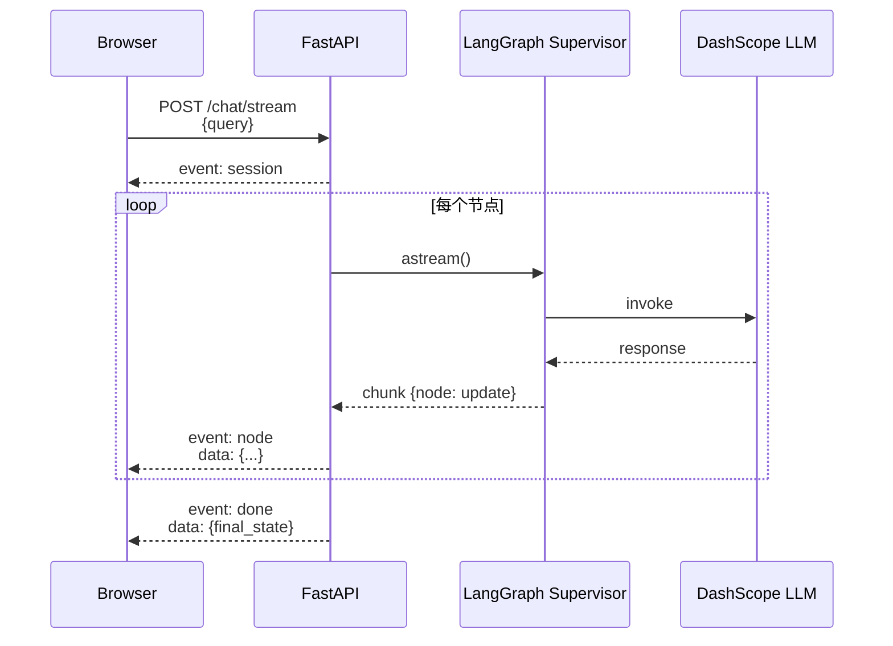

**端点设计**：
| 端点 | 方法 | 作用 |
|---|---|---|
| `/` | GET | 返回 index.html |
| `/health` | GET | 返回 provider + model |
| `/chat` | POST | 阻塞式（asyncio.to_thread 包同步 invoke） |
| `/chat/stream` | POST | SSE 流式（主打） |

**设计决策**：
1. **POST 而非 GET**：浏览器原生 `EventSource` 只支持 GET，但 GET 暴露 query 在 URL / 访问日志里。标准做法是 POST + fetch + `Response.body.getReader()`
2. **节点级而非 token 级**：`compiled.astream()` 每个 Node 完成 yield 一次，代码简单 + 体验够
3. **sse-starlette 的 EventSourceResponse**：异步生成器 yield `{"event":..., "data":...}`，框架自动补 CRLF 分隔
4. **同步 invoke 包进 `asyncio.to_thread()`**：`/chat` 阻塞接口不卡事件循环
5. **端口 8765**（非 8000）：避开用户本地已占的其他服务

**核心代码**：
- `tech_showcase/fastapi_service.py` 约 280 行
- `tech_showcase/static/index.html` 约 230 行（原生 JS，无前端框架）

**踩过的坑**（两个大坑）：
1. **SSE 行尾兼容坑**（最关键）
   - 症状：浏览器卡住，服务端日志显示流程完整跑完
   - 根因：`sse-starlette` 用 **CRLF (`\r\n`)** 行尾（HTTP/SSE 规范），前端 `split('\n\n')` 按 LF 切分永远切不开
   - 修复：前端改 `split(/\r?\n\r?\n/)`
   - 教训：用 `xxd` 看原始字节是调试 SSE 的必备技能
2. **chromadb 并发 Rust bindings 竞争**
   - 症状：`'RustBindingsAPI' object has no attribute 'bindings'`（Analyzer 偶发失败）
   - 根因：`get_vectorstore()` 每次 new `Chroma` 实例，FastAPI 并发下撞 Rust 底层
   - 修复：`rag/log_indexer.py` 加模块级单例 + `threading.Lock` double-checked locking
   - 教训：用 Rust bindings 的包（PyO3）对并发初始化不友好，必须单例化

**Java 类比**：
| AI Agent | Java 世界 |
|---|---|
| FastAPI | Spring WebFlux（原生 async） |
| `@app.post` | `@PostMapping` |
| `async def` | `@Async` |
| Pydantic BaseModel | DTO + `@Valid` |
| EventSourceResponse | `SseEmitter` / `Flux<ServerSentEvent>` |
| `astream()` | Reactor Flux 的 `onNext` |
| `asyncio.to_thread` | 扔到 `@Async` 线程池 |

**学习资料**：
- [FastAPI Streaming Responses](https://fastapi.tiangolo.com/advanced/custom-response/#streamingresponse)
- [sse-starlette 文档](https://github.com/sysid/sse-starlette)
- [MDN Server-Sent Events 规范](https://developer.mozilla.org/en-US/docs/Web/API/Server-sent_events/Using_server-sent_events)
- [LangGraph stream modes](https://langchain-ai.github.io/langgraph/how-tos/stream-values/)

---

### 06-session-memory.md（多轮对话，350 行）

**定位**：基于 FastAPI 加"应用层 session"让 Supervisor 能看到历史 Q&A，支持自然追问。

**Context**：
- 之前每次 `/chat/stream` 独立，追问"那 Payment 呢？"Supervisor 完全看不到上轮上下文
- 目标：用最小改动加 session 语义

**架构图**：

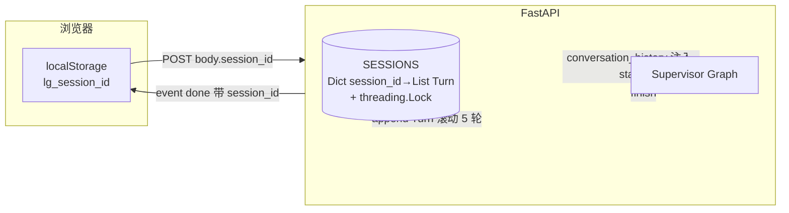

**设计决策**（选应用层 dict 的理由要写清）：
1. **应用层 dict 而非 LangGraph Checkpointer**：
   - Checkpointer 会让 SupervisorState 跨轮累积，`Annotated[List, add]` 字段不好清空，语义复杂
   - dict 实现最简，保持 SupervisorState 单轮无状态语义
   - Checkpointer 机制留到 HITL 场景（09）才真正用起来
2. **滚动窗口 5 轮**：超过丢最早的
3. **历史摘要规则**：`final_report.summary > agent_outputs[-1]` 截断 200 字（不塞全量，防 token 膨胀）
4. **前端用 localStorage**：首次请求服务端生成 uuid4 → done 事件回传 → 前端存下次带上
5. **新增 GET/DELETE `/session/{id}`**：调试 + 前端"新对话"按钮

**SupervisorState 改动**（只加一个 scalar 字段）：
```python
conversation_history: str  # 服务端一次性注入，不用 Annotated，不跨调用累积
```

**Supervisor prompt 改动**：条件段 `_build_history_section`，空时整段不显示

**核心代码**：
- `tech_showcase/langgraph_supervisor.py`（+15 行）
- `tech_showcase/fastapi_service.py`（+80 行：SESSIONS + lock + 3 个 helper + 2 个新端点）
- `tech_showcase/static/index.html`（+30 行：localStorage + session 栏 + 新对话按钮）

**最值钱的发现**（写进文档）：
**Supervisor 会"变聪明"**——滚动测试第 5 轮相同问题（5 次都问"有多少 ERROR"），Supervisor 第 5 次 `loop_count=1` 直接 END，不调 Parser。因为 prompt 里有 4 条相同 Q&A 历史，LLM 判断"已答过无需重复"。这就是 prompt 里"不必重复已答过的内容"规则起作用。**真实多轮对话的产品价值**——避免机械重复调 Agent。

**踩过的坑**：基本没有，设计一次过

**Java 类比**：
| 概念 | Java 世界 |
|---|---|
| SESSIONS dict | `ConcurrentHashMap<String, List<Turn>>` |
| threading.Lock | `synchronized` 块 |
| localStorage | HttpSession（浏览器端版本） |
| 滚动窗口 | FIFO Cache / LRU |

**学习资料**：
- [对话 Memory 模式对比](https://langchain-ai.github.io/langgraph/concepts/memory/)
- [浏览器 localStorage 用法](https://developer.mozilla.org/en-US/docs/Web/API/Window/localStorage)

---

### 07-langsmith-observability.md（可观测性，350 行）

**定位**：给所有 LangChain/LangGraph 调用接入分布式追踪（像 Zipkin 之于 Java）。

**Context**：
- CLI 日志只能看"[Parser] 产出：xxx"一行
- 一次 `/chat/stream` 内部发了 10+ 次 LLM/Tool 调用，没法看瀑布图、完整 prompt、token 消耗
- 业内标配 LangSmith（LangChain 官方 trace 平台）

**架构图**：

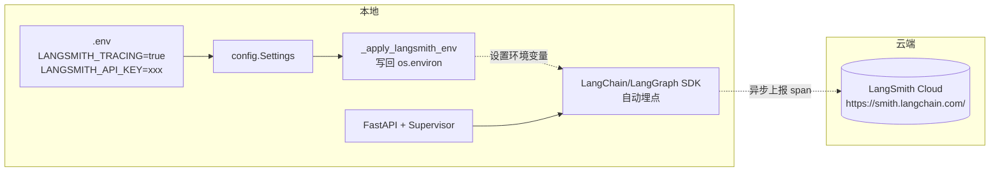

**设计决策**：
1. **新前缀 `LANGSMITH_*`**（非 `LANGCHAIN_*`）：V1.0 推荐
2. **增强版而非最简版**：
   - 最简版：只配 3 个 env
   - 增强版：给每次 invoke 加 `config={"metadata":{session_id, query_preview}, "tags":[chat-stream/chat-blocking]}`
   - 增强版收益：在 dashboard 按 session_id 过滤所有 trace（多轮对话必备）
3. **key 全程不进代码**：Settings 读 `.env`，`_apply_langsmith_env()` 启动时写回 `os.environ`（LangChain SDK 只认 env）
4. **启动日志打印 tracing 状态**：方便确认"我到底开了没"

**核心代码**：
- `config.py` +15 行（Settings 加 4 个 langsmith_* 字段 + `_apply_langsmith_env()`）
- `fastapi_service.py` +20 行（启动日志 + `_build_run_config()` 加 metadata/tags）
- `.env.example` 加 4 行占位

**能看到什么**（写明白界面演示）：
- 瀑布图：LangGraph (root) → supervisor → ChatOpenAI → parser → analyzer → ...
- 点开任一 ChatOpenAI 节点：完整 prompt 文本 + 原始 JSON response + token 数 + 成本估算
- 按 `metadata.session_id` 过滤：同一会话所有 trace 一键查

**Trace 实际帮我们发现的问题**（写一段真实案例）：
> 第 2 轮"那 Payment 呢？"的瀑布图显示：Supervisor 第 1 次决策 → 直接调 analyzer（!）→ 发现没数据 → Supervisor 重新决策 → 调 parser 补数据 → 再调 analyzer。**路由错了一次**。CLI 日志只能看到最终结果，LangSmith 瀑布图把内部"反复横跳"暴露无遗。这就是 trace 比 log 值钱 10 倍的体现。

**踩过的坑**：key 泄露到 `.env.example`（`.example` 文件会被 git 追踪！）

**Java 类比**：
| 概念 | Java 世界 |
|---|---|
| LangSmith | Zipkin / Jaeger / SkyWalking |
| trace | 一次完整请求的调用链 |
| span | 单次方法调用 |
| tags / metadata | Baggage / MDC 上下文 |
| 瀑布图 | Zipkin / Grafana Tempo 火焰图 |

**学习资料**：
- [LangSmith 官方 Quickstart](https://docs.smith.langchain.com/)
- [LangChain Tracing 指南](https://python.langchain.com/docs/how_to/debugging/#tracing)
- [OpenTelemetry 概念（Java 类比）](https://opentelemetry.io/docs/concepts/)

---

### 08-regression-testing.md（回归测试，450 行）

**定位**：Prompt 改动用数据说话，建立"seed YAML + baseline + LLM judge + Markdown 报告"完整闭环。

**Context**：
- 改 Supervisor prompt / 切模型 / 调 Tool 时，只能凭感觉判断好坏
- 想要像 JUnit 一样的"改完 → 跑 → 红绿一目了然"
- 同时衔接 LangSmith（给 trace 打 regression tag，事后可过滤）

**架构图**：

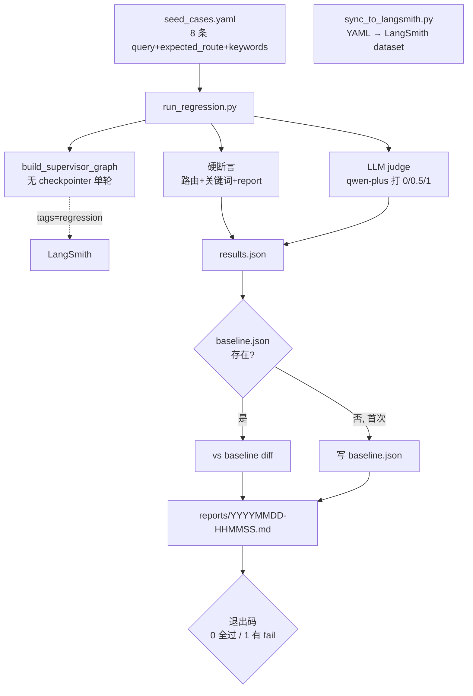

**设计决策**：
1. **YAML 本地为主，LangSmith 作副本**：
   - YAML 是 source of truth（git 版本化、Code Review 友好）
   - LangSmith dataset 作 UI 副本（浏览器看 example 列表）
2. **三层评估**：
   - 硬断言（路由 + 关键词 + report 存在）——进 pass 判断
   - LLM judge（qwen-plus 打 0/0.5/1）——进趋势对比，不进 pass
   - 性能（耗时）——进趋势对比
3. **judge 不进 pass 门槛**：self-bias 让绝对分不可靠，但**相对 diff**（改前改后）稳
4. **baseline.json 入 git，latest.json 不入 git**：baseline 就是"上次满意的锚点"
5. **退出码 0/1**：为未来 CI 集成预留

**8 条种子 case**（写表格列出全部）：
| # | name | query | expected_route | 期望关键词 |
|---|---|---|---|---|
| 1 | simple_count | 今天有多少 ERROR？ | parser | 6 |
| 2 | top_services | 报错最多的 3 个服务？ | parser | OrderService |
| 3 | time_filter | 08:00-09:00 的 ERROR？ | parser | DBPool |
| 4 | root_cause | DBPool 为什么失败？ | parser+analyzer | 连接池 |
| 5 | structured_report | 生成结构化日志报告 | parser+reporter | (report=true) |
| 6 | ambiguous | 帮我分析一下 | parser | ERROR |
| 7 | out_of_scope | 今天天气怎么样？ | [] | - |
| 8 | follow_up_payment | 那 Payment 呢？（带 history） | parser | Payment |

**首次跑的真实结果**（5/8 pass）——**3 条失败揭露的真实问题**：

| 失败 case | 表面现象 | 真实根因 |
|---|---|---|
| time_filter | keyword "DBPool" 未出现 | **seed YAML 错了**（该时段真没 DBPool 错误），不是 Agent 问题 |
| ambiguous | Parser 循环 7 次要澄清 | **真 bug**：面对模糊 query，Parser 不知道调哪个 Tool，Supervisor 没识破重复 |
| follow_up_payment | 直接调 Analyzer 跳过 Parser | **老 bug**：Supervisor 偶尔先调 Analyzer（trace 里见过多次） |

**核心代码**：
- `tech_showcase/regression/seed_cases.yaml`（8 条）
- `tech_showcase/regression/run_regression.py`（~260 行：load YAML → 逐条跑 → 断言 → judge → baseline diff → Markdown）
- `tech_showcase/regression/sync_to_langsmith.py`（~60 行，幂等 upsert）
- `tech_showcase/regression/README.md`（持续迭代手册，重点文档）

**踩过的坑**：无明显（首次跑就通）

**Java 类比**：
| 概念 | Java 世界 |
|---|---|
| seed_cases.yaml | `@Test` 方法们 |
| run_regression.py | JUnit Runner + 自定义 Reporter |
| baseline.json | Approval snapshot |
| LLM judge | 无直接对应（Java 世界断言 deterministic） |
| 退出码 | Maven `test` BUILD SUCCESS/FAIL |

**学习资料**：
- [ApprovalTests 思想（Java）](https://approvaltests.com/)
- [LangSmith Evaluation 文档](https://docs.smith.langchain.com/evaluation)
- [Prompt 工程的 TDD 思路](https://www.promptingguide.ai/techniques/fewshot)

---

### 09-hitl-checkpointer.md（HITL，450 行）

**定位**：补齐 LangGraph 核心机制——Checkpointer + interrupt_before，Reporter 前人工确认。

**Context**：
- 之前多轮对话刻意绕过了 LangGraph 原生 Checkpointer（用应用层 dict 代替）
- Reporter 会额外 +500~2000 tokens，想让用户"二次确认"
- 补完 HITL，整个 LangGraph 知识图谱就全了

**架构图**：

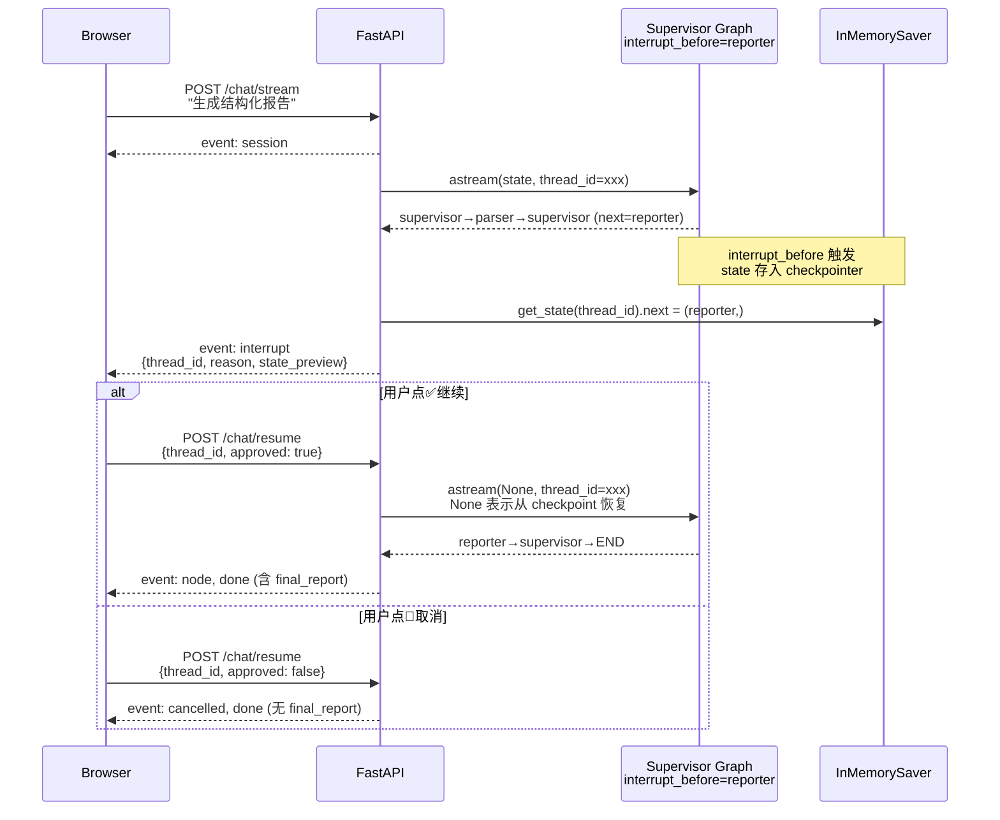

**设计决策**：
1. **只拦 Reporter**：最高成本节点；Parser/Analyzer 是信息收集无需确认
2. **InMemorySaver 不做持久化**：
   - 用户点按钮典型 3-30 秒
   - 重启场景稀少，自然淘汰
   - 不装 `langgraph-checkpoint-sqlite` 保持依赖干净
3. **thread_id ≠ session_id**（两个独立概念）：
   - `session_id`：业务多轮对话，跨请求，localStorage 长期
   - `thread_id`：LangGraph checkpoint key，单次请求，uuid4
   - 合并会让 checkpoint 跨轮累积，语义混乱
4. **approved=false 直接 cancel 不调 Reporter**：
   - 不执行 `compiled.astream(None, config)`
   - 立即推 `cancelled` + `done` 事件
   - checkpoint 残留无害（InMemory 随进程淘汰）
5. **CLI / 回归脚本保持无状态**：
   - `build_supervisor_graph()` 默认无参数（无 checkpointer 无 interrupt）
   - 只有 FastAPI 启动时显式传入
   - 两条路径并行不冲突

**核心代码**：
- `langgraph_supervisor.py` 的 `build_supervisor_graph(checkpointer=None, interrupt_before=None)`
- `fastapi_service.py` 的 `InMemorySaver()` 单例 + `_interrupt_reason()` + `stream_graph` 加中断检测 + `ResumeRequest` + `/chat/resume` 端点 + `stream_resume()` 生成器
- `static/index.html` 的 `onInterrupt` + `renderHitlCard` + `approveOrReject(bool)`

**踩过的坑**（新终端务必写清这个，LangGraph 1.x 关键差异）：

**坑：astream yield 的 chunk 结构不保证是 dict**
- **症状**：`AttributeError: 'tuple' object has no attribute 'items'`（step=4 Reporter 前炸）
- **根因**：LangGraph 1.x 在 `interrupt_before` 触发时，astream 会 yield 非字典类型的 chunk（interrupt 信号），且即使是 dict，value 也可能是 tuple 而非 dict
- **修复**：两层防御式 `isinstance(x, dict)` 判断
  ```python
  async for chunk in compiled_graph.astream(...):
      if not isinstance(chunk, dict):
          continue
      for node_name, update in chunk.items():
          if not isinstance(update, dict):
              continue
          # 正常处理
  ```
- **教训**：LangGraph 1.x 和 0.x 的 stream 格式有差异，工业级代码必须防御式写法

**Java 类比**：
| AI Agent | Java 世界 |
|---|---|
| HITL interrupt | Activiti / Camunda 的人工审批节点（UserTask） |
| Checkpointer | JobExecutionContext 持久化（Spring Batch） |
| thread_id | 流程实例 ID |
| resume | flowable 的 `runtimeService.trigger()` |

**学习资料**：
- [LangGraph Human-in-the-loop 官方教程](https://langchain-ai.github.io/langgraph/concepts/human_in_the_loop/)
- [LangGraph Checkpointer API](https://langchain-ai.github.io/langgraph/concepts/persistence/)
- [Activiti UserTask 对比参考](https://www.activiti.org/userguide/#bpmnUserTask)

---

### 99-future-work.md（后续优化清单，300 行）

**定位**：项目当前已完成的收尾 + 明确"下一步能做什么"的完整菜单。

**结构**：

#### 1. 剩余未做的 P2+ 候选
- **MCP Server**（把 `tools/` 暴露给 Claude Desktop / Cursor）—— 独立子项目，写个 stdio 服务器
- **CI 集成**（GitHub Actions + 回归脚本退出码）—— 纯 Java 技能迁移，适合作品集
- **Redis 升级**（SESSIONS dict → Redis）—— 结构已准备好，换一层实现即可
- **持久 Checkpointer**（InMemorySaver → SqliteSaver）—— 装 `langgraph-checkpoint-sqlite`，改 2 行
- **LLM 压缩历史**（超过 5 轮时摘要化）—— session_memory 的进阶
- **Token 级流式**（用 `astream_events('v2')` 处理 `on_chat_model_stream`）—— ChatGPT 逐字效果
- **Rerank**（BGE-reranker / DashScope `gte-rerank-v2`）—— RAG 进阶
- **Hybrid Search**（向量 + BM25）—— RAG 进阶

#### 2. 已知 bug 待修
写 3 条从 08-regression-testing.md 里暴露的：
- **ambiguous case 循环**：Parser 面对"帮我分析一下"循环 7 次要求澄清。改 Supervisor prompt 加"检测到 Parser 重复追问澄清 2 次 → END"规则
- **follow_up_payment 路由错**：Supervisor 偶尔先调 Analyzer。改 prompt 加"追问类问题（"那 XX 呢？"）必须先调 parser 收集新数据"
- **time_filter seed 错误**：期望关键词"DBPool"在该时段不存在，改 YAML 为合适的 service 名

**每条 bug 的修复方法**都给出：用 08 的回归测试验证修复效果（先看 red → 改 → 再跑看 green）

#### 3. 回归测试 case 扩展
- 当前 8 条，建议扩到 20-30 条
- 方法：
  - 每遇到一次生产 bug → 加一条 case 复现
  - 从 LangSmith trace 里挑 5 条有趣的做补充
  - 按"Supervisor 路由组合"系统性覆盖（parser / analyzer / reporter / 追问 / 越界）

#### 4. Prompt 工程方法论
- 本项目 prompt 都是直观写的，进阶方向：
  - Few-shot（在 prompt 里放几条 Q&A 示例）
  - Chain-of-Thought（让模型显式"先思考再回答"）
  - Self-Consistency（跑 N 次取多数）
  - Prompt Chaining（拆多步）
- 每个方向都可以用回归测试验证

#### 5. 评估体系进阶
- LangSmith Experiment 功能（UI 里批量跑 dataset 对比）
- 接 OpenAI Evals 或自建 eval harness
- 自动化指标：引入 BLEU / ROUGE（文本相似度）、factual consistency 专用模型评估

#### 6. 成本与性能优化
- Token 使用分析（从 LangSmith trace 聚合）
- 缓存策略（Anthropic Prompt Caching / OpenAI Predicted Outputs / Redis LLM-output cache）
- 更便宜的模型路由（简单问题走 qwen-turbo，复杂才 qwen-plus）

#### 7. 生产级安全加固
- 接口鉴权（OAuth2 / API Key）
- 速率限制（Sentinel / nginx）
- 输入净化（Prompt Injection 防护）
- 输出过滤（敏感信息脱敏）

---

## 五、写作风格规约

### 5.1 Mermaid 图要求

每份文档至少 1 张 Mermaid 图。常用三种类型：

**flowchart**（架构/数据流）：
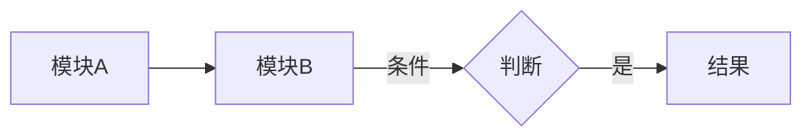

**sequenceDiagram**（时序交互）：
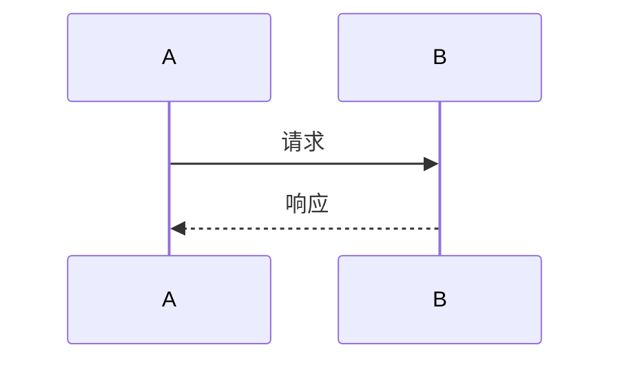

**stateDiagram-v2**（状态机）：


### 5.2 中文写作规约

- 代码关键词保留英文：`checkpointer`、`interrupt_before`、`thread_id`
- 中英文之间加空格：`启动 FastAPI 服务`、`用 Pydantic 约束输出`
- 避免长段落，多用无序列表 + 表格
- 每个核心决策必答"为什么选它"和"没选什么"（二选一不够，要写三方权衡）

### 5.3 代码片段规约

- 20-50 行足够，**不要全文贴**
- 优先贴"决策核心代码"（能说明设计的那几行）
- 路径格式：`tech_showcase/langgraph_supervisor.py:123-140`（带行号方便定位）
- 复杂片段后面跟"解读"段：3 句话说"这段代码为什么这么写"

### 5.4 Java 类比表规约

每份必有。精简到 3-6 行。选择标准：**Java 开发者一看就秒懂**的概念映射。避免强行类比（有些概念 Java 没有对应物，直接说"无对应"比硬套好）。

---

## 六、文件路径速查（新终端生成时引用）

| 目录/文件 | 涉及哪些 milestone |
|---|---|
| `config.py` | 03, 07, 09 |
| `tech_showcase/langgraph_supervisor.py` | 02, 06, 09 |
| `tech_showcase/fastapi_service.py` | 05, 06, 07, 09 |
| `tech_showcase/static/index.html` | 05, 06, 09 |
| `tech_showcase/all_in_one.py` | 01 |
| `tech_showcase/regression/` | 08 |
| `rag/eval_rag.py` | 04 |
| `rag/eval_rag_ragas.py` | 04 |
| `rag/eval_dataset.yaml` | 04 |
| `rag/log_indexer.py` | 04, 05（单例修复） |
| `legacy_learning/` | 01 |
| `.env.example` | 03, 07 |
| `schemas/output.py` | 02（被 Reporter 用） |
| `tools/log_tools_stage4.py` | 02（被 Parser 用） |

---

## 七、完成 checklist（新终端做完自检）

生成完 11 份文档后，逐项核对：

- [ ] `docs/milestones/` 下有 11 份 `.md` 文件
- [ ] 00-summary.md 有完整 Mermaid 技术栈图
- [ ] 每份 01-09 都有 Mermaid 图（不能纯 ASCII）
- [ ] 每份有"Java 类比速查"小节
- [ ] 每份有"学习资料"小节（至少 2 个外部链接）
- [ ] 每份末尾有"已知限制 / 后续可改"（衔接 99）
- [ ] 04 写清 self-judgment bias 对比数据
- [ ] 05 写清 CRLF 坑和 RustBindingsAPI 坑
- [ ] 07 写清 Trace 发现"反复横跳"的真实案例
- [ ] 08 写清 3 条失败 case 的真实根因
- [ ] 09 写清 astream chunk tuple 的坑 + 防御式代码
- [ ] 99 列清所有剩余 P2+ 候选 + 3 条已知 bug

---

## 八、新终端启动提示词（用户复制用）

```
读 /Users/photonpay/java-to-agent/docs/milestones/_GENERATION_PLAN.md，
按里面第二节顺序和第四节要点清单，依次生成 00 和 01-09、99 共 11 份文档到
docs/milestones/ 目录。

每份 300-500 行、Mermaid 图、全中文、详细版。
每生成完一份就 continue 下一份，不要问我任何问题，
按 PLAN 里的决策直接写。全部写完后打印 checklist 让我核对。
```
